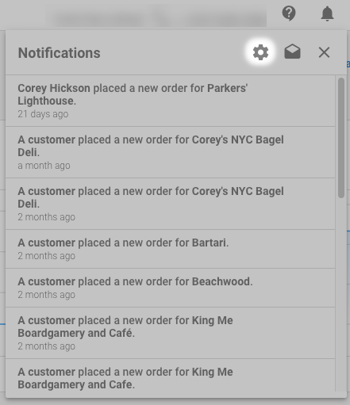

It used to be difficult for fulfillment agents to know if they needed to stop working on a project. If a customer canceled and a product was deactivated, agents weren't informed. It fell upon the Salesperson's shoulders to communicate with the agent. This step was manual and often missed, and the work clients weren't paying for was completed.

With the **Product Deactivated** notification, this is no longer an issue. Fulfillment agents are notified when a product associated with a project is deactivated. This information helps them decide whether to continue working on a project.

And if they struggle to know which tasks needed attention, there's a notification to help. When tasks are within 24 hours of their due date, the agent is notified. This is done via the **Tasks Due Tomorrow** notification.

Even better, the **Tasks Due Tomorrow** notification can be used by salespeople, allowing them to keep tabs on upcoming work.

### How do I enable and disable these notifications?

Both notifications are enabled by default. Any user can change their notification settings:

1. Log in to your center of choice (most admins access **Partner Center**).
2. Click  > .
   
   
   
3. Uncheck both notifications (email and in-app) under **Task.**
4. Click **Save.**