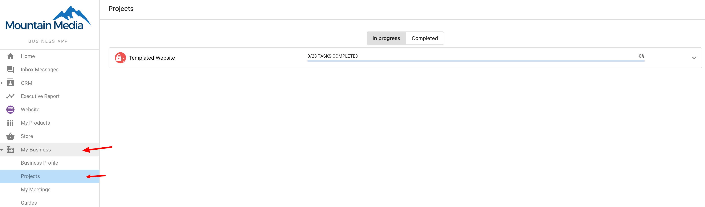

**Q: Do my clients get access to Task Manager?**

**A: No - your clients will not have access to Task Manager.** Task Manager is a project management tool built for fulfillment agents and other internal teams. If you were to add a client as a Task Manager user, they would be able to see *all accounts*, not just their own. They would also be able to see private notes and adjust global task settings.

Although your clients cannot access Task Manager, **it is possible for them to see updates on their fulfillment projects in Business App**. 

