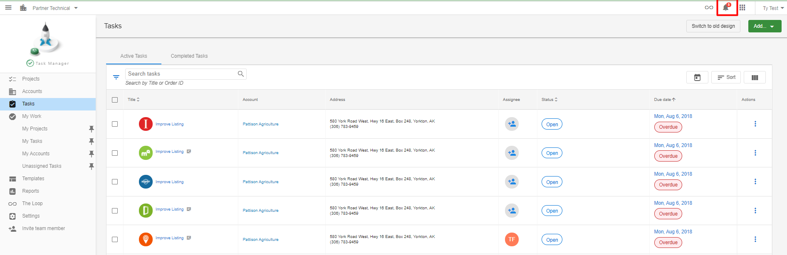
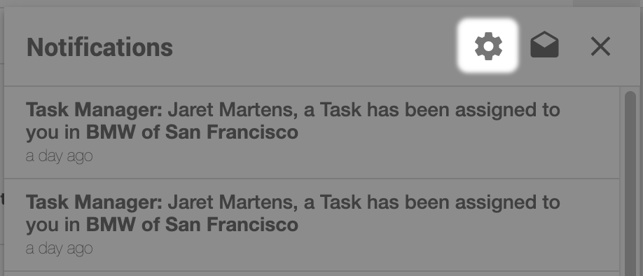
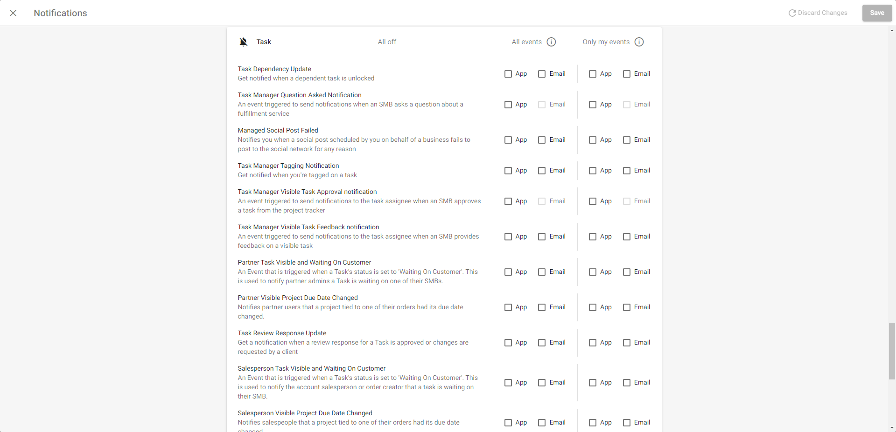

Task Manager users will receive in-app notifications and emails when they are assigned a task or project. This can occur if a new task or project is created, or when an existing one is reassigned. Notifications can be created for all events, or only events that directly involve a User.

Should a user click on the notification or on the link within the email they receive, they will be brought directly to the task in Task Manager.

## How to adjust task manager user notifications

Task Manager users can adjust their notification settings directly within Task Manager.

1. Partner Center > Fulfillment > Open Task Manager or directly from Partner Center
2. Click the **notification bell** in the top navigation bar
   
3. Click the **settings gear** icon.
   
4. Scroll down to **Task** and check the notifications the Task Manager user wishes to receive.
   
5. Click **Save** at the top right of the screen.

## What types of notifications are there for Task Manager Users?

- **Task Dependency Update** - Get notified when a dependent task is unlocked
- **Task Manager Question Asked Notification** - An event triggered to send notifications when an SMB asks a question about a fulfillment service
- **Managed Social Post Failed** - Notifies you when a social post scheduled by you on behalf of a business fails to post to the social network for any reason
- **Task Manager Tagging Notification** - Get notified when you're tagged on a task
- **Task Manager Visible Task Approval notification** - An event triggered to send notifications to the task assignee when an SMB approves a task from the project tracker
- **Task Manager Visible Task Feedback notification** - An event triggered to send notifications to the task assignee when an SMB provides feedback on a visible task
- **Partner Task Visible and Waiting On Customer** - An Event that is triggered when a Task's status is set to 'Waiting On Customer'. This is used to notify partner admins a Task is waiting on one of their SMBs.
- **Partner Visible Project Due Date Changed** - Notifies partner users that a project tied to one of their orders had its due date changed.
- **Task Review Response Update** - Get a notification when a review response for a Task is approved or changes are requested by a client
- **Salesperson Task Visible and Waiting On Customer** - An Event that is triggered when a Task's status is set to 'Waiting On Customer'. This is used to notify the account salesperson or order creator that a task is waiting on their SMB.
- **Salesperson Visible Project Due Date Changed** - Notifies salespeople that a project tied to one of their orders had its due date changed.
- **Project Due Date Changed** - Be notified when a project tied to one of your orders had its due date changed.
- **Task SocialPost Feedback Update** - Get a notification when a SocialPost for a Task is approved or changes are requested by a client
- **Task Assignee Update** - Get a notification when a Task is assigned to you
- **Task Due Soon** - Get notifications when a task is almost due
- **Product Deactivated** - Get notified when a product associated with a project is deactivated. You may wish to stop working on the associated project.
- **Project Complete** - Get notified when your fulfillment team completes a project
- **Task waiting for your input** - Be notified when there is a task that is waiting for your input.