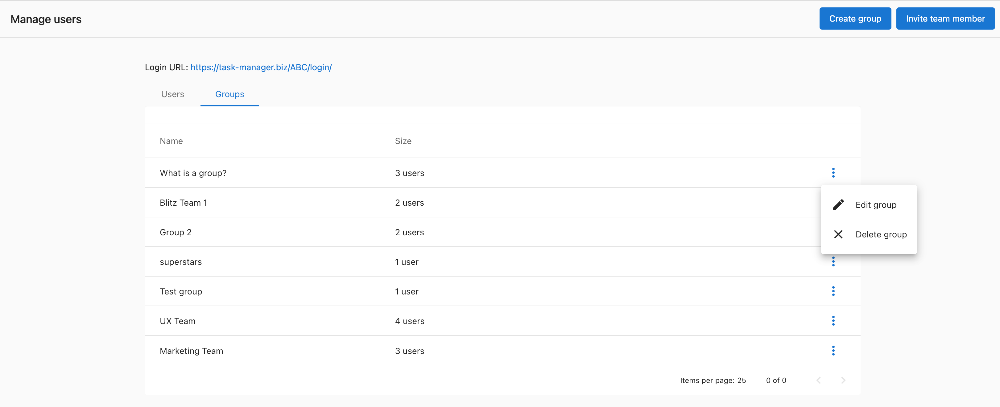
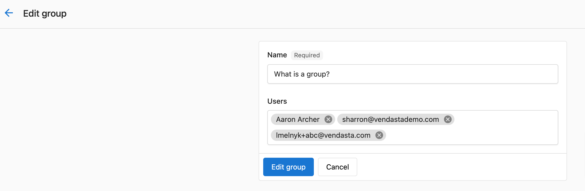

# Task Manager Users – Complete Overview

## What is Task Manager User Management?

Task Manager user management allows you to create, organize, and manage team members who will collaborate on projects and tasks. The system includes user creation, group organization, notification management, and permission control to structure your fulfillment team effectively.

## Why is Task Manager User Management important?

As companies grow, there's an increased need for structure. People begin to specialize, teams form, and work is divided. Most larger agencies feature complex hierarchies of people. Task Manager user management ensures the right person does the right job by matching your task management software to how your organization works in the real world.

Task Manager works best when your team uses it together. You can see the projects and tasks assigned to each other, track responsibilities, and automatically assign specific tasks to certain team members.

## What's Included with Task Manager User Management?

### User Creation and Management
- Create new Task Manager users with specific roles
- Assign Digital Agent or Manager permissions
- Send welcome emails to new users
- Update existing user permissions

### User Groups
- Create groups containing Task Manager users and other groups
- Structure staff hierarchies that match real-world organization
- Filter the `Tasks > Overview` page by group
- Add users and groups to multiple groups (many-to-many relationships)

### Notification System
- In-app notifications and email alerts for task assignments
- Customizable notification preferences for each user
- Specialized notifications like "Product Deactivated" and "Tasks Due Tomorrow"
- Direct links from notifications to specific tasks

### Access Control
- Role-based permissions (Digital Agent vs Manager)
- Manager-specific capabilities (delete tasks, bulk reassign, manage groups)
- Client access restrictions (clients cannot access Task Manager)

## How to Create Task Manager Users

1. Go to `Partner Center` > `Fulfillment` > `Users`
2. Click `Invite Team Member` OR search for an existing user to update permissions
3. **Option 1: Invite New Team Member**
   - Enter their `First name`, `Last name`, and `Email`
   - Choose their `Role` as Digital Agent
   - Optional: Make the user a manager (Managers can delete, bulk reassign tasks, and manage Task Manager groups)
   - Optional: Send Welcome Email to User
4. **Option 2: Update Existing User**
   - Search for an existing user
   - Edit Team Member Permissions to Digital Agent/Manager

## How to Create and Manage User Groups

### Creating User Groups

1. Go to `Partner Center` > `Fulfillment` > `Users`
2. Click `Create group`
3. Name the group
4. Optional: Add users and other groups
5. Click `Create group`

### Understanding Group Structure

Groups can contain Task Manager users and other groups. The relationship isn't one-to-one, so you can add each user and group to as many groups as you'd like.

If Group 3 contains both Group 1 and Group 2, then everyone in Group 1 and Group 2 will automatically be part of Group 3. If you remove a user directly from Group 3, they would still belong to that group if they are part of Group 1 or Group 2.

### Adding Users to Existing Groups

1. Go to `Partner Center` > `Fulfillment` > `Users`
2. Click `Groups`
3. Click on the `menu (3 dots)` > `Edit group` next to the group you wish to modify
4. Click on the `Users` fields to add or remove users or groups
5. Click `Edit group`

### Editing or Deleting Groups

1. Go to `Partner Center` > `Fulfillment` > `Users`
2. Click `Groups`
3. Click on the `menu (3 dots)` next to the group you wish to modify
4. Choose `Edit group` to modify or `Delete group` to remove
5. To delete: Click `Delete group` to confirm removal

:::warning
If a user is part of a group in the Groups field, that user will continue to be part of the group you are editing. To ensure they are fully removed, you'll need to also remove them from any other listed groups they are a part of.
:::

## How to Manage User Notifications

### Adjusting Individual Notification Settings

Task Manager users can adjust their notification settings directly within Task Manager:

1. Go to `Partner Center` > `Fulfillment` > `Open Task Manager`
2. Click the `notification bell` in the top navigation bar
3. Click the `settings gear` icon
4. Scroll down to `Task` and check the notifications you wish to receive
5. Click `Save` at the top right of the screen

### Key Notification Types

**Essential Fulfillment Notifications:**
- **Product Deactivated**: Get notified when a product associated with a project is deactivated. This helps agents decide whether to continue working on a project
- **Tasks Due Tomorrow**: When tasks are within 24 hours of their due date, the agent is notified

**Task Assignment Notifications:**
- **Task Assignee Update**: Get notified when a task is assigned to you
- **Task Manager Tagging Notification**: Get notified when you're tagged on a task
- **Task Dependency Update**: Get notified when a dependent task is unlocked

**Client Interaction Notifications:**
- **Task Manager Visible Task Approval notification**: Get notified when a client approves a task from the project tracker
- **Task Manager Visible Task Feedback notification**: Get notified when a client provides feedback on a visible task
- **Task waiting for your input**: Be notified when there is a task waiting for your input

### Managing System-Wide Notification Settings

Both Product Deactivated and Tasks Due Tomorrow notifications are enabled by default. Any user can change their notification settings:

1. Log in to `Partner Center`
2. Click  > 
3. Uncheck both notifications (email and in-app) under `Task`
4. Click `Save`

## Understanding Client Access Restrictions

**Clients do not have access to Task Manager.** Task Manager is a project management tool built for fulfillment agents and other internal teams. If you were to add a client as a Task Manager user, they would be able to see all accounts, not just their own. They would also be able to see private notes and adjust global task settings.

However, it is possible for clients to see updates on their fulfillment projects in Business App.

## Manager vs Digital Agent Permissions

### Digital Agent Permissions
- Create and complete tasks
- View assigned projects and tasks
- Receive notifications
- Participate in group activities

### Manager Permissions (in addition to Digital Agent permissions)
- Delete tasks
- Bulk reassign tasks
- Manage Task Manager groups
- Access advanced administrative functions

## Frequently Asked Questions (FAQs)

Can clients access Task Manager?

No, clients cannot access Task Manager. Task Manager is designed for internal fulfillment teams only. If clients were given access, they would see all accounts and private information, not just their own projects.

What's the difference between a Digital Agent and a Manager?

Digital Agents can create and complete tasks, while Managers have additional permissions including the ability to delete tasks, bulk reassign tasks, and manage Task Manager groups.

Can I add a user to multiple groups?

Yes, the relationship between users and groups isn't one-to-one. You can add users and groups to multiple groups as needed to match your organizational structure.

How do I know when tasks are due soon?

Enable the "Tasks Due Tomorrow" notification to receive alerts when tasks are within 24 hours of their due date. This notification is enabled by default.

What happens when a product is deactivated?

When a product associated with a project is deactivated, fulfillment agents receive a "Product Deactivated" notification. This helps them decide whether to continue working on the associated project.

Can I filter tasks by user group?

Yes, managers can filter the Tasks > Overview page in Partner Center by group, making it easier to manage work across different teams.

How do notifications work when I'm assigned a task?

Task Manager users receive both in-app notifications and emails when assigned a task or project. Clicking the notification or email link takes you directly to the task in Task Manager.

What happens if I remove a user from a group but they're in a sub-group?

If a user is part of a sub-group within the group you're editing, they will continue to be part of the main group. You'll need to remove them from all relevant groups to fully remove their access.

Can I turn off specific types of notifications?

Yes, each user can customize their notification preferences through the notification settings. You can choose to receive email notifications, in-app notifications, or both for different types of events.

How do I invite someone who already has access to other parts of the system?

You can search for existing users and update their permissions to include Digital Agent or Manager access for Task Manager, rather than creating a new invitation.

What notifications do salespeople receive about fulfillment?

Salespeople can receive "Tasks Due Tomorrow" notifications to keep tabs on upcoming work, and notifications when tasks are "Waiting On Customer" for their accounts.

Can groups contain other groups?

Yes, groups can contain both individual users and other groups. This creates a hierarchy where everyone in contained groups automatically becomes part of the parent group.

