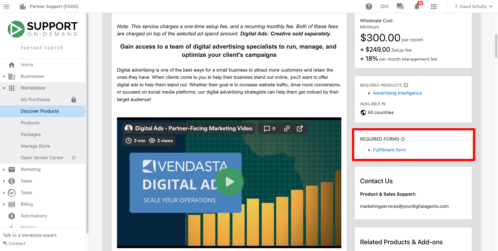
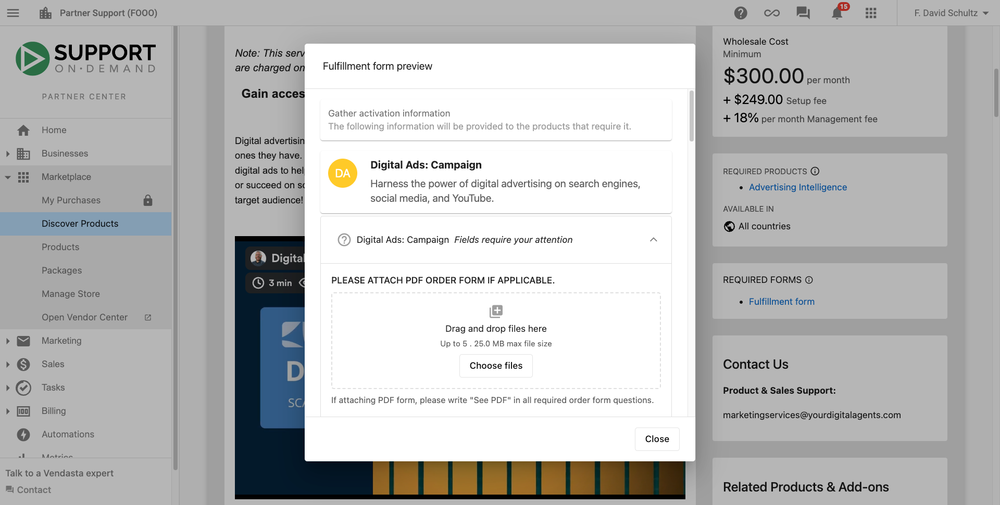
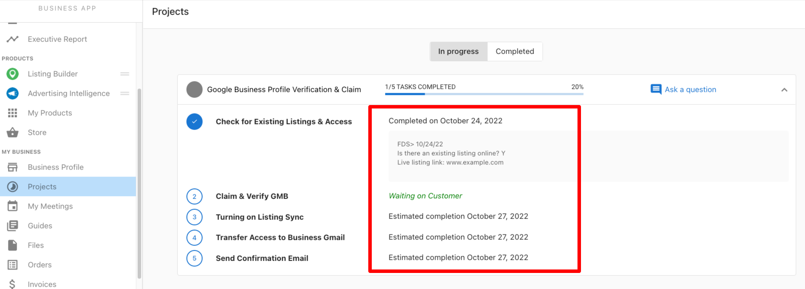
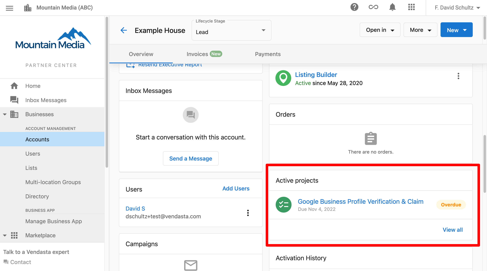
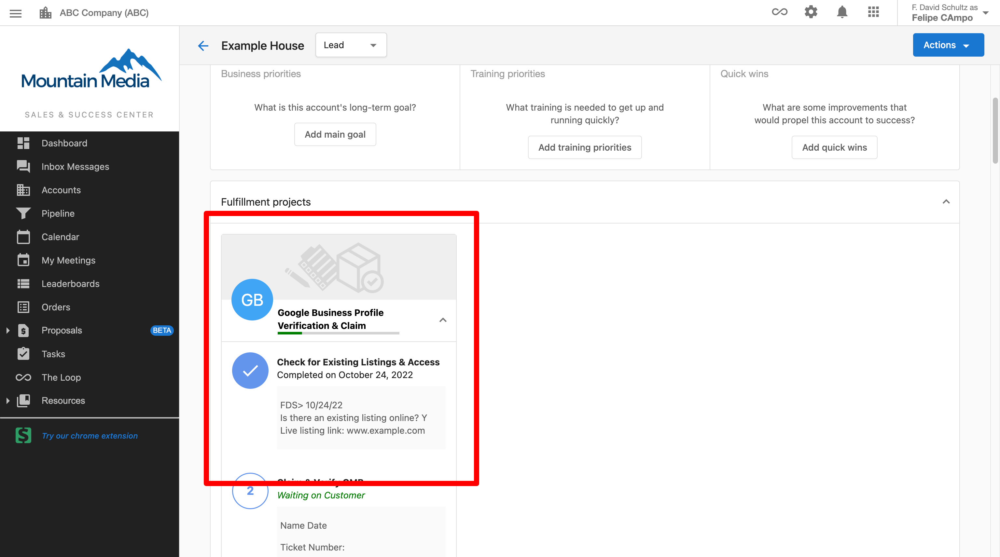
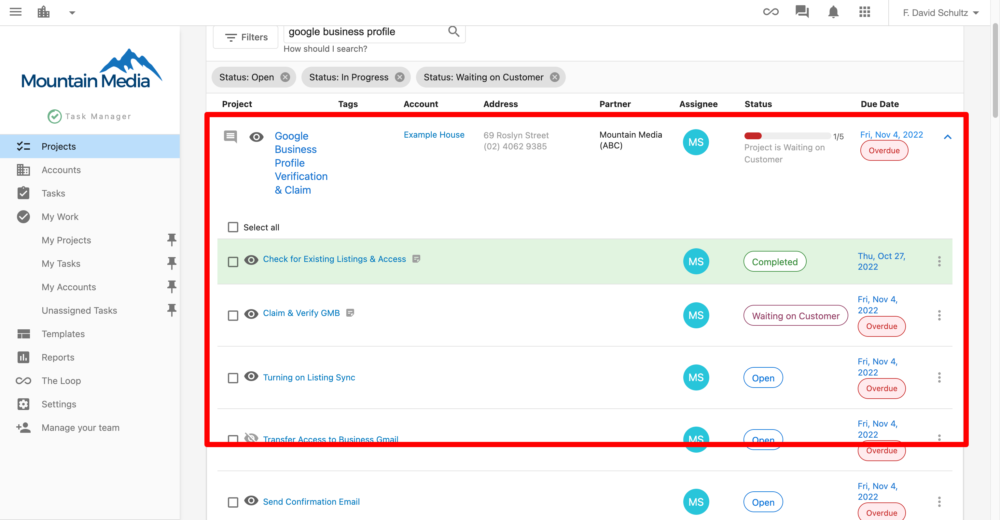

Vendasta's Marketing Services allows you to outsource your fulfillment work to our team of digital experts. By leveraging our team and our processes, you're able to deliver great websites, ad campaigns, and blog content with industry-leading turnaround times and ensure that your clients have optimized listing presence, a managed reputation, and engaged customers through social networks. Each service is executed based on industry best practices and tried-and-true processes to ensure fast delivery of quality results. Follow this guide to help you get started in using Marketing Services and ensure you're set up for success!

## Getting Started Checklist

1. [Set yourself up for success](#set-yourself-up-for-success)
2. [Learn best practices: videos by service](#learn-best-practices-videos-by-service)
3. [Order the product(s)](#order-the-products)
4. [Attend the pre-launch call (if applicable)](#attend-the-pre-launch-call-if-applicable)
5. [Track the progress of fulfillment](#track-the-progress-of-fulfillment)

## Set yourself up for success

Building a new website, taking over your customers' social posting, and setting up a successful digital ads campaign comes with a lot of moving parts.

These steps are laid out to help equip you with plenty of resources and information to get even more out of your fulfilled services!

### Find product details and assets in the Marketplace

  <iframe style={{position: 'absolute', top: '0', left: '0', width: '100%', height: '100%'}} src="https://www.loom.com/embed/7deebc4ccef24086a6902caeb7bab281?sid=89d16034-d3d0-4719-886c-fae400f1ddc0" frameborder="0" allowFullScreen></iframe>

1. Go to Partner Center > Marketplace > [Discover Products](https://partners.vendasta.com/marketplace/products)
2. Click More filters
3. Check the box for Marketing Services
4. Click into any service you want to learn more about
5. Read through product information, find FAQs, and check out add-ons
6. Click Screenshots & Files to find marketing images, sales decks, and expectation brochures
7. Click the Start Selling button in the top right corner to add to your store

### Familiarize yourself with the service expectations

  <iframe style={{position: 'absolute', top: '0', left: '0', width: '100%', height: '100%'}} src="https://www.loom.com/embed/6694229ee413425184c06928986543d3?sid=ee0bfef7-6c71-42b2-867f-97065e7a316a" frameborder="0" allowFullScreen></iframe>

Expectation brochures are unbranded documents provided by Marketing Services that break down the timelines, details, and deliverables that you and your customers can expect after ordering. You can also check out [this article](/getting-started/getting-started-guides/expectations-by-service-within-marketing-services) to get a high-level overview and reference for expectations across all product lines.

You can find expectation brochures inside of the platform:

1. Go to Partner Center > Marketplace > [Discover Products](https://partners.vendasta.com/marketplace/products)
2. Go to the product page for the Marketing Services product for which you want more expectation information
3. Click Screenshots & Files
4. Look for a file with **Expectation** in the title

Or you can access them on the Marketing Services [unbranded website](https://examples.yourdigitalagents.com/) and click Expectation Brochures.

[Learn more.](/getting-started/getting-started-guides/expectations-by-service-within-marketing-services)

### Review the fulfillment forms

An important step in ensuring a quick turnaround for your fulfillment is providing a completed fulfillment form. The information in these forms help the Marketing Services teams to complete the ordered services in alignment with what you and your customer wants.

Fulfillment form information is also available in Partner Center > Marketplace > Discover Products by visiting any of the product pages. On the right, you will find a section for Required Forms and clicking into it will show you the form.

Accessing the fulfillment form preview in Partner Center is one of the best ways to check for the information. You can find downloadable pdfs with some of the important form details [here](https://examples.yourdigitalagents.com/expectation-brochures/#:~:text=General%20Product%20Order%20Information).

## Learn best practices: videos by service

Here are some hints and answers to some of our most frequently asked questions, directly from members of our team!

### Tips & Tricks - Websites

  <iframe style={{position: 'absolute', top: '0', left: '0', width: '100%', height: '100%'}} src="https://www.loom.com/embed/0a38b45b78c24a449dd7dc17a2933bab?sid=7ea8ab34-2888-462d-88b2-65ba9049ce6a" frameborder="0" allowFullScreen></iframe>

### Tips & Tricks - Digital Ads

  <iframe style={{position: 'absolute', top: '0', left: '0', width: '100%', height: '100%'}} src="https://www.loom.com/embed/3d5fae9419f2492c985eee9ae8133abc?sid=d0164e70-dcb7-4000-ba82-f062dc344c0b" frameborder="0" allowFullScreen></iframe>

### Tips & Tricks - Social Posting

  <iframe style={{position: 'absolute', top: '0', left: '0', width: '100%', height: '100%'}} src="https://www.loom.com/embed/7d973898cacd4f5389e3481e499f262e?sid=4f87dcca-6d5a-4882-b771-7e084bf65e40" frameborder="0" allowFullScreen></iframe>

### Tips & Tricks - Blogs

  <iframe style={{position: 'absolute', top: '0', left: '0', width: '100%', height: '100%'}} src="https://www.loom.com/embed/93bb445239e34c3785939201e8a0cb14?sid=d44372a4-3c20-4365-9725-82d4f102ee63" frameborder="0" allowFullScreen></iframe>

### Tips & Tricks - Review Responses & Requests

  <iframe style={{position: 'absolute', top: '0', left: '0', width: '100%', height: '100%'}} src="https://www.loom.com/embed/3204cefd8224407da154ec5a9dc9b282?sid=051ca87c-e1a0-489d-802b-b61841fb16f2" frameborder="0" allowFullScreen></iframe>

### Tips & Tricks - Listings

  <iframe style={{position: 'absolute', top: '0', left: '0', width: '100%', height: '100%'}} src="https://www.loom.com/embed/8d08c2dc63114e4bb8c4493feb48a77d?sid=b0ca6655-03b5-4895-a4c3-2dabaa87ce2e" frameborder="0" allowFullScreen></iframe>

### Tips & Tricks - Common Blockers

  <iframe style={{position: 'absolute', top: '0', left: '0', width: '100%', height: '100%'}} src="https://www.loom.com/embed/6be02d40d6694610be3162380e29fcda?sid=febcdd55-beb7-4690-9666-36aea6315868" frameborder="0" allowFullScreen></iframe>

## Order the product(s)

### Ordering products - General

  <iframe style={{position: 'absolute', top: '0', left: '0', width: '100%', height: '100%'}} src="https://www.loom.com/embed/97f19914b7bf4e2ebc1009975ef1551b?sid=6d42f3b8-7c84-4eb9-b9d3-5f6dc24782d1" frameborder="0" allowFullScreen></iframe>

Ordering Marketing Services products is the same as [ordering any product](/getting-started/announcements/ordering-products) in the platform. It's important to know that our teams require additional information after the product has been ordered so they can successfully fulfill the service in line with what you and your customers require.

1. Go to Partner Center > Businesses > Accounts > Click on the account for which you want to place an order
2. Click Order Products
3. Select the package(s) or product(s) you wish to order
   - You may be prompted to activate additional products that are needed to fulfill services (eg. Social Marketing is needed for our team to post as part of our social posting services)
4. Click Proceed to Next Step
5. Review and fill in any contact information
6. Click Next
7. Review and Purchase

After completing the purchase, you will be presented with a [fulfillment form](/getting-started/getting-started-guides/marketing-services-fulfillment-forms). This form contains necessary details to be completed so that Marketing Services teams can successfully complete the work that has been purchased.

Check out this video for full details on inputting information, sharing, and submitting a fulfillment form.

  <iframe style={{position: 'absolute', top: '0', left: '0', width: '100%', height: '100%'}} src="https://www.loom.com/embed/ed6f1b17347c44948d2be512f386c806?sid=f5159b91-7c40-4142-8253-e63489948854" frameborder="0" allowFullScreen></iframe>

### Ordering - Website Services

Website services in particular require a lot of information about a business in order to successfully create their website and web copy with expedient turnaround times. Check out our [website ordering guide](https://marketing-services.zendesk.com/hc/en-us/articles/19127162749463) and the video below for more info.

:::note
The following video showcases an older workflow from before the implementation of fulfillment forms. The workflow is very similar, with the exception that the ability to upload a content form pdf comes *after* the purchase.
:::

  <iframe style={{position: 'absolute', top: '0', left: '0', width: '100%', height: '100%'}} src="https://www.loom.com/embed/18352d523eea4be88fe1489adf1d5116?sid=ee4687f2-73d7-4de1-8507-b64125c856dc" frameborder="0" allowFullScreen></iframe>

### Ordering - Digital Ads

When ordering Digital Ads, you will be required to choose the ad spend for the campaign. This is the amount specific to the ad spend and then the system will calculate the ad management fee for you. You will be prompted to do this between steps 4 and 5 in the workflow noted above.

Note that the ad spend, management fee, and setup fees are all a part of the wholesale cost.

Check out this video to learn more:

  <iframe style={{position: 'absolute', top: '0', left: '0', width: '100%', height: '100%'}} src="https://www.loom.com/embed/b2028bb8ab544380865fbac5df13c740?sid=9625e292-03d0-4a13-9794-282a54ce46b0" frameborder="0" allowFullScreen></iframe>

## Attend the pre-launch call (if applicable)

Almost all services include a pre-launch call, often called an onboarding call, to welcome the customer, go through a content questionnaire, and set expectations for the services. Check out [this article](https://marketing-services.zendesk.com/hc/en-us/articles/19299630230423-Expectations-by-Service-within-Marketing-Services) to see which services receive a pre-launch call.

  <iframe style={{position: 'absolute', top: '0', left: '0', width: '100%', height: '100%'}} src="https://www.loom.com/embed/bfe981ad72fc4c6e8c5689ccb0b5af9f?sid=51bdebe0-f25c-41ba-be8d-2a3cd2417bc4" frameborder="0" allowFullScreen></iframe>

Our team will choose a time for this call and send an invite to any contacts listed at the time of order (these contacts will also be given a link to reschedule if necessary as part of the invite). The call will happen over a Google meet, the agent from Marketing Services typically does this with camera off to preserve white label, and will use the call to align the customer expectations and needs from the service with fulfillment processes.

This call is also important to ensure that we have all of the necessary access and connections that we need. Learn more about [connecting accounts in Business App](/getting-started/getting-started-guides/connecting-accounts-in-business-app). You can also learn more about [how Facebook connections for Digital Ads work](/getting-started/getting-started-guides/how-facebook-connections-for-digital-ads-work).

## Track the progress of fulfillment

  <iframe style={{position: 'absolute', top: '0', left: '0', width: '100%', height: '100%'}} src="https://www.loom.com/embed/43b9b517883a4e71a1d7f9c33dfae858" frameborder="0" allowFullScreen></iframe>

You, your sales team, and your customers can keep an eye on the progress of fulfillment for the services you have ordered.

The easiest way to access this information is through Business App > Projects.

There is also a Projects card found in the account under Partner Center > Accounts > Manage Accounts.

Your salespeople can view this information on the account page under Fulfillment projects.

You can also find information by going into Task Manager > Projects. But note that some of this information may be "grayed out" or inaccessible because the project is being completed in Marketing Service's Task Manager account and a read-only version is being shared with you.

[**Learn more.**](/getting-started/product-guides/task-manager/task-manager-projects)

[Back to top](#getting-started-checklist)