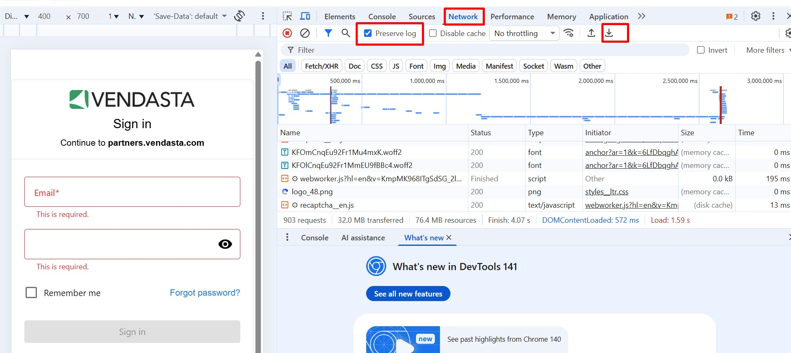

# Partner Troubleshooting Guide

This space contains guides which will aid you in troubleshooting some issues you may possibly encounter while working in the platform. These guides should help you determine if an issue you are facing can be resolved before they are considered technical issues which require escalation to the Vendasta Support team.

:::info
Please note there is no guarantee these actions will resolve your issue so if after troubleshooting you still experience issues please submit a ticket to [support@vendasta.com](mailto:support@vendasta.com)
:::

## Common issue: Login issues and platform slowness

### Explanation

Login failures and platform slowness are usually caused by browser-related issues rather than a platform outage.

### Issue

- Cannot log in or login page won't load
- Stuck on a loading spinner after entering credentials
- Platform is unusually slow or unresponsive

### Fix

1. **Check the Vendasta status page** — Visit [status.vendasta.com](https://status.vendasta.com) to rule out an active outage before troubleshooting your browser.

2. **Clear your browser cache and cookies** — Cached data can interfere with login. See the [Cache and Cookies section](#common-issue-cache--cookies) below for steps.

3. **Disable browser extensions** — Ad blockers, Dark Mode tools, and password managers can block platform resources. Disable all extensions and try again.

4. **Try incognito or private browsing mode** — Extensions are typically disabled in incognito mode, which helps isolate whether an extension is the cause.

5. **Try a different browser** — If the issue only occurs in one browser, the problem is browser-specific. Chrome is recommended for the Vendasta platform.

6. **If the issue persists** — Contact [support@vendasta.com](mailto:support@vendasta.com) with details about what you're seeing.

## Common issue: Cache & Cookies

### Explanation

Our platform is built to rely on your web browser's environment, a clean environment means the platform is happier and has fewer potential errors. By clearing your cache and cookies, you reset your browser settings and reduce the impact of cached data-related issues.

### Issue

- 404/500 errors
- Spinning wheel
- Loading irrelevant information
- Duplicating information from a previous page
- Blank or partially loaded screens
- Images or videos not loading
- Login failed with no error

### Fix

:::warning Important Note
It is a good practice to capture a HAR file to identify potential issues before clearing Cache & Cookies. See the HAR file section below for detailed instructions.
:::

1. Clear cache and cookies
2. Close out all open browsers
3. Re-open intended page
4. If the issue remains contact [support@vendasta.com](mailto:support@vendasta.com)

## Common issue: Mailing Information Not Configured

### Explanation

This error will occur when the email settings have not been enabled on their default Market. This contact information needs to be enabled to comply with international spam laws.

### Issue

This error will appear in the history of a list that failed to be added to a campaign.

### Fix

1. Navigate to **Administration > Customize**
2. Select **Markets** from the top tab
3. Click the **pencil** next to the market name to edit settings
4. Scroll down to **Email Settings**
5. Change the contact information to **Your Contact Information** from **None**

## Common issue: Network and Platform Connectivity (How to Generate a Network HAR File)

### Explanation

There may be instances where you are not able to access areas of the platform while others are able to. In some cases, this can be linked to your network settings blocking specific domains through which we load some of our resources that you are accessing.

In order for our Technical Support Team to better troubleshoot these types of issues, we may require your Network (HAR) File to identify these errors or the root cause of the problem.

### Issue

- Unable to access certain platform areas while others can
- Network connectivity problems
- Resources not loading properly
- Platform functionality blocked by network settings
- Technical support requesting HAR file for diagnosis

### Fix

#### For Chrome and Most Browsers

1. Go to the Login page on Business/Partner Center (or any area of the platform that you are having issues in)
2. Right-click on the page and select **"Inspect"** from the selection panel that pops up
3. In the console that pops up select the **"Network"** tab
4. Select **"Preserve Log"**
5. Complete the same action you were attempting to do
6. You should see a bunch of information populate in the window that pops up

7. With the **Network** panel open, **refresh the page** and try the action again (if applicable).  
8. Click the **Download icon (↓)** at the top of the Network panel.  
9. Select **"Export HAR (Sanitized)"** to save your network log.  
10. Choose a location on your computer to save the file.  
11. Email the file to the **Support On Demand** team if requested, so we can diagnose the issue.

:::info File Size Note
The HAR file may be over 35MB. If so, we recommend file sharing with Google Drive.
:::

#### For Safari

To get your HAR file in Safari:

1. Navigate to the menu bar at the top of the screen, and click on **"Safari"** then select **Preferences > Advanced**
2. Make sure the option **"Show Develop menu in the menu bar"** (the last setting) is selected
3. Then, you should be able to proceed with getting a HAR file like normal from the browser:
   - Right click > `Inspect element` → `Network` > Check **"Preserve log"** > Refresh page > Right click on any lines that appear > Select **"Save HAR"**

## Common issue: Product Activation Failed but I was Charged

### Explanation

In the event that the product activation fails, our system will automatically initiate a refund for the failed products. For instant billing, the funds will appear in your bank account within 5 business days typically.

For invoiced billing, the refund will be in the form of removing the failed product activation from the monthly invoice.

### Issue

A credit card was charged the wholesale cost of a failed product activation.

### Fix

No fix is required.

1. Check **Billing Center** under **Refunds**
2. Once the refund has been issued, you can see it in **Partner Center** by going to **Administration > Financial Documents > Credit Notes**

## Common issue: Jim Salesman is Showing on the Email When I Send a Test

### Explanation

The Jim Salesman salesperson contact card will appear when we don't select an account to impersonate on the test email. You can replicate real-life contact information by selecting an account from the menu at the top of the email preview in the text box that reads "Generic Account". Once an account is selected, you will see the new information in the preview email.

### Issue

Jim Salesman is showing as the Salesperson contact card instead of your contact information.

### Fix

1. From the email preview select the **Generic Account** drop-down menu
2. Select the business you wish to replicate in the test email
3. You will now see the assigned salesperson's contact information on the test email

## Common issue: Review Display Widget Not Showing Google Reviews

### Explanation

The default widget available in Reputation AI Express ONLY supports My Listing reviews.

### Issue

You are using the review display widget but Google, Facebook and other review sources are missing from the widget.

### Fix

1. Activate the Reputation AI add-on Review Display Widget Pro
2. Direct client to replace the currently embedded code on their website with the new code in the Widget section of Reputation AI

## Common question: When to Contact Marketing Support vs Support on-Demand

### Explanation

Send a ticket to Support on-Demand if you are unsure where the best place to submit the ticket is, we will make sure it gets where it needs to be. However, there are some challenges when we get a ticket for Vendasta Services. Vendasta Services does not use the same system that Support on-Demand uses, this means that we can't just send the ticket to them to action. This can cause delays and loss of information in the transfer.

### Issue

Unsure who to contact about a Vendasta Services related issue or question.

### Fix

1. **Is this an error with the platform/product?**
   - **support@vendasta.com**

2. **Does this involve making changes to work Vendasta Services is currently doing or will be doing in the future?**
   - **support@yourdigitalagents.com**

3. **Is there a reporting error or an error message blocking work, or does this feel like a bug?**
   - **support@vendasta.com**

4. **Is this communication/feedback/questions for the Vendasta Services teams?**
   - **support@yourdigitalagents.com**

## Best practice: Submitting a Support Ticket

### Explanation

The more applicable information we have, the better our investigation will be, the fewer times we will have to reach out to you, and the quicker we can find an answer/escalate the problem. Understanding your specific processes and terminology helps our Support Agents provide more targeted assistance.

### Issue

Unsure on what to include in a support request.

### Fix

For best results, please include the following information in the body of the ticket or request:

1. Your Partner ID
2. Account Group ID (if applicable)
3. User or team member affected (if applicable)
4. Replication Steps
5. Screenshots (or video) of error messages

These best practices are highly recommended when submitting a ticket to support.

## Frequently Asked Questions

What is a HAR file and why do you need it?

A HAR (HTTP Archive) file is a log of network activity that captures all the web requests made by your browser. It helps our Technical Support Team identify network-related issues, blocked resources, or connectivity problems that might be preventing you from accessing certain platform features.

Is it safe to share my HAR file?

HAR files can contain sensitive information including cookies, passwords, and personal data. Only share HAR files with Vendasta Technical Support when requested for troubleshooting. Never share HAR files publicly or with unauthorized parties.

My HAR file is too large to email. What should I do?

HAR files can be quite large (often over 35MB). If your file is too large for email, upload it to Google Drive, Dropbox, or another file-sharing service and share the link with our support team instead.

Can I generate a HAR file on mobile devices?

While possible on some mobile browsers, HAR file generation is most reliable on desktop browsers like Chrome, Firefox, Safari, and Edge. For the best troubleshooting experience, we recommend using a desktop browser when generating HAR files.

How long should I wait before saving the HAR file?

Wait until you've reproduced the issue you're experiencing before saving the HAR file. This ensures the file captures the problematic network activity. If the issue occurs immediately, you can save the file right after the problem appears.

How often should I clear my browser cache and cookies?

Clear your cache and cookies when experiencing platform issues like login problems, display errors, or unexpected behavior. As a general practice, clearing cache monthly helps maintain optimal browser performance, but only clear when troubleshooting specific issues.

Why do I see "Jim Salesman" in my test emails?

"Jim Salesman" appears when no specific account is selected for email preview. To see realistic contact information, select an actual account from the "Generic Account" dropdown in the email preview before sending your test.

Will I be refunded if product activation fails?

Yes, if product activation fails, our system automatically initiates a refund for the failed products. For instant billing, refunded funds typically appear in your bank account within 5 business days.

What's the difference between Support on-Demand and Vendasta Services?

Support on-Demand handles technical platform issues, while Vendasta Services manages marketing campaigns and creative work. If unsure, submit to Support on-Demand first - they'll route your ticket to the appropriate team if needed.

Why can't I access certain areas of the platform?

Platform access issues can be caused by browser cache problems, network restrictions, or account permissions. Try clearing your cache first, then generate a HAR file if issues persist. Your network may be blocking specific domains required for platform functionality.

