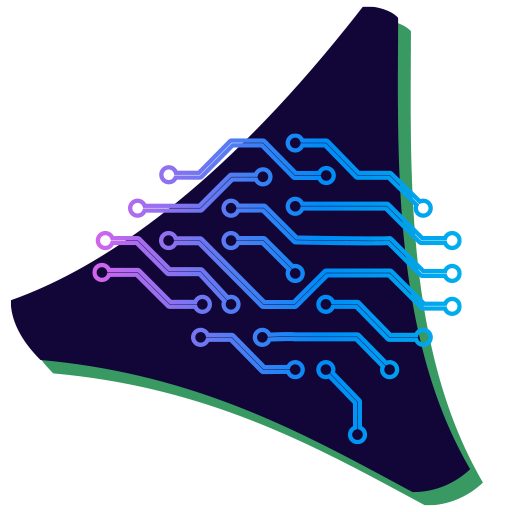

# Getting Started with Vendasta (Start Here)

Use this guide to quickly get oriented—what the platform includes, how onboarding works, trial limitations, and continued learning resources.

## Platform overview

Vendasta provides an end-to-end platform that helps you scale sales, marketing, fulfillment, and operations.

<iframe src="//www.youtube-nocookie.com/embed/lrX17R94zSo" width="560" height="315" frameborder="0" allowFullScreen></iframe>

### The platform has 3 environments

One for you and your salespeople, one for your customers, and one for fulfillment. Together, they empower you to provide products and services to local businesses.

:::note
Some features listed below are not available with the Free and Startup plans. [Learn more](https://www.vendasta.com/pricing)
:::

### Partner Center is for your business

- Customize your branding and settings
- Manage your prospects and customers
- Set up products and services
- Build your online store
- Publish and track marketing campaigns
- Manage salespeople
- Manage billing
- Manage customers' products, services, and credentials

Admins can access Partner Center via [partners.vendasta.com](https://partners.vendasta.com/dashboard?utm_campaign=partner-onboarding&utm_medium=referral&utm_source=resource-center&utm_content=welcome-inline-link). Partner Center isn't white‑labeled, and the URL isn't customizable.

### Business App is for your customers

In Business App, your prospects and customers can:

- Receive updates about key business metrics
- Access the products they've purchased
- Browse products and services in your online store
- View proof‑of‑performance reports

Your customers access Business App from a URL unique to your agency (found under Accounts > Manage Users in Partner Center). The Growth and Scale plans include the ability to customize this domain.

### Task Manager is for fulfillment

Your team can:

- Update listings, respond to reviews and mentions
- Create social posts and engage with leads
- Onboard new customers and complete custom tasks

Access Task Manager at [https://task-manager.biz/login/](https://task-manager.biz/login/).

## Partner Onboarding

Our Onboarding Specialists help you get set up for success. They can train you on:

- Adding accounts
- Building your store
- Building email marketing campaigns
- Setting up automations
- Running, customizing, and sending Snapshot Reports
- Adding your team
- Building sales and customer onboarding processes

To learn more about onboarding packages, contact onboarding@vendasta.com.

## Trial limitations

Expand to view trial details and limitations

### What is a trial?

A trial allows limited access to higher‑tier features for a set time.

### How to initiate a trial

1. From Partner Center (no credit card needed)
2. By a Vendasta representative

### What features are limited while on Trial?

| Feature | How is it limited? |
| --- | --- |
| Vendasta payments | Unavailable for Free partners on a trial. Only available on paid tiers. |
| Start selling 3rd party products in the Marketplace | Unavailable for Free or Starter partners on a trial. |
| Publishing email campaigns and sending test emails | Unavailable for Free partners on a trial. Only available for paid tiers. |
| Acquisition Widgets | Unavailable for Free partners on a trial. |
| Premium Reports | Unavailable for Free or Starter partners on a trial. |
| Additional seats | Unavailable on a trial. |
| Snapshot Reports and Standard Product allotment | Only the amount for the current subscription is available. |

## Continued learning

  

    
  

  

    <h3><a href="https://academy.vendasta.com/">Vendasta Academy</a></h3>
    
A place to earn certification, connect with others, events, and find assistance.

    
<a href="https://academy.vendasta.com/">Vendasta Academy →</a>

  

  

    
  

  

    <h3><a href="https://www.vendasta.com/webinar/">Vendasta Live Training</a></h3>
    
Once you feel comfortable with the process, it is time to intimately learn about these products. In live training, you'll do just that.

  

  

    
  

  

    <h3><a href="https://www.facebook.com/groups/vendasta/">Visit the Community!</a></h3>
    
Ask questions, browse posts, and connect with peers and Vendasta experts.

  

## FAQs

Are some features unavailable on the Free plan?

Yes. Some features are unavailable on Free and Startup plans. See the current plan comparison at `https://www.vendasta.com/pricing`.

