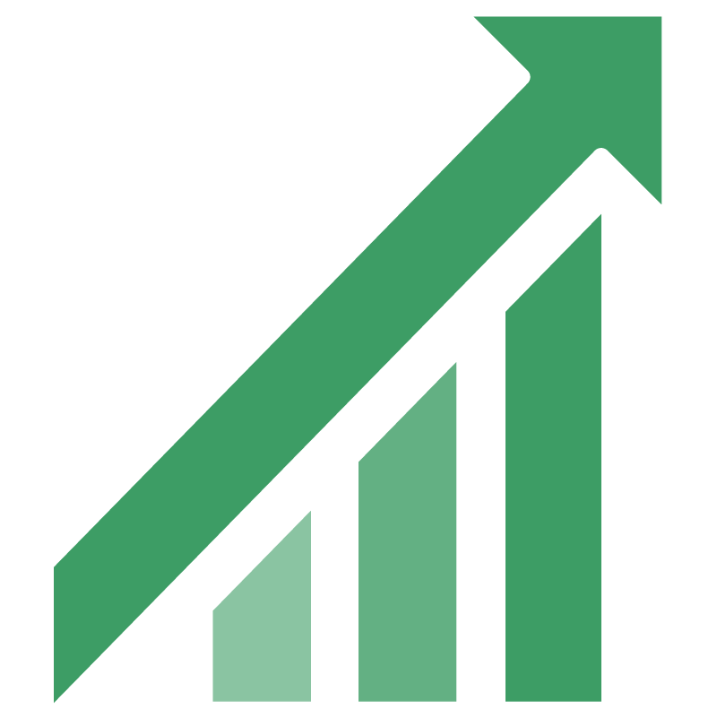

# Intro to Vendasta

Use this guide to quickly get oriented with the Vendasta platform; each platform environment, how onboarding works, trial limitations, and continued learning resources.

## Platform overview

Vendasta provides an end-to-end platform that helps you scale sales, marketing, fulfillment, and operations.

<iframe src="//www.youtube-nocookie.com/embed/lrX17R94zSo" width="560" height="315" frameborder="0" allowFullScreen></iframe>

### The platform has 3 environments

One for administrators and salespeople (Partner Center), one for customers (Business App), and one for fulfillment (Task Manager). Together, they empower you to provide products and services to local businesses.

:::note
Some features listed below are not available with the Free and Startup plans. [Learn more](https://www.vendasta.com/pricing)
:::

### Partner Center is for your business

- Customize your branding and settings
- Manage your prospects and customers
- Set up products and services
- Build your online store
- Publish and track marketing campaigns
- Manage salespeople
- Manage billing
- Manage customers' products, services, and credentials

Admins can access Partner Center via [partners.vendasta.com](https://partners.vendasta.com/dashboard?utm_campaign=partner-onboarding&utm_medium=referral&utm_source=resource-center&utm_content=welcome-inline-link). Partner Center isn't white‑labeled, and the URL isn't customizable.

### Business App is for your customers

In Business App, your prospects and customers can:

- Receive updates about key business metrics
- Access the products they've purchased
- Browse products and services in your online store
- View proof‑of‑performance reports

Your customers access Business App from a URL unique to your agency (found under Accounts > Manage Users in Partner Center). The Growth and Scale plans include the ability to customize this domain.

### Task Manager is for fulfillment

Your team can:

- Update listings, respond to reviews and mentions
- Create social posts and engage with leads
- Onboard new customers and complete custom tasks

Access Task Manager at [https://task-manager.biz/login/](https://task-manager.biz/login/).

## Levels of access

Vendasta's platform has four levels of access, each with its own login.

### Administrators

Administrators, or admins, are top‑level users designed to manage all aspects of their Vendasta experience. They are given access to the powerful Partner Center dashboard, enabling them to efficiently manage their clients.

### Salespeople

Salespeople have mid‑level access to the platform. They are the primary representatives your clients will communicate with.

### Users

Users have low‑level access. They are given access to Business App to view activity, reports, and purchased products.

### Digital Agents

Digital Agents have access to Task Manager to work on fulfillment tasks and projects.

## Partner Onboarding

Our Onboarding Specialists help you get set up for success. They can train you on:

- Adding accounts
- Building your store
- Building email marketing campaigns
- Setting up automations
- Running, customizing, and sending Snapshot Reports
- Adding your team
- Building sales and customer onboarding processes

To learn more about onboarding packages, contact onboarding@vendasta.com.

## Trial limitations

Expand to view trial details and limitations

### What is a trial?

A trial allows limited access to higher‑tier features for a set time.

### How to initiate a trial

1. From Partner Center (no credit card needed)
2. By a Vendasta representative

### What features are limited while on Trial?

| Feature | How is it limited? |
| --- | --- |
| Vendasta payments | Unavailable for Free partners on a trial. Only available on paid tiers. |
| Start selling 3rd party products in the Marketplace | Unavailable for Free or Starter partners on a trial. |
| Publishing email campaigns and sending test emails | Unavailable for Free partners on a trial. Only available for paid tiers. |
| Acquisition Widgets | Unavailable for Free partners on a trial. |
| Premium Reports | Unavailable for Free or Starter partners on a trial. |
| Additional seats | Unavailable on a trial. |
| Snapshot Reports and Standard Product allotment | Only the amount for the current subscription is available. |

## Continued learning

  

    
  

  

    <h3><a href="https://academy.vendasta.com/">Vendasta Academy</a></h3>
    
A place to earn certification, connect with others, events, and find assistance.

    
<a href="https://academy.vendasta.com/">Vendasta Academy →</a>

  

  

    
  

  

    <h3><a href="https://www.vendasta.com/webinar/">Vendasta Live Training</a></h3>
    
Once you feel comfortable with the process, it is time to intimately learn about these products. In live training, you'll do just that.

  

  

    
  

  

    <h3><a href="https://www.facebook.com/groups/vendasta/">Visit the Community!</a></h3>
    
Ask questions, browse posts, and connect with peers and Vendasta experts.

  

## Supported countries

Our platform can be used in all countries. Please see below for the supported functionality.

### Reputation Management

| Listings | Limited available sources for other countries |
| --- | --- |
| Reviews | Limited available sources for other countries |
|  | *Our source list has been optimized for the United States, Canada, Australia, and New Zealand. [View the full list of sources.](../../administration/platform-settings/customize/listing-and-review-sources-that-support-media)* |
| Mention Searches | English only |
| Social Activity |  |
| Social Audience |  |

### Social Marketing

| Respond to Customers |  |
| --- | --- |
| Content Searches |  |
| Social Post |  |

### Local SEO

| My Listing |  |
| --- | --- |
| Citation Builder | The US Only |
| Listing Sync Pro | The US, CAN, Australia, France, Italy, Ireland, Germany, South Africa, UAE, UK, and International offering |

## Country codes (ISO 3166 Alpha-2)

Vendasta uses 2‑digit country codes that follow the ISO 3166 International Standard. The full list is provided below for reference.

View full list of country codes

| Country | Alpha-2 code |
| ------- | ------------ |
| Afghanistan | AF |
| Albania | AL |
| Algeria | DZ |
| American Samoa | AS |
| Andorra | AD |
| Angola | AO |
| Anguilla | AI |
| Antarctica | AQ |
| Antigua and Barbuda | AG |
| Argentina | AR |
| Armenia | AM |
| Aruba | AW |
| Australia | AU |
| Austria | AT |
| Azerbaijan | AZ |
| Bahamas (the) | BS |
| Bahrain | BH |
| Bangladesh | BD |
| Barbados | BB |
| Belarus | BY |
| Belgium | BE |
| Belize | BZ |
| Benin | BJ |
| Bermuda | BM |
| Bhutan | BT |
| Bolivia (Plurinational State of) | BO |
| Bonaire, Sint Eustatius and Saba | BQ |
| Bosnia and Herzegovina | BA |
| Botswana | BW |
| Bouvet Island | BV |
| Brazil | BR |
| British Indian Ocean Territory (the) | IO |
| Brunei Darussalam | BN |
| Bulgaria | BG |
| Burkina Faso | BF |
| Burundi | BI |
| Cabo Verde | CV |
| Cambodia | KH |
| Cameroon | CM |
| Canada | CA |
| Cayman Islands (the) | KY |
| Central African Republic (the) | CF |
| Chad | TD |
| Chile | CL |
| China | CN |
| Christmas Island | CX |
| Cocos (Keeling) Islands (the) | CC |
| Colombia | CO |
| Comoros (the) | KM |
| Congo (the Democratic Republic of the) | CD |
| Congo (the) | CG |
| Cook Islands (the) | CK |
| Costa Rica | CR |
| Croatia | HR |
| Cuba | CU |
| Curaçao | CW |
| Cyprus | CY |
| Czechia | CZ |
| Côte d'Ivoire | CI |
| Denmark | DK |
| Djibouti | DJ |
| Dominica | DM |
| Dominican Republic (the) | DO |
| Ecuador | EC |
| Egypt | EG |
| El Salvador | SV |
| Equatorial Guinea | GQ |
| Eritrea | ER |
| Estonia | EE |
| Eswatini | SZ |
| Ethiopia | ET |
| Falkland Islands (the) [Malvinas] | FK |
| Faroe Islands (the) | FO |
| Fiji | FJ |
| Finland | FI |
| France | FR |
| French Guiana | GF |
| French Polynesia | PF |
| French Southern Territories (the) | TF |
| Gabon | GA |
| Gambia (the) | GM |
| Georgia | GE |
| Germany | DE |
| Ghana | GH |
| Gibraltar | GI |
| Greece | GR |
| Greenland | GL |
| Grenada | GD |
| Guadeloupe | GP |
| Guam | GU |
| Guatemala | GT |
| Guernsey | GG |
| Guinea | GN |
| Guinea-Bissau | GW |
| Guyana | GY |
| Haiti | HT |
| Heard Island and McDonald Islands | HM |
| Holy See (the) | VA |
| Honduras | HN |
| Hong Kong | HK |
| Hungary | HU |
| Iceland | IS |
| India | IN |
| Indonesia | ID |
| Iran (Islamic Republic of) | IR |
| Iraq | IQ |
| Ireland | IE |
| Isle of Man | IM |
| Israel | IL |
| Italy | IT |
| Jamaica | JM |
| Japan | JP |
| Jersey | JE |
| Jordan | JO |
| Kazakhstan | KZ |
| Kenya | KE |
| Kiribati | KI |
| Korea (the Democratic People's Republic of) | KP |
| Korea (the Republic of) | KR |
| Kuwait | KW |
| Kyrgyzstan | KG |
| Lao People's Democratic Republic (the) | LA |
| Latvia | LV |
| Lebanon | LB |
| Lesotho | LS |
| Liberia | LR |
| Libya | LY |
| Liechtenstein | LI |
| Lithuania | LT |
| Luxembourg | LU |
| Macao | MO |
| Madagascar | MG |
| Malawi | MW |
| Malaysia | MY |
| Maldives | MV |
| Mali | ML |
| Malta | MT |
| Marshall Islands (the) | MH |
| Martinique | MQ |
| Mauritania | MR |
| Mauritius | MU |
| Mayotte | YT |
| Mexico | MX |
| Micronesia (Federated States of) | FM |
| Moldova (the Republic of) | MD |
| Monaco | MC |
| Mongolia | MN |
| Montenegro | ME |
| Montserrat | MS |
| Morocco | MA |
| Mozambique | MZ |
| Myanmar | MM |
| Namibia | NA |
| Nauru | NR |
| Nepal | NP |
| Netherlands (the) | NL |
| New Caledonia | NC |
| New Zealand | NZ |
| Nicaragua | NI |
| Niger (the) | NE |
| Nigeria | NG |
| Niue | NU |
| Norfolk Island | NF |
| Northern Mariana Islands (the) | MP |
| Norway | NO |
| Oman | OM |
| Pakistan | PK |
| Palau | PW |
| Palestine, State of | PS |
| Panama | PA |
| Papua New Guinea | PG |
| Paraguay | PY |
| Peru | PE |
| Philippines (the) | PH |
| Pitcairn | PN |
| Poland | PL |
| Portugal | PT |
| Puerto Rico | PR |
| Qatar | QA |
| Republic of North Macedonia | MK |
| Romania | RO |
| Russian Federation (the) | RU |
| Rwanda | RW |
| Réunion | RE |
| Saint Barthélemy | BL |
| Saint Helena, Ascension and Tristan da Cunha | SH |
| Saint Kitts and Nevis | KN |
| Saint Lucia | LC |
| Saint Martin (French part) | MF |
| Saint Pierre and Miquelon | PM |
| Saint Vincent and the Grenadines | VC |
| Samoa | WS |
| San Marino | SM |
| Sao Tome and Principe | ST |
| Saudi Arabia | SA |
| Senegal | SN |
| Serbia | RS |
| Seychelles | SC |
| Sierra Leone | SL |
| Singapore | SG |
| Sint Maarten (Dutch part) | SX |
| Slovakia | SK |
| Slovenia | SI |
| Solomon Islands | SB |
| Somalia | SO |
| South Africa | ZA |
| South Georgia and the South Sandwich Islands | GS |
| South Sudan | SS |
| Spain | ES |
| Sri Lanka | LK |
| Sudan (the) | SD |
| Suriname | SR |
| Svalbard and Jan Mayen | SJ |
| Sweden | SE |
| Switzerland | CH |
| Syrian Arab Republic | SY |
| Taiwan (Province of China) | TW |
| Tajikistan | TJ |
| Tanzania, United Republic of | TZ |
| Thailand | TH |
| Timor-Leste | TL |
| Togo | TG |
| Tokelau | TK |
| Tonga | TO |
| Trinidad and Tobago | TT |
| Tunisia | TN |
| Turkey | TR |
| Turkmenistan | TM |
| Turks and Caicos Islands (the) | TC |
| Tuvalu | TV |
| Uganda | UG |
| Ukraine | UA |
| United Arab Emirates (the) | AE |
| United Kingdom of Great Britain and Northern Ireland (the) | GB |
| United States Minor Outlying Islands (the) | UM |
| United States of America (the) | US |
| Uruguay | UY |
| Uzbekistan | UZ |
| Vanuatu | VU |
| Venezuela (Bolivarian Republic of) | VE |
| Viet Nam | VN |
| Virgin Islands (British) | VG |
| Virgin Islands (U.S.) | VI |
| Wallis and Futuna | WF |
| Western Sahara | EH |
| Yemen | YE |
| Zambia | ZM |
| Zimbabwe | ZW |
| Åland Islands | AX |

## FAQs

Are some features unavailable on the Free plan?

Yes. Some features are unavailable on Free and Startup plans. See the current plan comparison at `https://www.vendasta.com/pricing`.

Which country is data stored in?

We use Google's US data centers for storage, processing, and backups. Our head office is in Canada; therefore, for debugging and quality checks, your data may be used in Canada.

For details about data center security, see Google's overview: `http://www.google.com/about/datacenters/inside/data-security/`.

