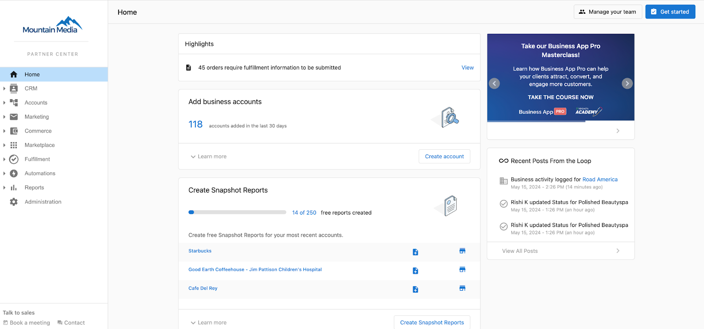
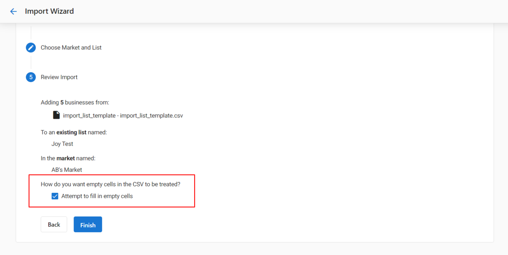
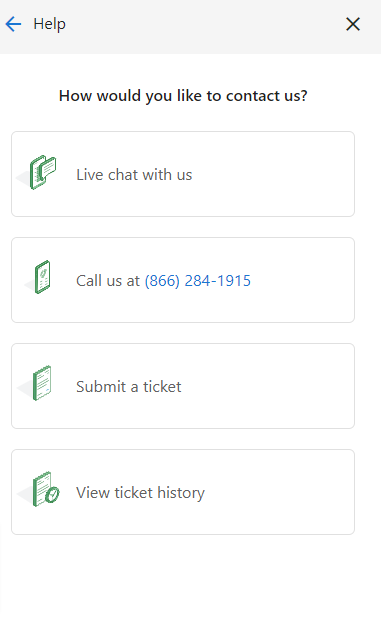

# Partner Center Overview

## What is Partner Center?

Partner Center is your gateway to Vendasta's powerful platform.

In Partner Center, you can:

- Manage your client accounts
- Manage users
- Start selling and activating products
- Set up your store
- Manage other admins
- Configure multi-location groups*
- Publish and track marketing campaigns*
- Create Acquisition Widgets*
- Manage orders*
- Manage salespeople and sales teams*
- Manage fulfillment services for multiple clients*
- Customize your branding*

:::note
Certain features may only be available on select subscription levels.
:::

All admins can access Partner Center via [partners.vendasta.com](https://partners.vendasta.com).

If you're new to the platform, we highly recommend following our Getting Started Guides.

## Customize your domains

:::note
Custom domains are available for most paid subscriptions. Please refer to [vendasta.com/pricing](https://vendasta.com/pricing) for more details on eligibility as per the subscription tiers.
:::

When we set up your white label, we ask about your preferences for which URLs your customers, prospects, and salespeople see. There are two options: Default URLs and Custom URLs. You will typically choose to customize your domains if you already have a website and access to its DNS settings. If you want to maintain white-label for Sales teams in the Partner Center CRM, you will also need to customize your domains.

To customize your domains:

1. Fill in [this form](https://custom-domains-form.marketingservices.dev/) to send us your domain preferences.
2. Once you submit the form, we'll email you TXT and CNAME records, along with instructions on how to enter them into your DNS settings.

## Rebrand the Vendasta Platform using a custom domain

:::note
These options are only available on select subscription levels.
:::

We understand acquisitions, company rebrands, and more happen. We'll take the leg work off your plate, and make changing your company name and access URLs an easy switch.

### Request a Platform Rebrand

To rebrand your Vendasta Platform, please email [support@vendasta.com](mailto:support@vendasta.com) with the following details:

- Preferred company name.
- Preferred sub-domain for default URLs.
- Updated accounting details (billing name and address), if applicable.

If you have previously set up a custom domain with our Support team, we ask that you work directly with them to update your URLs. Please submit this form.

Your work is done! Our Support On-Demand team will reach out when this change goes live.

## Enrichment process for importing Accounts to Partner Center

Google's inference is used during the bulk account import process and requires the Company Name, Zipcode, and Google Place ID to work.

### What Information Do We Infer?

- companyName
- website
- workNumber
- latitude
- longitude
- address
- city
- state
- zip
- country
- taxonomyId
- hoursOfOperation
- socialUrls

Our system will attempt to pull additional data provided the box at the bottom of the upload wizard called **'Attempt to fill in empty cells'** is checked.

If there is any doubt about identifying the correct business (via Google search), we will not import any data to avoid pulling in the wrong data.

:::important
The enrichment only takes place when the account is created, not when the account is updated and requires:

- Company Name, Zipcode, and Google Place ID
- The 'Attempt to fill in empty cells' box must be checked
:::

## Support On-Demand

All Vendasta Partners have access to our Support On-Demand department. These experts can answer your questions or put you in touch with those who can. Some examples of topics they can assist you with:

- Platform technical assistance 
- Foundational Product technical assistance 
- Admin Support
- Billing Questions 
- Troubleshooting & Bug Reports

Support Specialists can be reached via any of the following methods:

- Email - support@vendasta.com
- Phone - If your subscription tier includes phone support, the phone number can be found by navigating to Partner Center > Help > Contact Us > Platform Support 

## Submitting a Support Ticket

When we need to submit a ticket to Support on-Demand, it can be difficult to know what should be included, how much information is needed, and where should the request be submitted to. The short answer is all three of these are important to you, your partner, and Support on-Demand, and following this guide will answer all three of these questions!

For the best results, please include the following information in the body of the ticket or request:

- **Partner ID**
- **Account Group ID** (if applicable)
- **User or team member affected** (if applicable)
- **Replication Steps** (This should be a TL:DR of the issue and the steps you took to replicate it)
- **Screenshots** (or video) of error messages

When submitting a ticket, to Support on-Demand, your best channel is sending a ticket to support@vendasta.com. Partners can also contact us using the in-platform chat to reach an agent, and contracted Partners can call in to speak with a live agent 24/7.

Here is a great example of a submitted Support Request:

 *Hey Team,*

 *Partner ID: XXXX*

 *Account Group ID: AG-XXXXXXXXX*

 *Partner FOOO is running into an issue with the Local SEO dashboard. Specifically within the Local SEO > Listing Sync section, and Google Business Profile.*

 *I've attached a video walkthrough here of what we're experiencing.* 

 *I'm pretty sure this is not the intended function (please let me know if I am wrong) - so what can the client or I do to have the proper reporting come in?*

 *Thanks in advance for your help!* 

## How can I view my ticket history?

To view your ticket history, navigate to Partner Center, click on the question mark icon on the upper right side > and select Contact Us. Then select **Platform Support > View ticket history.** 

Marketing Services tickets will not be available in this view. Only tickets logged with Support can be viewed. For Marketing Services ticket details, please reach out to the respective @yourdigitalagents.com email or contact support for coordinating with Marketing Services team.

## Billing Support

Support On-Demand is always the best first step with questions regarding your invoice, pricing, and failed payments. However, we have a full accounting team ready to assist with questions regarding payment methods, billing information, or unexpected charges. To contact the team directly, email [billingsupport@vendasta.com](mailto:billingsupport@vendasta.com).

## Feature and Resource Requests

You can submit your ideas and connect with our product teams [here](https://vendasta.canny.io/)! Common submissions include:

- Feature requests
- Marketplace product suggestions
- Marketing resource needs

## Frequently Asked Questions about Partner Center

How do I contact my assigned representative in Partner Center?

Contact information for your assigned representative can be found within your Partner Center dashboard. Look for support or account management sections, or reach out to [support@vendasta.com](mailto:support@vendasta.com) for assistance in connecting with your representative.

Can I use the same email address to access multiple Partner Center dashboards?

Admin email addresses can be tied to **only one** Partner Center dashboard at a time.

If you manage multiple Partner Center dashboards, a unique email address will be required for each one.

Why are the products' URLs not secure?

Our team uses Google-managed SSL certificates and these are applied to the login portals - Business App, and Partner Center.

Outside of that, we do not currently auto-uplift those certificates in the individual apps such as Reputation Management and Local SEO as they would be behind those login portals.

On a case-by-case basis, the Technical Team can assist with securing the URL to uplift to HTTPS using Postman. Please reach out to Support on Demand ([support@vendasta.com](mailto:support@vendasta.com)).

Why can't I log in to Partner Center?

So you can't access Partner Center? Have you tried clearing your cache and cookies and refreshing the page? Have you updated Chrome and restarted your computer? Are you certain you have the correct admin email address?

If you answered yes to all of the above, one possibility is you may have an **Ad Blocker extension** on your Google Chrome that is preventing your access to our Platform.

