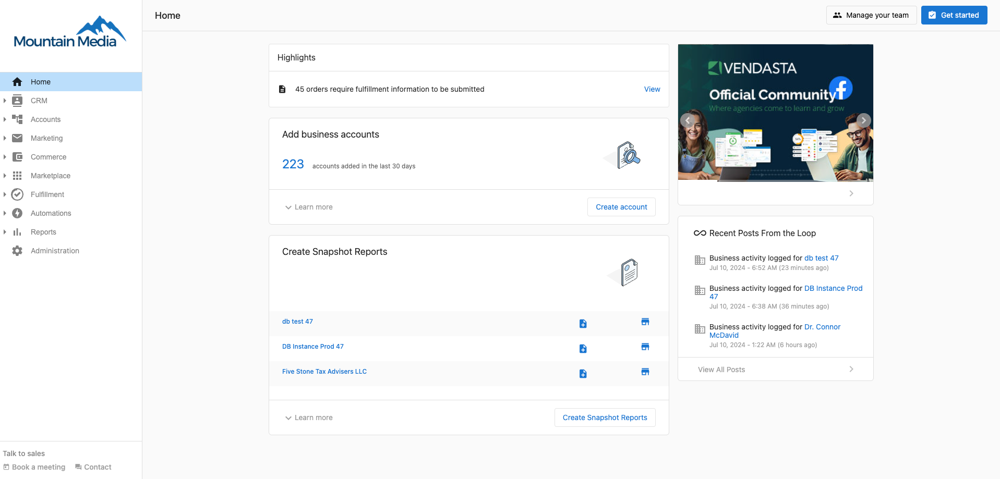
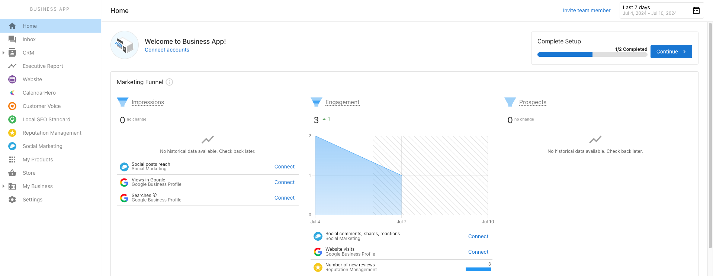
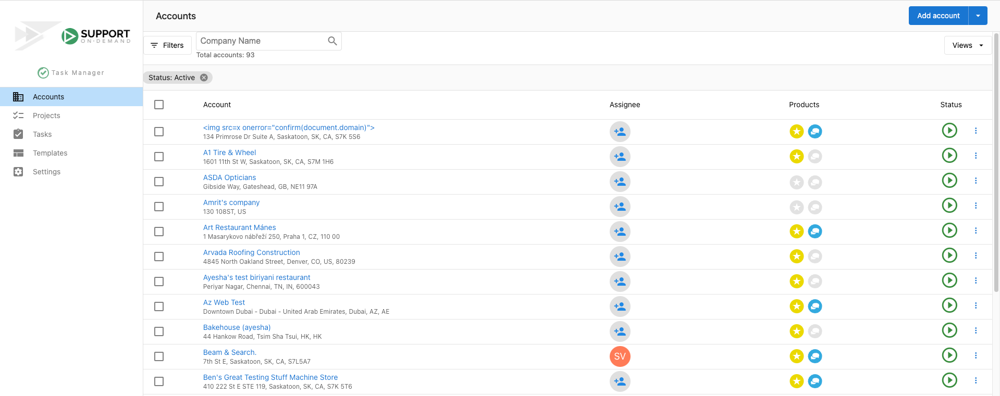

# Welcome to Vendasta

Welcome to the Vendasta platform! Use this guide to get oriented quickly—what the platform includes, who uses which parts, how onboarding works, trial limitations, and how to continue learning.

## Platform overview

What if you had your own branded end-to-end commerce platform that empowered you to scale sales, marketing, fulfillment, and operations better than you could ever imagine? As you watch the video below, ask yourself: how could these features accelerate my business?

<iframe src="//www.youtube-nocookie.com/embed/lrX17R94zSo" width="560" height="315" frameborder="0" allowFullScreen></iframe>

### The platform has 3 environments

One for you and your salespeople, one for your customers, and one for fulfillment. Together, they empower you to provide products and services to local businesses.

:::note
Some features listed below are not available with the Free and Startup plans. [Learn more](https://www.vendasta.com/pricing)
:::

### Partner Center is for your business

In Partner Center, you can:

- Customize your branding and settings
- Manage your prospects and customers
- Set up your products and services
- Build your online store
- Publish and track marketing campaigns
- Manage your salespeople
- Manage your billing
- Manage your customers' products, services, and credentials

All admins can access Partner Center via [partners.vendasta.com](https://partners.vendasta.com/dashboard?utm_campaign=partner-onboarding&utm_medium=referral&utm_source=resource-center&utm_content=welcome-inline-link). Partner Center isn't white-labeled, and the URL isn't customizable.

### Business App is for your customers

In Business App, your prospects and customers can:

- Receive updates about key business metrics
- Access the products they've purchased
- Browse products and services in your online store
- View proof-of-performance reports

Your customers can access Business App from a URL that's unique to your agency. You can find your URL below the title on the [Accounts > Manage Users](https://partners.vendasta.com/bc-admin) tab in Partner Center. The Growth and Scale plans include the ability to customize this domain.

To give your customers access to Business App, you'll need to create user credentials for them. Alternatively, prospects can access Business App for free from a Snapshot Report.

### Task Manager is for fulfillment

In Task Manager, you and your fulfillment team can:

- Update listings
- Respond to reviews
- Respond to mentions
- Create social posts
- Engage with leads
- Onboard new customers
- Complete custom tasks

Your fulfillment team can access Task Manager from [https://task-manager.biz/login/](https://task-manager.biz/login/)

To give your team access to Task Manager, you'll need to create user credentials for them.

  <a 
    style={{ 
      fontSize: '16px', 
      fontWeight: 'bold', 
      color: '#ffffff', 
      backgroundColor: '#33ace2', 
      textDecoration: 'none', 
      borderRadius: '5px', 
      padding: '10px 30px 9px 30px', 
      border: '1px solid #33ACE2', 
      display: 'inline-block', 
      textAlign: 'center'
    }} 
    href="/getting-started/welcome-to-vendasta/getting-started-guide"
  >
    View Getting Started Guide
  </a>
  

## Levels of access

Vendasta's Platform has four levels of access, each with its own login.

### Administrators

Administrators, or admins, are top-level users designed to manage all aspects of their Vendasta experience. They are given access to the powerful Partner Center dashboard, enabling them to efficiently manage their clients. They have the ultimate control when it comes to tailoring how salespeople and users access the platform, as well as what features are available to them. With full permissions, an admin can perform the following:

- Can view and edit automations
- Access to dashboard
- Can manage company billing
- Able to customize platform
- Can view and edit company profile
- Can access marketplace
- Can enable products
- Can manage accounts and users
- Can manage marketing
- Can manage sales
- Can manage task manager
- Can manage groups
- Can create and manage admins
- Can manage orders
- Can manage retail billing

You can customize each admin to have access to specific features by altering their permissions. You can also configure separate sets of permissions to manage Contact, Company and Activities in CRM under the "CRM access" section.

Note: Certain features may be limited to partners on select [subscription levels](https://www.vendasta.com/pricing).

### Salespeople

Salespeople have mid-level access to the platform. They are the primary representatives your clients will communicate with. This allows your salespeople to accomplish the following:

- Manage contacts, companies, and activities*
- Create and manage opportunities
- Create, refresh, and configure Snapshot Reports
- Launch email campaigns
- Create and manage tasks
- Log calls, emails, meetings, and other sales activity
- Create and submit orders for admin or customer approval
- Add account notes
- Schedule Meetings

The URL for the Partner Center can be customized. Find out more [here](/getting-started/welcome-to-vendasta/customize-your-domains).

\* Can be configured individually under the "CRM access" sections.

### Users

Users have low-level access. They are given access to Business App, allowing them to do the following:

- View their business' recent activity
- View their Executive Report
- Access and order products
- Browse the store and make Purchases
- Configure their customer List
- Schedule Meetings
- Edit their Business Profile
- Configure notification settings
- Add notification recipients

The URL for Business App can be customized. To view the current URL users can use to access Business App, navigate to Partner Center > Businesses > Users. It will be displayed at the top of the page.

### Digital Agents

Digital Agents have access to Task Manager, allowing them to do the following:

- View all fulfillment tasks and projects for their customers.
- Filter tasks to view only tasks and projects assigned to them.
- Create tasks and projects.
- Edit task and project statuses.
- Update fulfillment notes.
- Create recurring tasks and projects.
- Create project templates.
- Assign accounts, tasks, and projects to Digital Agents.

To view the login URL for Task Manager, navigate to Partner Center > Tasks > Users.

## Partner Onboarding

Our dedicated team of product and platform experts known as Onboarding Specialists are assigned to your account for 90 days when you purchase an onboarding package. They will assist you in getting your agency set up for success in our platform by providing comprehensive training on:

- [Adding accounts](/getting-started/welcome-to-vendasta/create-account-in-partner-center)
- [Building your store](/getting-started/welcome-to-vendasta/build-your-store-quick-reference-guide)
- [Building email marketing campaigns](/getting-started/welcome-to-vendasta/create-email-campaigns)
- [Setting up automations](/getting-started/welcome-to-vendasta/create-a-new-automation)
- [Running](/getting-started/welcome-to-vendasta/create-snapshot-reports), [customizing](/getting-started/welcome-to-vendasta/customizing-snapshot-reports), and [sending](/getting-started/welcome-to-vendasta/send-snapshot-reports) Snapshot Reports
- [Adding your team](/getting-started/welcome-to-vendasta/create-partner-center-admins)
- Building [sales](/getting-started/welcome-to-vendasta/sample-prospecting-process) and [customer onboarding](/getting-started/welcome-to-vendasta/sample-client-onboarding-process) processes
- And so much more!

To learn more about our Onboarding packages, please contact us at onboarding@vendasta.com.

## Trial Limitations

Expand to view trial details and limitations

### What is a trial?

A trial is a state that an account can be placed in that allows access to certain features of a higher subscription tier for a limited time.

### How to initiate a trial

1. From Partner Center (by clicking an in-platform call-to-action and starting a trial with no credit card necessary)
   - This starts a Premium trial for 14 days (for most partners) or 30 days (if referred by an affiliate)
2. By a Vendasta representative
   - Contact a Vendasta representative for assistance setting up a trial

### What features are limited while on Trial?

Some features, even while on a trial, may be limited or unavailable. Typically, these limitations are in place to protect against fraudulent activity.

| Feature | How is it limited? |
| --- | --- |
| Vendasta payments | Unavailable for Free partners on a trial. Only available on paid subscription tiers. |
| Start selling 3rd party products in the Marketplace | Unavailable for Free or Starter partners on a trial. |
| Publishing email campaigns and sending test emails | Unavailable for Free partners on a trial. Only available for paid subscription tiers. |
| Acquisition Widgets | Unavailable for Free partners on a trial. |
| Premium Reports | Unavailable for Free or Starter partners on a trial. |
| Additional seats | Unavailable on a trial. Only the seats available at the subscription tier. |
| Snapshot Reports and Standard Product allotment | Only the amount for the current subscription is available (1 for each on Free). |

## Vendasta Continued Learning

Our success is your success—keep learning with these programs:

  

    
  

  

    <h3><a href="https://academy.vendasta.com/">Vendasta Academy</a></h3>
    
A place to earn certification, connect with others, events, and find assistance.

    
<a href="https://academy.vendasta.com/">Vendasta Academy →</a>

  

  

  

    
  

  

    <h3><a href="https://www.vendasta.com/webinar/">Vendasta Live Training</a></h3>
    
Once you feel comfortable with the process, it is time to intimately learn about these products. In live training, you'll do just that.

  

  

  

    
  

  

    <h3><a href="https://www.facebook.com/groups/vendasta/">Visit the Community!</a></h3>
    
Ask questions, browse posts, and connect with peers and Vendasta experts.

  

  

