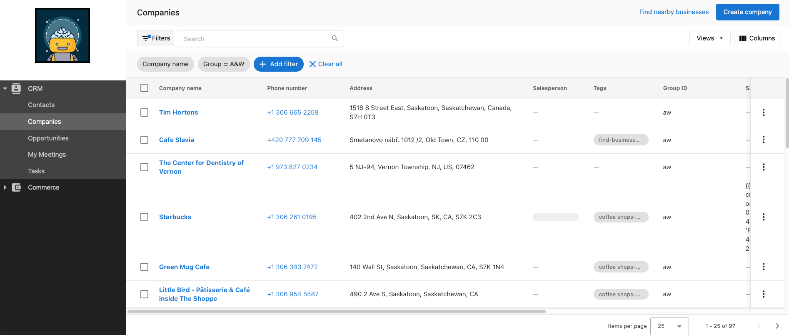

Vendasta's Platform has four levels of access, each with its own login.

### Administrators

Administrators, or admins, are top-level users designed to manage all aspects of their Vendasta experience. They are given access to the powerful Partner Center dashboard, enabling them to efficiently manage their clients. They have the ultimate control when it comes to tailoring how salespeople and users access the platform, as well as what features are available to them. With full permissions, an admin can perform the following:

- Can view and edit automations
- Access to dashboard
- Can manage company billing
- Able to customize platform
- Can view and edit company profile
- Can access marketplace
- Can enable products
- Can manage accounts and users
- Can manage marketing
- Can manage sales
- Can manage task manager
- Can manage groups
- Can create and manage admins
- Can manage orders
- Can manage retail billing

You can customize each admin to have access to specific features by altering their permissions. You can also configure separate sets of permissions to manage Contact, Company and Activities in CRM under the "CRM access" section.

*Please note that certain features may be limited to partners on select [subscription levels](https://www.vendasta.com/pricing).*

### Salespeople

Salespeople have mid-level access to the platform. They are the primary representatives your clients will communicate with. This allows your salespeople to accomplish the following:

- Manage contacts, companies, and activities*
- Create and manage opportunities
- Create, refresh, and configure Snapshot Reports
- Launch email campaigns
- Create and manage tasks
- Log calls, emails, meetings, and other sales activity
- Create and submit orders for admin or customer approval
- Add account notes
- Schedule Meetings

The URL for the Partner Center can be customized. Find out more [here](/getting-started/welcome-to-vendasta/customize-your-domains).

*Can be configured individually under the "CRM access" sections.*

### Users

Users have low-level access. They are given access to Business App, allowing them to do the following:

- View their business' recent activity
- View their Executive Report
- Access and order products
- Browse the store and make Purchases
- Configure their customer List
- Schedule Meetings
- Edit their Business Profile
- Configure notification settings
- Add notification recipients

The URL for Business App can be customized. To view the current URL users can use to access Business App, navigate to *Partner Center > Businesses > Users*. It will be displayed at the top of the page.

### Digital Agents

Digital Agents have access to Task Manager, allowing them to do the following:

- View all fulfillment tasks and projects for their customers.
- Filter tasks to view only tasks and projects assigned to them.
- Create tasks and projects.
- Edit task and project statuses.
- Update fulfillment notes.
- Create recurring tasks and projects.
- Create project templates.
- Assign accounts, tasks, and projects to Digital Agents.

To view the login URL for Task Manager, navigate to *Partner Center > Tasks > Users*.