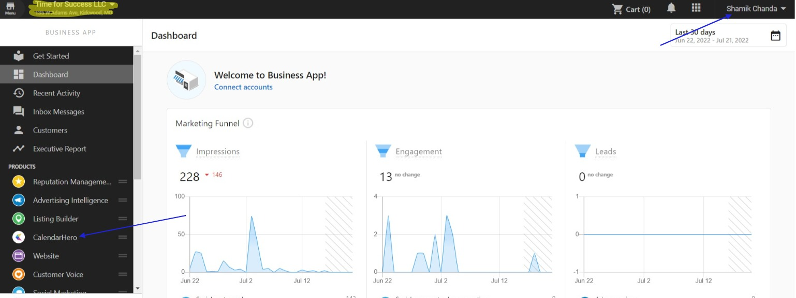
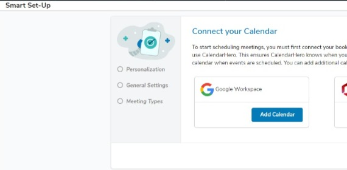
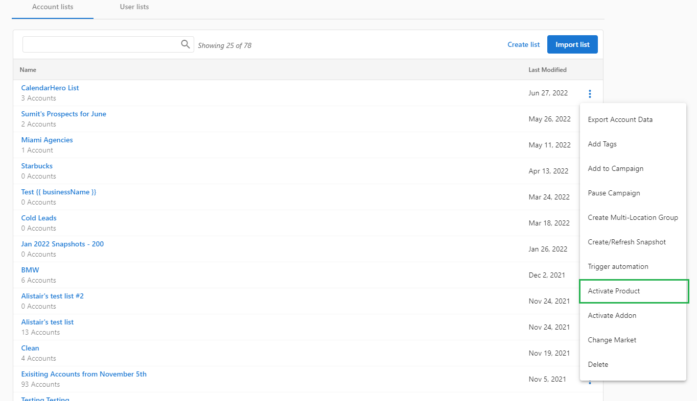

# Getting Started with CalendarHero

## Accessing CalendarHero

1. Create a new Business App user in Partner Center with CalendarHero activated for the account.

2. The user logs in to Business App and clicks **CalendarHero** in the left navigation.

3. The user's CalendarHero account is created automatically and they are routed to the dashboard to set up their calendar and meeting links.

To be a user on more than one CalendarHero account, each account requires a unique user with a different email address.

## Activating CalendarHero for all accounts

There are no limits to how many free versions of CalendarHero can be activated for clients.

1. Ensure the product is enabled by clicking **Start Selling** in Partner Center.

2. Create a list of all accounts to activate CalendarHero for.

3. Click the kebab menu next to the list and select **Activate Product**.

4. Search for and select CalendarHero, then click **Activate**.

