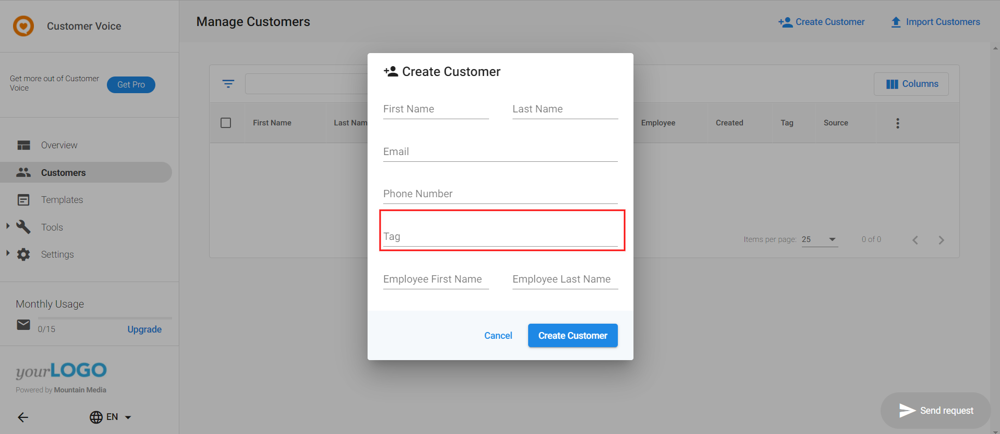
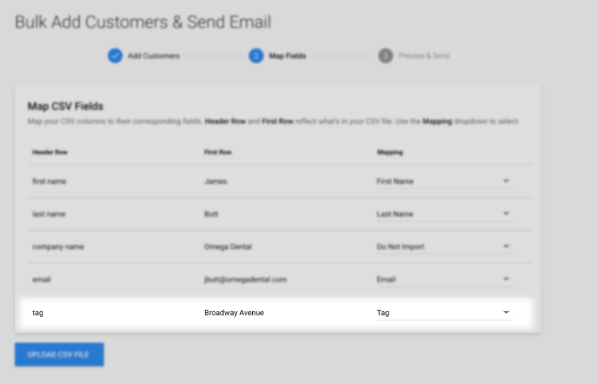
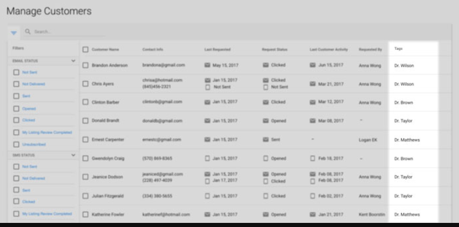

:::note
As of February 21st, 2025, Customer Voice has become a legacy Vendasta product. Start using [Reputation Management Premium](https://partners.vendasta.com/marketplace/products/RM) to automatically collect reviews and NPS via email and SMS.
:::

The Contact tag feature allows your clients to add tags to their customers. This will allow them to categorize their contacts by things like services or products they purchased, or what employee serviced them. For example, if multiple doctors serve a single clinic location, you can tag patients by which doctor treated them.

### Adding a customer tag

When adding a customer into the system, you'll see an option to include a tag.

Tags can also be included when uploading customers in bulk using a CSV.

### Filtering

Once a tag has been associated with a contact, it can then be filtered using these tags on the **Customers** page. This will allow for easy categorization when sending review requests.

