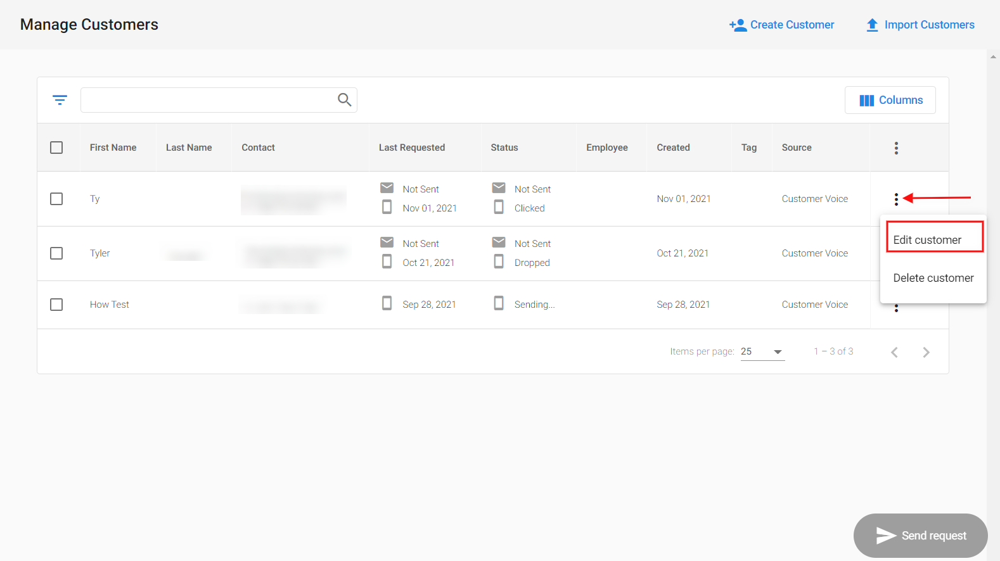
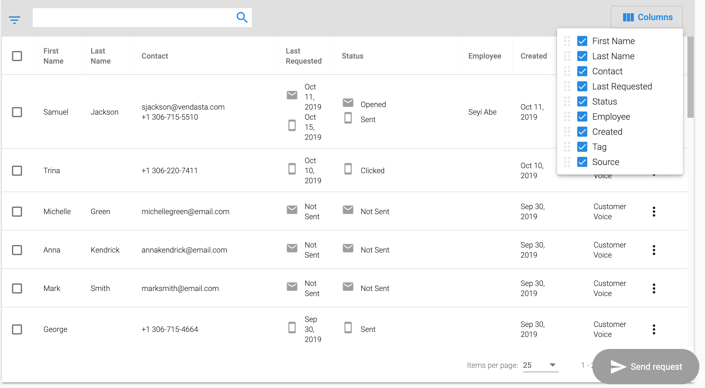

**_Note:_** _As of February 21st, 2025, Customer Voice has become a legacy Vendasta product. Start using [Reputation Management Premium](https://partners.vendasta.com/marketplace/products/RM) to automatically collect reviews and NPS via email and SMS._

### **What is the Customer Table?**

The Customer Table in Customer Voice includes a **Source** column that displays where a new customer was added from, as well as the ability to rearrange the order of the columns, hide columns, and edit your customer information in the customer list.

**Why is the Customer Table important?**

You have the flexibility to edit your customer's name and contact information in the Customer Table. The Source column will give you the ability to keep track of which application a new customer was added from. You can also customize the table by rearranging the order of columns or choosing to hide columns that are not relevant to your business.

### **How does the Customer Table work?**

Go to **Customer Voice > Customers**.

1. To edit a customer, click on the dot icon menu on the right side of the table > choose **Edit customer**.
   

2. To rearrange or hide columns, click on the **Columns** button in the top right corner of the table. You can show or hide columns by selecting the box next to the column title in the drop-down menu. You can rearrange columns by clicking and dragging on the dotted icon next to the column title.

   

<iframe src="//fast.wistia.com/embed/iframe/em8gkv736f" width="560" height="315" frameBorder="0" allow="autoplay; fullscreen" allowFullScreen></iframe>