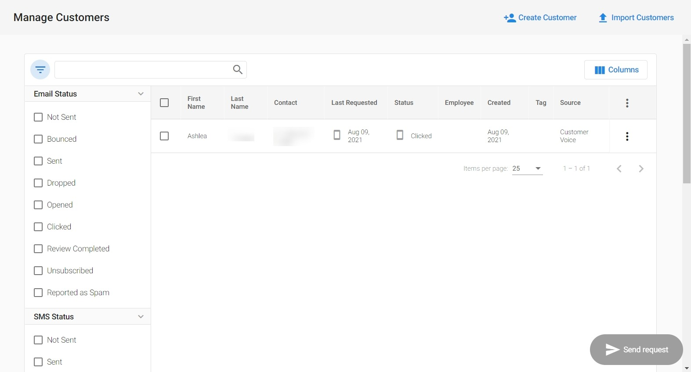

*Note: As of February 21st, 2025, Customer Voice has become a legacy Vendasta product. Start using [Reputation Management Premium](https://partners.vendasta.com/marketplace/products/RM) to automatically collect reviews and NPS via email and SMS.*

Users of Customer Voice can view their review request status details and email history in the Customer Table.

### Why is viewing review request status Important?

Quickly and easily keep track of the review requests sent to an individual customer and view a detailed status of the performance of the emails sent.

### How does viewing review request status work?

1. Go to **Customer Voice > Customers**.
2. Click on the **filter** button , and under the column **Email Status** click on the status you would like to view details for.

You will be able to view the date and time of each email review request that has been sent to that customer, and actions that have been taken, such as opened and clicked. If there has been no request sent or the email has bounced it will state there is no email history for this customer.

