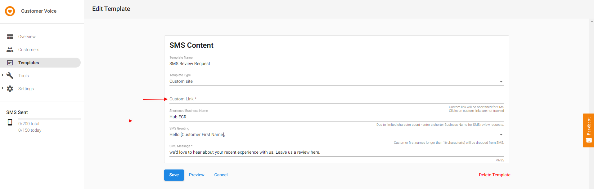

:::caution Legacy Product
As of February 21st, 2025, Customer Voice has become a legacy Vendasta product. Start using [Reputation Management Premium](https://partners.vendasta.com/marketplace/products/RM) to automatically collect reviews and NPS via email and SMS.
:::

To change the link in the SMS template to a custom one:

1. Launch the **Customer Voice** product > go to **Templates** > select **SMS Template**
2. Change the template type to "**custom site**" and insert the custom link here.
   * For example, you can insert a link to a Google Form to collect customer feedback.

:::note
**Please note:**

* Custom links will be shortened for SMS
* Clicks on custom links are not tracked
:::