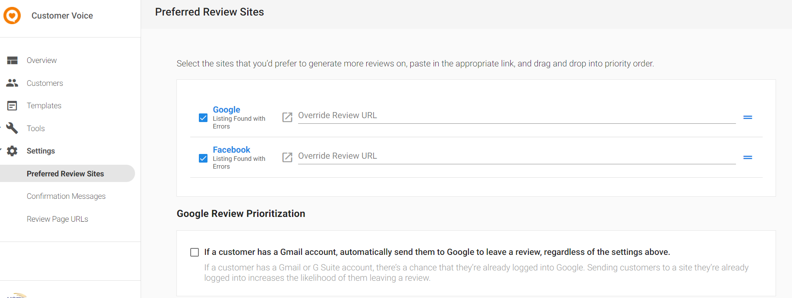

:::caution Legacy Product
As of February 21st, 2025, Customer Voice has become a legacy Vendasta product. Start using [Reputation Management Premium](https://partners.vendasta.com/marketplace/products/RM) to automatically collect reviews and NPS via email and SMS.
:::

If a customer submits a positive review, they will be encouraged to copy that review and share it on other prominent review sites, such as Google and Facebook.

You can customize which sites are displayed by following these steps:

1. Launch **Customer Voice** > **Settings > Preferred Review Sites**.
   - Here, you will see the review sites (Customers with active Reputation Management will have their Review site URL automatically pulled from the Primary Listings tab).
2. Select/Deselect the box to the left of your preferred sites. (You can also enter the review URL for other listed sites manually).

**Please Note:**

- Customers with **Reputation Management Pro** will have more options for Preferred Review Sites.
- You will not be able to select/add sources where the Review URL is missing.
- If you have selected a site where the business' info is inaccurate, it will not appear as a suggestion on My Listing until it is accurate.