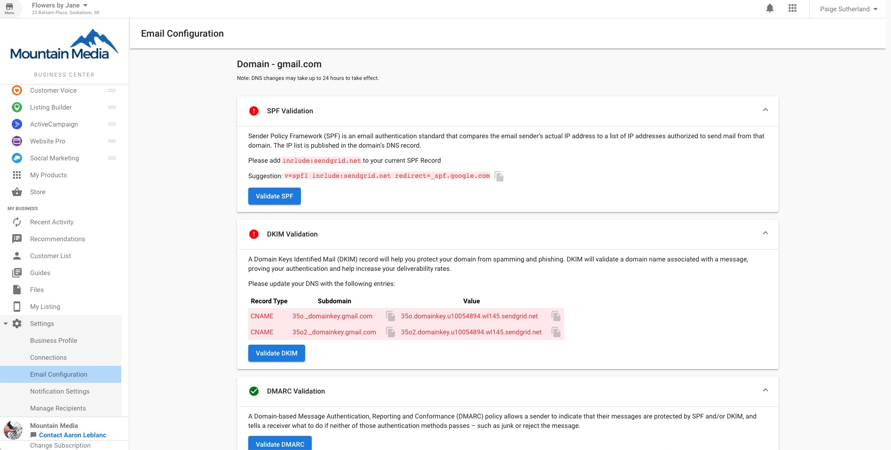

:::caution Note
As of February 21st, 2025, Customer Voice has become a legacy Vendasta product. Start using [Reputation Management Premium](https://partners.vendasta.com/marketplace/products/RM) to automatically collect reviews and NPS via email and SMS.
:::

## What is a custom domain?

Email configurations in Business App allow Customer Voice to send emails from your email address using your domain name. (i.e. From: theteam@mybusiness.com)

## Who has access to custom domains?

All Customer Voice Pro users can customize their email domain names.

## Why are custom domains important?

Emails that come from a familiar domain are trusted by more people and thus have a higher chance of being opened. Also, when all of these categories are properly configured in the DNS Settings panel of your domain hosting, emails that you send out will have a lower chance of landing in the recipient's spam folder.

Note: If you choose to not customize the "Send from" email, emails in Customer Voice will continue to be sent from noreply+*smbname*@smblogin.com.

## How do custom domains work?

:::info
To prevent emails from being sent on someone's behalf unintentionally, email service providers check the digital records of incoming mail. These records—including Sender Policy Framework (SPF), Domain Keys Identified Mail (DKIM), and Domain-based Message Authentication, Reporting & Conformance (DMARC)—act as digital handshakes agreeing to send an email on someone's behalf. You can prevent your emails from being flagged as spam by updating your Domain Name System (DNS) record with the correct SPF, DKIM, and DMARC entries. Updating these entries creates an agreement between our sending service and your domain and allows us to send email campaigns on your behalf.
:::

1. From **Partner Center** > **Accounts** > Search for Business and open the **Business App** of the client for which you'd like to configure email settings for
2. **Settings** > **Email Configuration** > edit **Email 'Send From' Information**
3. Enter the email address that will be used to send emails
4. Enter the name that you'd like to appear when recipients receive the email
5. Verify the SPF, DKIM, and DMARC Validations under your domain. A green circle with a checkmark means that the record is validated correctly; a red circle with an exclamation mark means that the record is invalid.
6. For each invalid record, update your DNS record with the correct entries. (Follow the video below)

For Step 6, the video below shows steps to configure email settings in Partner Center, however, these steps are similar to the steps you'll take in Business App. Note: this video shows steps taken with a GoDaddy account. Steps will be similar to other domain providers.

If your business clients do not own a custom domain, consider [selling GoDaddy domains](https://partners.vendasta.com/marketplace/products/MP-4TMLZSQ5FMJQX5T75TPC43FQBWD2VXLB) through Vendasta's Marketplace.

<iframe src="https://fast.wistia.com/embed/iframe/f2i5rh7g5j" width="560" height="315" frameborder="0" allowFullScreen></iframe>

## Important Notes:

Adding these settings does not guarantee that emails will not be flagged as spam. To ensure your email is delivered successfully, check the content and subject lines of your emails. Make sure to avoid colored text, text in all caps, attachments, exclamation marks, promotional words, and phrases (such as "make money," "save money," "cheap," and "act now"), profanity, and explicit content as these may cause your emails to be flagged as spam.