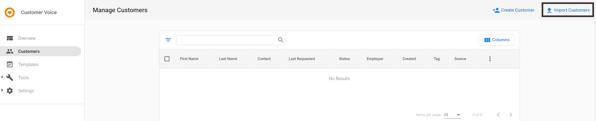
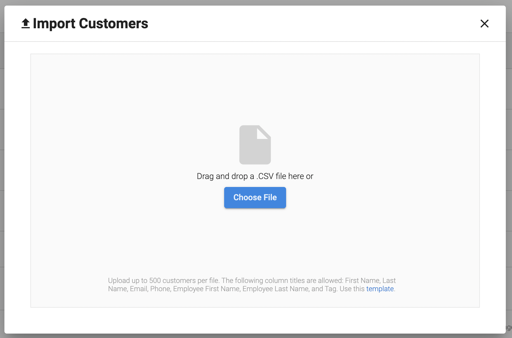
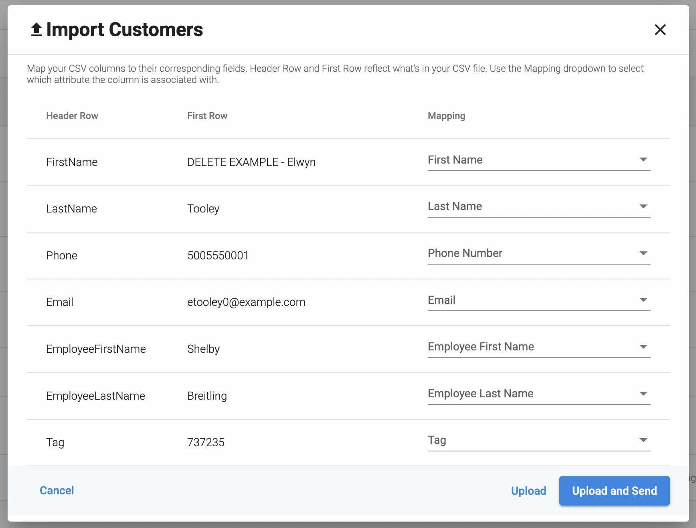
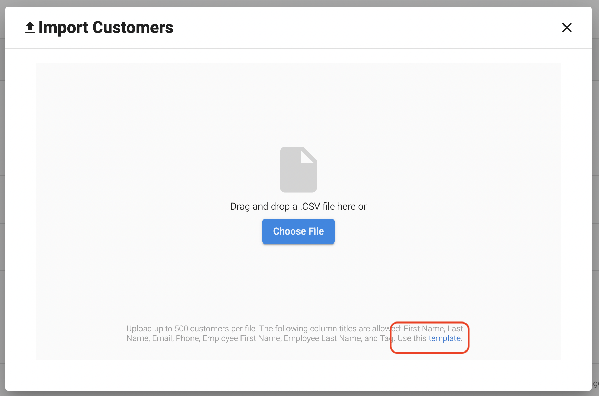

**_Note:_ As of February 21st, 2025, Customer Voice has become a legacy Vendasta product. Start using [Reputation Management Premium](https://partners.vendasta.com/marketplace/products/RM) to automatically collect reviews and NPS via email and SMS.**

## To bulk upload a customer list .csv file:

1. Launch **Customer Voice product > Customers tab > Import Customers.**

2. **Upload your customer list in a .csv file format. *Please note that the appropriate field headings must be included in the first row of the .csv document. Field headings may include first name, last name, and email address.**

The template below provides the framework on which to build your CSV.

[Sample-Customer-List-Template.csv](/downloads/legacy-customer-voice/Sample-Customer-List-Template.csv)

3. Attach your file.

4. Choose appropriate mapping fields. For example, first name, last name, email.

The system validates that all addresses are formatted correctly.

5. Select 'upload' to import the list of contacts into Customer Voice.

***Note:***

- *Each CSV can only contain 500 contacts. Further contacts will need to be broken into their own CSVs for upload.*
- *When creating lists through CSV upload, the system does not check for duplicate entries.*
    
    *For example, if the list has two entries with the same e-mail ID, it does not check for duplicate entries and stops updating. However, for manual contact creation, it checks for existing email IDs and prevents creating duplicates.*

- *You can also access [this template](/downloads/legacy-customer-voice/Sample-Customer-List-Template.csv) on the Import Customers screen:*

