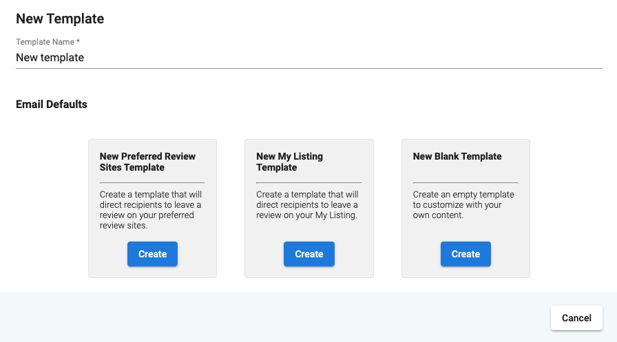
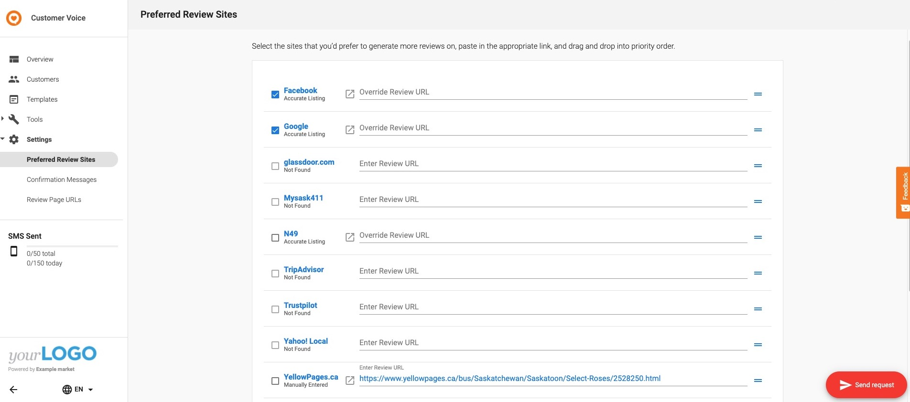
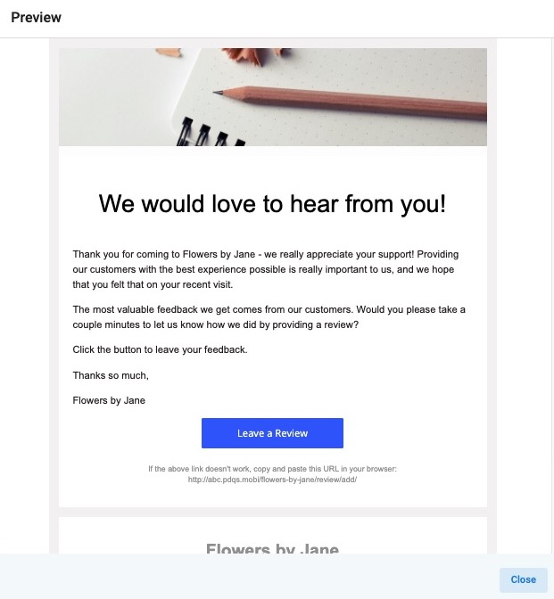

**_Note:_ As of February 21st, 2025, Customer Voice has become a legacy Vendasta product. Start using [Reputation Management Premium](https://partners.vendasta.com/marketplace/products/RM) to automatically collect reviews and NPS via email and SMS.**

There are two review request workflows possible with Customer Voice: My Listing, and My Preferred Sites. The template type you choose will determine what sources you can request reviews on. Create a new template by going to **Customer Voice** **> Templates >** **Add New Template.** 

### **My Preferred Sites**

*See the attached PDF for the list of review sources that are eligible for requesting reviews.*

Use this template type to request reviews on prominent 3rd-party review sources, such as Google and Facebook. 

The My Preferred Sites template automatically pulls in the URLs and logos of up to three sites configured under **Customer Voice >** **Settings > My Preferred Sites**. These sources are determined by the Partner in **Partner Center > Administration > Customize > Listing Sources**.

### **My Listing** 

Use this template type to request reviews on your clients' **My Listing** page. The **My Listing template** automatically inserts the link to the business's My Listing page, a 1st party listing site.

When the contact receives the email or SMS, they can click to leave a review on the My Listing page. They will then be prompted to leave a star rating and review, which will publish to the My Listing page regardless of the rating or review content. This allows businesses to collect and address feedback, even negative feedback.

*Example: My Listing template email.*

If the review left was a 4 or 5-star rating, after the review is published on the My Listing page, the reviewer **will then be asked** to share it on one of the business's Preferred Sites.

If the review left was a 1 to 3-star rating, after the review is published on the My Listing page, the reviewer **will not be asked** to share it on one of the business's Preferred Sites.

### Resources

- [Review Request Sources PDF](/downloads/legacy-customer-voice/Review_Request_Sources_Updated_January_2021.pdf)