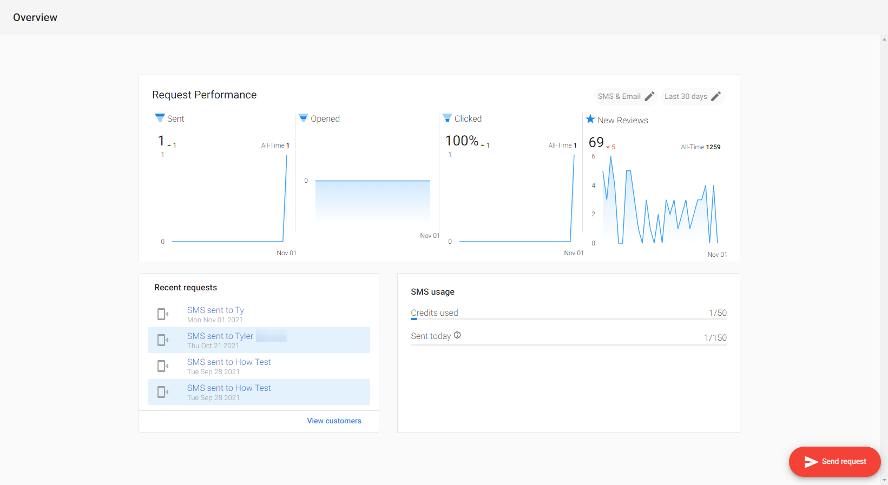

# Customer Voice (Legacy)

:::warning Deprecated
As of February 21st, 2025, Customer Voice is legacy. Use [Reputation AI Premium](https://partners.vendasta.com/marketplace/products/RM) for reviews and NPS via email and SMS.
:::

Customer Voice was a feedback tool that let you invite customers to leave reviews, boost star ratings, and improve SEO. The following sections describe what it is, how to use it, the overview dashboard and metrics, and SMS registration. For configuration and other topics, see [Settings](./settings/email-domain-settings.mdx), [Customers](./customers/customer-table.mdx), [Templates](./templates/alternate-email-templates.mdx), and [Tools](./tools/email-signature-widget.mdx).

## What is Customer Voice?

Online reviews are critical for local businesses: nearly 90% of consumers say they'll only consider a business with an average rating of 3–5 stars. With Customer Voice, clients could reach customers via email or text and collect reviews on the sites that mattered most.

You could assist your clients in three key areas:

- **Generate more reviews** – Choose a method, provide a customer list, and send requests to build credibility.
- **Deliver a listening tool** – Let clients see customer feedback and address negative feedback before it went live.
- **Boost star ratings** – Target review sites important to the business (e.g. Google, Facebook).

## Product details

**Turn customer experiences into stars**

With Customer Voice, your clients could gather customer experiences to boost online star power and drive more business. With a couple of clicks, they could reach customers via email or text and collect reviews on the sites that were most important to their business.

  

    

      
    

    

      
<strong>Product description</strong>

      
Customer Voice is a feedback tool that allows you to invite customers to leave reviews, boost online star ratings, and improve SEO. With just a couple of clicks, you can reach customers via email or text, and collect reviews on the sites that are most important to your business.

    

  

## Customer Voice walkthrough

<iframe src="https://fast.wistia.com/embed/iframe/anh7b0lejg" width="560" height="315" frameBorder="0" allow="autoplay; fullscreen" allowFullScreen></iframe>

## Overview page and performance metrics

Business owners could visualize the effectiveness of review requests on the **Customer Voice** → **Overview** page: how many were sent, open rate, and click-through rate. A performance funnel helped pinpoint areas for improvement (e.g. changing the subject line). Metrics included requests sent by email and SMS.

The Overview page also showed **SMS usage stats** and a **recent requests** log so business owners could see credits left, when they expire, and request to purchase more.

Go to **Customer Voice** → **Overview**. You could expect:

- A review request performance funnel
- Metrics for email performance over time
- Filter by date range
- Metrics for sent, opened, and clicked requests
- The number of new reviews found on connected accounts

## SMS performance metrics

The performance funnel included SMS metrics for accounts with an SMS add-on.

SMS reporting included the number of messages sent and click-through rate. Open rate is not available for SMS. Go to **Customer Voice Pro** (with SMS add-on) → **Overview** to toggle between Email only, SMS only, or both, filter by date range, and see new reviews from connected accounts.

## A2P 10DLC registration

To prevent spam and SMS abuse, US phone carriers require businesses to register their phone numbers before sending SMS (A2P 10DLC). US-based businesses must register to continue using Customer Voice SMS review requesting. As of **August 31, 2023**, carriers block messages from unregistered businesses.

**What is A2P 10DLC?** – A system that allows businesses to send Application-to-Person messaging via standard 10-digit long code numbers. Registration is required for clients using Inbox (Business App) or Customer Voice to send notifications, marketing messages, and review requests. This affects US businesses only.

**What to do** – US-based SMBs must register to keep sending SMS after Aug 31, 2023. In Customer Voice, go to **Settings** → **SMS Configuration** to submit the business for registration. Registration can take up to 28 days. For step-by-step instructions, see [Register for SMS text messaging](./settings/register-for-sms-text-messaging.mdx).

## Documentation

- [Customer table](./customers/customer-table.mdx), [Contact tags](./customers/contact-tags.mdx), [Review request status](./customers/review-request-status.mdx)
- [Email domain settings](./settings/email-domain-settings.mdx), [Register for SMS text messaging](./settings/register-for-sms-text-messaging.mdx)
- [Alternate email templates](./templates/alternate-email-templates.mdx), [Add custom links to SMS](./templates/add-custom-links-sms.mdx)
- [Email signature widget](./tools/email-signature-widget.mdx), [Automatically send review requests with mobile kiosk](./tools/automatically-send-review-requests-to-new-customers-with-mobile-kiosk.mdx)

## Frequently asked questions

What products are needed for Customer Voice?

Customer Voice works with other products for best results:

- **Local SEO** – Required for the client to have a My Listing page where reviews are collected.
- **Reputation AI** – Connects to Customer Voice for review sources. With Reputation AI Standard, Facebook and Google listing URLs are pulled into Customer Voice; with Reputation AI Pro you can add more review sources. Listings must exist in Reputation AI for this sync.

How do I activate SMS add-ons?

SMS add-ons are only available with **Customer Voice Pro**.

1. Go to **Partner Center** → **Accounts** → **Manage Accounts**.
2. Open the account and select **Order Products**.
3. Choose the SMS add-on by location and message volume, then complete the order.

Can I customize buttons in Customer Voice?

Yes.

1. Open a template and right-click the button.
2. Select **Insert/Edit Link**.
3. Update **URL** for the destination and **Text to Display** for the button label.

Can I hide the business address on review request emails?

No. The business address is required for **CAN-SPAM** compliance. Unsolicited commercial email must include physical address and contact information; it cannot be removed.

Can the link in the SMS template be changed to a custom one?

Yes.

1. Go to **Customer Voice** → **Templates** → **SMS Template**.
2. Set the template type to **custom site** and insert your custom link (e.g. a Google Form).

:::info
Custom links are shortened for SMS. Clicks on custom links are not tracked.
:::

What is the character limit for SMS messages?

**128 characters** total for the whole message, including:

- Business name
- SMS greetings
- SMS message

When do Customer Voice SMS credits reset?

SMS credits reset on the **1st of each month**. This is tied to the third-party SMS system renewal, not the add-on renewal date.

Example: 100 credits activated April 16th reset to 0/100 on May 1st.

How do I edit the review request email template?

1. Open the **Email template** tab for a customer.
2. Click the three-dot menu on the template preview and select **Edit template**.

You can then add a custom message, choose review sources, set layout and colors, profile picture, business address visibility, opt-out, and unsubscribe link. Changes apply to all future emails sent to that customer.

How do I create a custom email review request template?

1. Go to **Customer Voice** → **Templates** → **Add New Template** and name it.
2. Choose one of: **New Preferred Review Sites Template**, **New My Listing template**, or **New Blank Template**.
3. Edit the pre-populated template or use a blank one and add variables, images, and text.

How do I send emails from a custom domain?

**Customer Voice Pro** users can set a custom "send from" domain.

1. In **Partner Center** → **Accounts**, open the Business App → **Settings** → **Email Configuration**.
2. Edit **Email 'Send From' Information** and enter the address and display name.
3. Verify **SPF**, **DKIM**, and **DMARC** in your DNS. Update any invalid records.

This helps deliverability; content and subject lines also affect spam filtering.

How do I send SMS review requests?

SMS add-ons are required.

- **Single new contact:** On the Customer Voice overview tab click **Send request**, fill the form (include phone number), choose an SMS template, then **Send**.
- **Existing contacts:** Go to **Overview** → **Customers**, select one or more customers with phone numbers, click **Send request**, choose a template, then **Send to [#] Customers**.

How do I send review requests to multiple customers at once?

Available in **Customer Voice Pro**.

1. Go to **Customer Voice** → **Customers**.
2. Select multiple customers.
3. Click **Send Request** (bottom right), choose a template, then **Send**.

How do I upload multiple customers at once?

1. Go to **Customer Voice** → **Customers** → **Import Customers**.
2. Upload a .csv with the correct column headers in the first row (e.g. first name, last name, email).
3. Attach the file, map fields, then upload.

- Max **500 contacts** per CSV.
- Duplicates are not detected on import.
- A sample template is available on the Import screen.

Where does a review go once submitted?

It depends on the template:

- **My Preferred Sites** – Reviews go to the sites you directed users to. Status in **Customer Voice** → **Customers** updates to Bounced, Sent, Clicked, or Opened.
- **My Listing** – Reviews go to the My Listing page (Local SEO). Status shows as Review Completed.

Which sources can I request reviews on?

Two template types:

- **My Preferred Sites** – Third-party sites like Google and Facebook. You can choose up to three from **Customer Voice** → **Settings** → **My Preferred Sites** (driven by **Partner Center** → **Administration** → **Customize** → **Listing Sources**).
- **My Listing** – The client's My Listing page.

Create templates under **Customer Voice** → **Templates** → **Add New Template**.

How do I change the three suggested review sites (Preferred Sources)?

1. Go to **Customer Voice** → **Settings** → **Preferred Review Sites**.
2. Select or clear the sites you want, or enter review URLs manually.

- With **Reputation AI**, listing URLs can be pulled from the Primary Listings tab. **Reputation AI Pro** adds more options.
- You cannot add sources without a review URL. Inaccurate business info must be fixed before a site appears on My Listing.

Do Inbox (Business App) and Customer Voice Pro use the same phone number?

- **Same number** – If the client sent SMS review requests through Customer Voice Pro before their first Inbox message.
- **Different numbers** – If they used Business App Inbox first.

How do I embed the Review Generation Widget on my website?

1. Go to **Customer Voice** → **Tools** → **Widgets**.
2. Customize the widget and select **Copy Widget Code**.
3. Paste the code into your site's HTML.

For **WordPress**: use the editor in **Text** mode (not Visual), paste the code, and adjust width/height if needed.

Why is first name not displayed in review requests via SMS?

The first name is dropped when the **128-character** limit is exceeded.

- Use a shortened business name and keep the SMS message short so the first name fits.
- The editor shows character count in real time and indicates when the first name will be dropped.

Why is my custom template failing?

- **HTML** – Smart (curly) quotes in HTML often cause errors; use straight quotes. Unicode is fine in body text but not inside HTML tags.
- **CSS** – Move each media query into its own `<style>` tag so they don't conflict.

