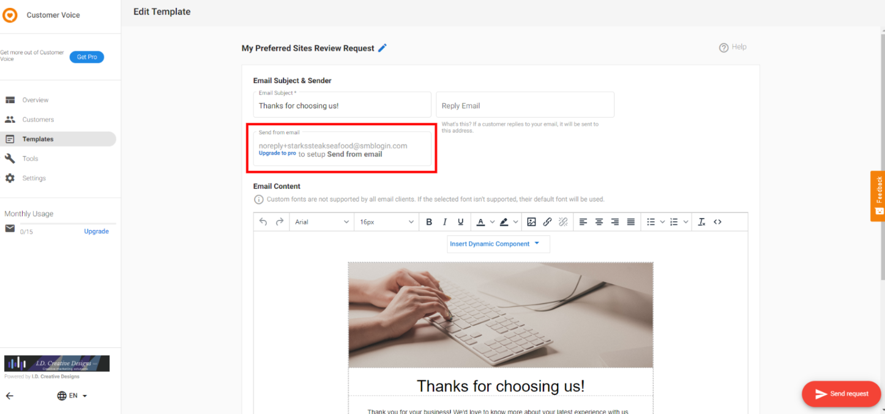

:::warning Deprecated
As of February 21st, 2025, Customer Voice is legacy. Use [Reputation AI Premium](https://partners.vendasta.com/marketplace/products/RM) for reviews and NPS via email and SMS.
:::

A frequently asked question in Customer Voice is "Why are the review requests going out from @smblogin.com and how can I modify it to display/use my email address?"

For instance:

For Customer Voice Standard accounts, emails will come from the email noreply+businessname@smblogin.com. The client's business name will be automatically substituted for "businessname." Clients may customize their "sent-from" email domain with **Customer Voice Pro**. Do this by clicking `Edit Send from email` when editing an email template.

After upgrading to the Pro edition, the setting can be configured in `Business App` → `Settings` → `Email Configuration`:

To edit send from information, domain validation is not required. You can just change the send from information to be able to send review requests from that email address.