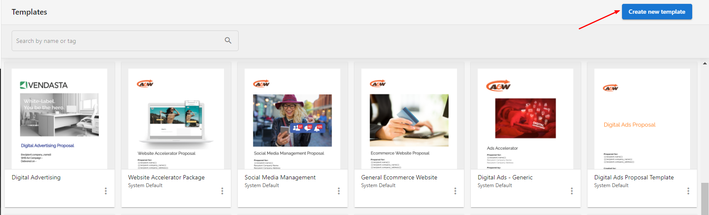
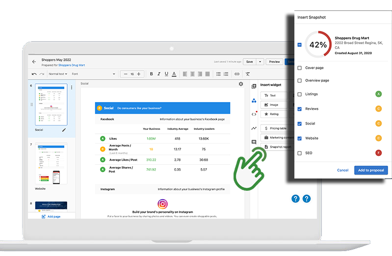
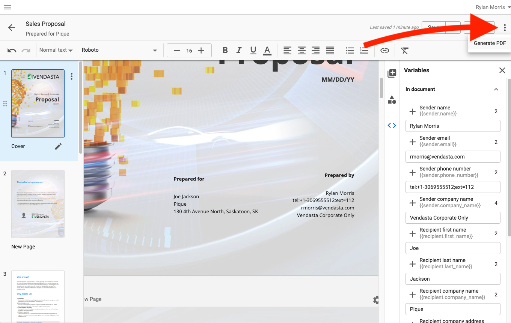
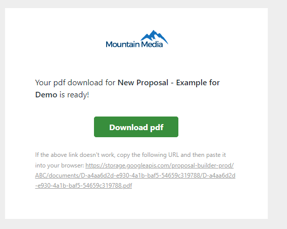
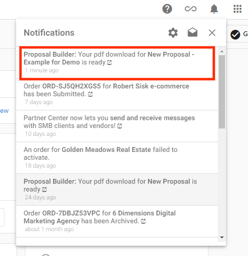
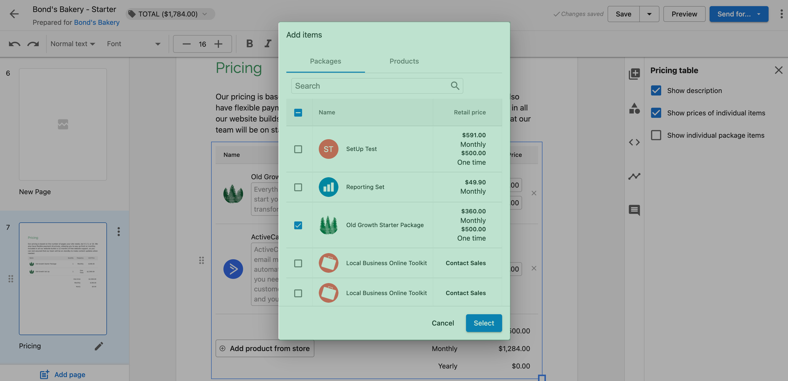
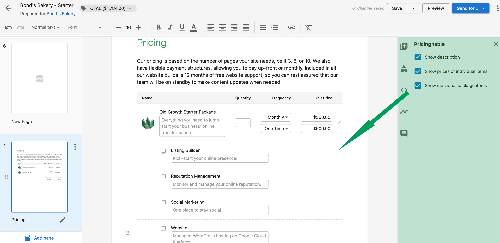

# Proposals (Legacy)

:::warning Legacy product
Proposal Builder is a legacy product. This documentation is maintained for historical reference for partners who may still have active proposals or need to understand past functionality.
:::

Proposal Builder let you create, manage, and track professional proposals from `Partner Center` → `Commerce` → `Proposals`. It provided customizable templates, professional PDFs, notification tracking, flexible pricing, and Snapshot Report integration to help close deals.

## What was Proposal Builder?

Proposal Builder was a tool in Commerce for creating professional proposals. It let you create, edit, and track proposals with customizable templates, professional PDF generation, notification tracking, flexible pricing displays, and integration with Snapshot Reports.

## Why it was used

Professional proposals help win business and communicate value. Proposal Builder kept your presentation consistent, showed client engagement, and worked with Snapshot Reports so prospects saw their needs, and you could follow up at the right time.

## What you could do

- Create proposals using customizable templates
- Generate PDFs for client sharing
- Track engagement with email and in-app notifications
- Display flexible pricing options, including retail pricing
- Add Snapshot Reports to highlight prospect pain points
- Filter and manage proposals by salesperson
- Preview templates before choosing a design
- Archive proposals when no longer needed
- Use multiple currencies for international clients

## Set up and create proposals

### Access and create a proposal

1. Go to `Partner Center` → `Commerce` → `Proposals`
2. Click `Create New Proposal`
3. Choose an existing template or create one from scratch

### Create a proposal template

1. Go to `Partner Center` → `Commerce` → `Proposals` → `Templates`
2. Click `Create New Template`
3. Add your branding and content structure, then save the template

### Add Snapshot Reports to proposals

Snapshot Reports help highlight prospect pain points and recommended solutions:

1. Generate a Snapshot Report for the prospect (recommended ahead of time)
2. Go to `Partner Center` → `Commerce` → `Proposals` → `Manage Proposals`
3. Choose a template or create a new proposal
4. Select the recipient account
5. Open the `Insert widget` panel and click `Snapshot report`
6. Select the sections you want

Sections become widgets you can rearrange.

:::tip
Generate the Snapshot Report ahead of time. Reports can take up to 24 hours to generate and work well as prospecting tools for first meetings.
:::

## Key features

### Professional PDFs

Proposals could be turned into polished PDFs to share with clients.

### Notifications

- **Email** – Get notified when clients view or interact with proposals.
- **In-app** – See real-time updates when clients take action.

### Pricing options

- **Retail pricing** – Show standard retail prices for products and services.
- **Flexible display** – Customize how pricing appears in proposals.

## Managing proposals

From the Proposals dashboard you could view all proposals and their statuses, edit or duplicate proposals, and archive ones no longer needed.

### Filter by salesperson

1. Go to `Partner Center` → `Commerce` → `Proposals`
2. Click the filter icon to the left of the `Search` bar
3. Select a `Salesperson` from the dropdown

### Preview templates

1. Go to `Partner Center` → `Commerce` → `Proposals` → `Manage Proposals` or `Templates`
2. Choose a template and scroll through the preview
3. Repeat until you find a match, then name the proposal and select a recipient
4. Click `Create`

## Best practices (historical)

- Keep proposals concise and focused on client needs
- Use consistent branding
- Include clear calls to action
- Follow up promptly after sending
- Review analytics to understand engagement
- Generate Snapshot Reports ahead of time for stronger first impressions
- Use templates to keep the team consistent

## Frequently asked questions

Can I create proposals in multiple currencies?

Yes. If you sell in multiple currencies and have multiple markets set up, a salesperson in a given market can create proposals using that market’s products and packages with the appropriate currency.

How do I delete a proposal?

Proposals cannot be deleted after creation. You can archive one by clicking `Archive` on the right side of the Manage Proposals page.

Why add Snapshot Reports to proposals?

Snapshot Report integration helps start the conversation with content that highlights the prospect’s pain points and your recommended solutions, so prospects better understand the value of your proposal.

Why filter by salesperson?

Filtering lets salespeople see only their proposals and status (viewed, commented, approved) without scrolling through colleagues’ proposals.

Why preview templates before use?

Format and content affect how well a proposal closes a deal, and the right design depends on the client and opportunity. Previewing helps you pick the best template for each case.

