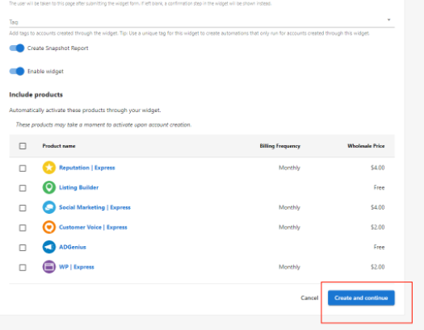

:::info Legacy Feature Notice
As of November 17, 2025, the Acquisition Widget is now a legacy Vendasta feature. We recommend using [CRM Forms](/marketing/forms) to automatically capture leads and fully customize nurturing automations (including Snapshot Report workflows). If you prefer a setup similar to the original Acquisition Widget, you can use the "Acquisition Widget" form template, which provides a comparable default configuration.
:::

When a new customer signs up for an account through the acquisition widget they will not be automatically sent the New User Welcome email that you would normally associate with new user creation. In order to have a welcome email sent, you will need to add a Welcome Email campaign to the widget when creating it.

## Add a welcome email campaign

1. You can add a campaign when creating or editing an acquisition widget by selecting the campaign line.

2. From the drop-down list, select the applicable campaign name.

3. Once the desired campaign is selected, click `Save and Continue` to move to the next step in the creation of the widget.

