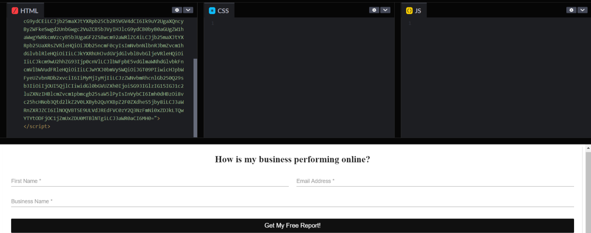

# How can I test my Acquisition Widget code?

:::info Legacy Feature Notice
As of November 17, 2025, the Acquisition Widget is now a legacy Vendasta feature. We recommend using [CRM Forms](/marketing/forms) to automatically capture leads and fully customize nurturing automations (including Snapshot Report workflows). If you prefer a setup similar to the original Acquisition Widget, you can use the "Acquisition Widget" form template, which provides a comparable default configuration.
:::

One easy way to determine if a widget is working or not is to copy the widget code and enter it into the HTML portion of [http://codepen.io/pen](http://codepen.io/pen). This will display what the layout looks like to end-users.

If nothing is displayed, the widget may likely be broken. In this instance, please report to Support on Demand via support@vendasta.com.