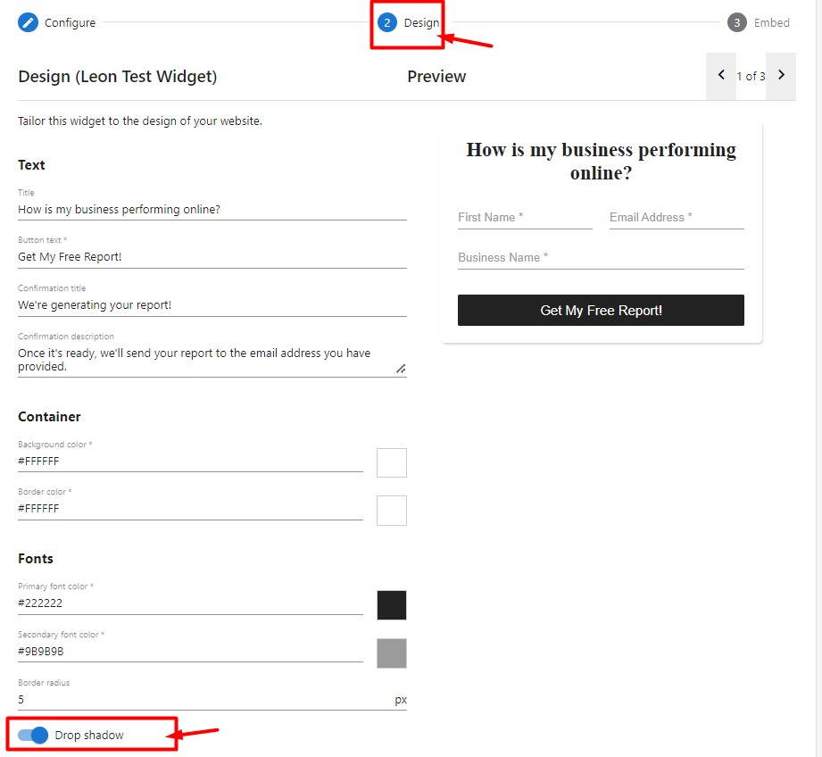

:::info Legacy Feature Notice
As of November 17, 2025, the Acquisition Widget is now a legacy Vendasta feature. We recommend using [CRM Forms](/marketing/forms) to automatically capture leads and fully customize nurturing automations (including Snapshot Report workflows). If you prefer a setup similar to the original Acquisition Widget, you can use the "Acquisition Widget" form template, which provides a comparable default configuration.
:::

To enable or disable the drop shadow on your acquisition:

1. Log in to the **Partner Center.**
2. Go to the **Marketing** tab > click on **Acquisition widgets.**
3. Select a widget > Navigate to Design (click on 'Save and Continue' at the end of the page).
4. Scroll down to **Fonts** and turn on/off the toggle next to **drop shadow.**
5. Click on **Save & continue > Finish.**

