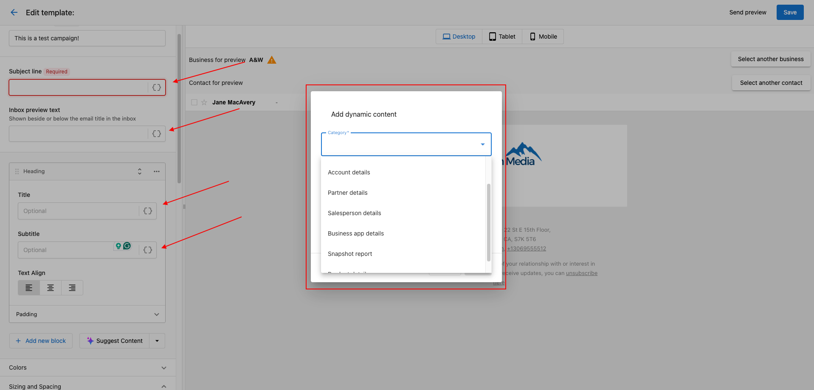
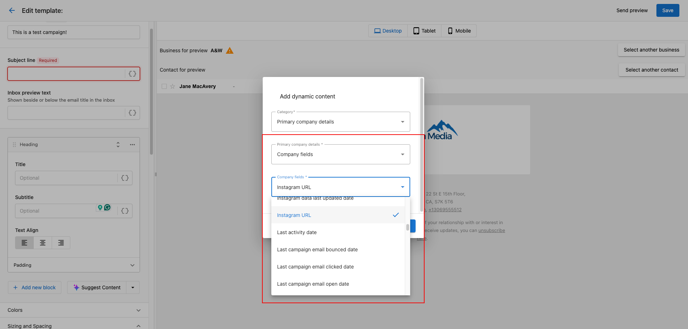

<iframe 
  src="//www.youtube-nocookie.com/embed/2gKOo9ccenw" 
  width="560" 
  height="315" 
  frameBorder="0" 
  allowFullScreen=""
/>

You can use **dynamic content** to personalize your emails and improve the effectiveness of your campaigns.

### **How does dynamic content work?**

> Once your email is sent, the platform automatically replaces dynamic content with real information about your prospect/customer, products, and more depending on the content you chose. That means you only have to build one campaign, and the content in your emails will automatically be personalized!

To add dynamic content from the **Create Content** or **Edit Content** page:

> You can access the **Create Content** or **Edit Content** page by [creating a custom campaign](/marketing/marketing-campaigns/create-custom-campaigns) or [editing an existing campaign](/marketing/marketing-campaigns/edit-campaigns).

### **Add Dynamic Components to the Email Builder**

1. Navigate to **Partner Center > Marketing > Campaigns > Create Campaign > Name your new campaign > Create new email.**

2. From here, you can add Dynamic Components to your Subject Line and Inbox Preview Text. Once you have added a new block of text for the body of your email, you can also insert Dynamic Components:

### **Options for dynamic components include**

1. Account details
2. Partner details
3. Salesperson details 
4. Business App details 
5. Snapshot Report
6. Product details 

Once a category is selected, further options to add specific details will become available: 

