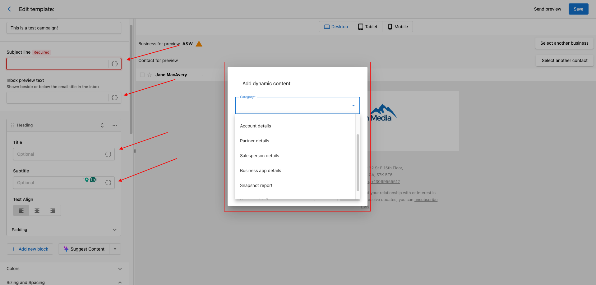
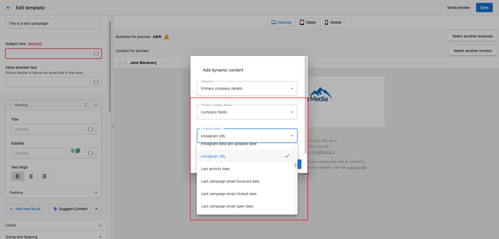

<iframe 
  src="//www.youtube-nocookie.com/embed/2gKOo9ccenw" 
  width="560" 
  height="315" 
  frameBorder="0" 
  allowFullScreen=""
/>

You can use **dynamic content** to personalize your emails and improve the effectiveness of your campaigns.

### **How does dynamic content work?**

Once your email is sent, the platform automatically replaces dynamic content with real information about your contacts, products, and more depending on the content you chose. That means you only have to build one campaign, and the content in your emails will automatically be personalized!

### **Add Dynamic Components to the Email Builder**

1. Navigate to **Partner Center > Marketing > Campaigns > Create Campaign > Name your new campaign > Create new email.**

2. From here, you can add Dynamic Components to your Subject Line and Inbox Preview Text. Once you have added a new block of text for the body of your email, you can also insert Dynamic Components:

### **Options for dynamic components include**

1. **Contact details** - Personalize with [CRM contact fields](/crm/contacts/crm-default-contact-fields) including name, email, phone number, job title, interests, skills, and engagement data
2. **Primary company details** - Include [CRM company fields](/crm/companies/crm-default-company-fields) like company name, website, address, employee count, and social media URLs  
3. **Account details** - Add account-related information and settings
4. **Partner details** - Include partner branding and contact information
5. **Salesperson details** - Add salesperson contact information and personal details
6. **Business App details** - Include Business App-specific information
7. **Snapshot Report** - Add report data and insights
8. **Product details** - Include product information and features

Once a category is selected, further options to add specific details will become available: 

