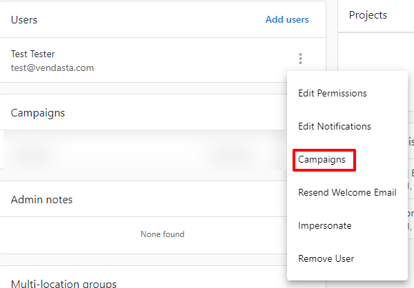
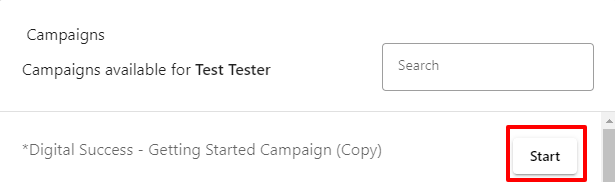

Yes, you can add an additional recipient to an active email campaign.

1. Go to Partner Center > Accounts > Manage [Accounts](https://partners.vendasta.com/manage-accounts).
2. Find the account associated with the user, then click on the account name. This will bring you to the account details page.
3. On the account details page, scroll down to the **Users** section. Click the **menu** icon  beside the User you want to add to the campaign.
4. Select **Campaigns** from the menu.  

5. Find the campaign you want to send to the User, then click **Start** next to the campaign name.  
