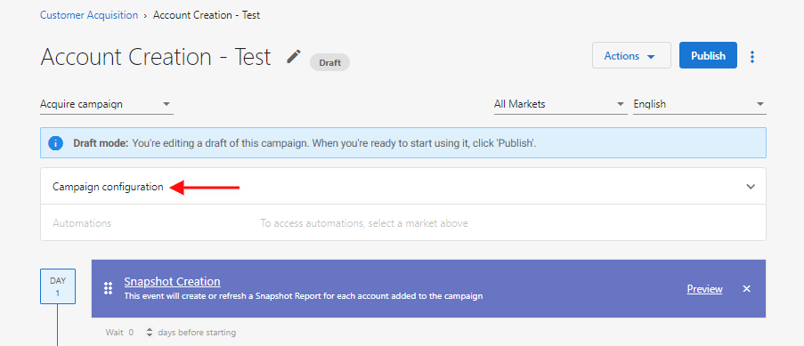
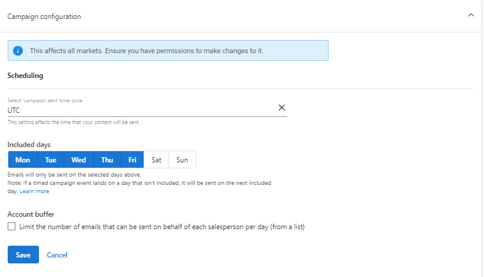

In the **Campaign Configuration** section of a campaign, you can configure the following settings:

- [Time Zone](#time-zone)
- [Included Days](#included-days)
- [Account Buffer](#account-buffer)
- [Scheduling Campaigns Walkthrough Video](#scheduling-campaigns-walkthrough-video)

## Time Zone

By default, campaigns are sent in your local time zone. To change this setting:

1. Select a time zone.
2. Click **Save**.

## Included Days

By default, emails are only sent Monday-Friday. However, the delays that are set between campaign events count all the days of the week. If an email is scheduled to send on a day that's not included, the email will be sent on the next included day.

:::note
For example, a campaign includes two emails: the first email occurs on Day 1, and the second email occurs on Day 4. The included days are Monday-Friday.
- If the first email is sent on a Monday, the second email will be sent on Thursday.
- If the first email is sent on Wednesday, the second email will be sent on Monday.
- If the first email is sent on Friday, the second email will be sent on Monday.
:::

To change this setting:

1. Select the days that emails should be sent on.
2. Click **Save**.

## Account Buffer

The account buffer limits the number of emails that can be sent on behalf of each salesperson per day. The buffer only applies when adding a list to a campaign (not adding individual accounts). Only the first email step of a campaign is affected—the remaining emails in a campaign are sent with the delays set in the campaign. Pausing and resuming a campaign will bypass the buffer.

:::note
For example, if a company has 4 salespeople, and the buffer is set to 2 recipients per day, then 8 recipients will be added to the campaign per day. Each recipient will receive subsequent emails in the campaign with the delays that are set in the campaign.
:::

By default, the buffer is disabled. To turn on the buffer:

1. Toggle the **Account Buffer** to **ON**.
2. Enter the maximum number of recipients that should be added to the campaign per salesperson per day (from a list).
3. Click **Save**.

This feature is available in both Partner Center--Marketing--Campaigns and Business App--Campaigns. However, setting in Business App--Campaigns are not dependent on Partner Center--Campaigns.

## Scheduling Campaigns Walkthrough Video

<iframe 
  src="https://drive.google.com/file/d/17wY5cNDUF8X4WQ2nVLBn5BaSvFA4RoEe/preview" 
  width="640" 
  height="480" 
  allowFullScreen
></iframe>