Email campaigns can promote your products and generate hot leads for your salespeople. You can manage your campaigns from the **Marketing** tab in Partner Center.

1. Add recommended campaigns or Create custom campaigns
2. Preview and test your campaigns
3. Publish your campaigns

### **Add recommended campaigns**

Building email campaigns is a hassle, so we've done the legwork for you—we've built ready-made campaigns that are proven to generate hot leads. These automated campaigns allow your salespeople to connect with more prospects and determine where it's best to spend their time.

To add a recommended campaign:

1. Go to **Partner Center** > **Marketing > Campaigns.**
2. Go to the **Recommended Campaigns** tab. 

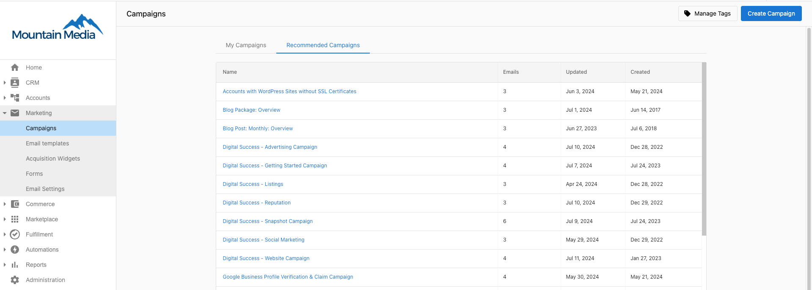

3. Browse the selection of ready-made campaigns. 

:::note
You can preview each email within a campaign by clicking the name of the campaign.
:::

4. When you find a campaign you like: 
   - Click on the campaign name, then click **Actions > Copy.**

5. Go to the Duplicate Campaign.

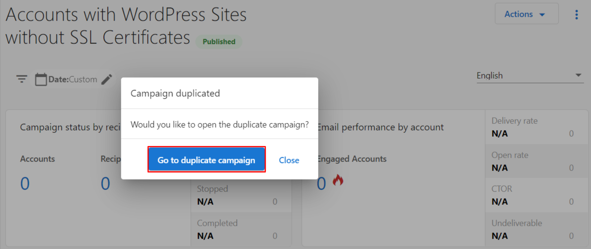

6. Edit the campaign details as desired. The campaign must be in a Draft Status to allow editing. 
7. When you are ready, click **Publish**.

:::note
You can edit your campaign before launching it. [Learn more](/marketing/campaigns/edit-email-campaigns)
:::

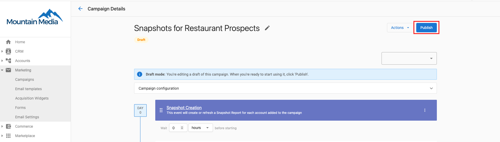

[You have the flexibility to craft your own email campaigns with the New Email Builder.](/marketing/email-builder/new-email-builder)

To create a custom campaign with the Old Email Builder:

1. Go to **Partner Center** > **Marketing > Campaigns.**
2. Click **Create Campaign** in the upper right. 

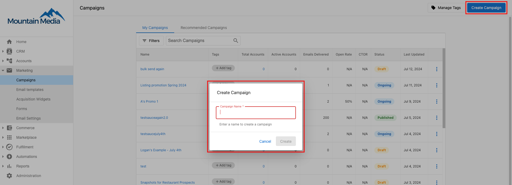

3. Enter a descriptive name for the campaign that your salespeople will recognize. Click **Create**.
4. Click **Add existing email, Create new email, or Add Snapshot Report**

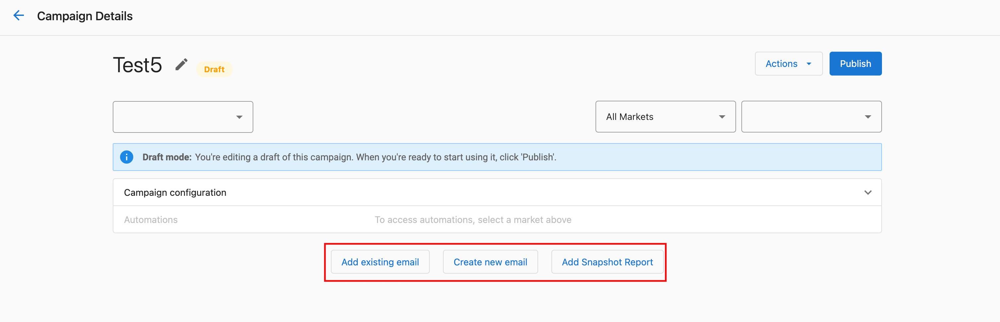

5. If you select **Create new email**, you will immediately enter the [Email Builder](/marketing/email-builder/new-email-builder).

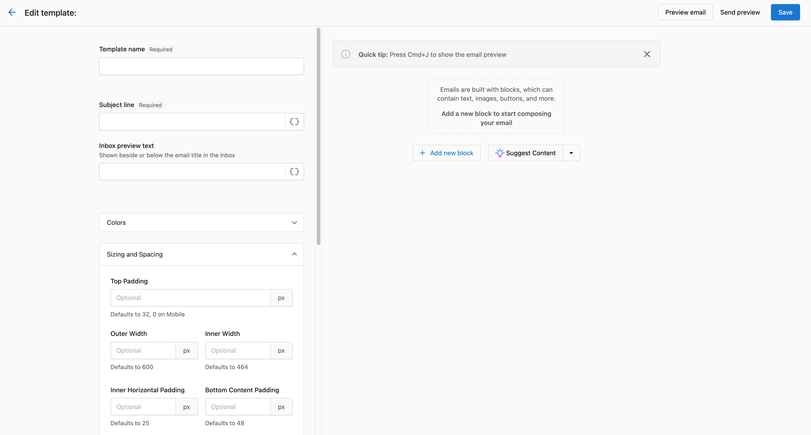

6. If you selected **Add Snapshot Report**, the campaign will automatically create or refresh a Snapshot Report for your prospect. If any of the emails in the campaign link to the Snapshot Report, this event ensures the information in the report is up-to-date.
7. Continue adding events until you have finished creating the campaign.
8. Adjust the "days before starting" or "days before previous event." 

:::note
We recommend the following email frequencies:
**Customer Acquisition**: lower frequency (1 email/week)
**Product Adoption**: higher frequency (3 emails/week)
**Product Upsell**: lower frequency (1 email/week)
:::

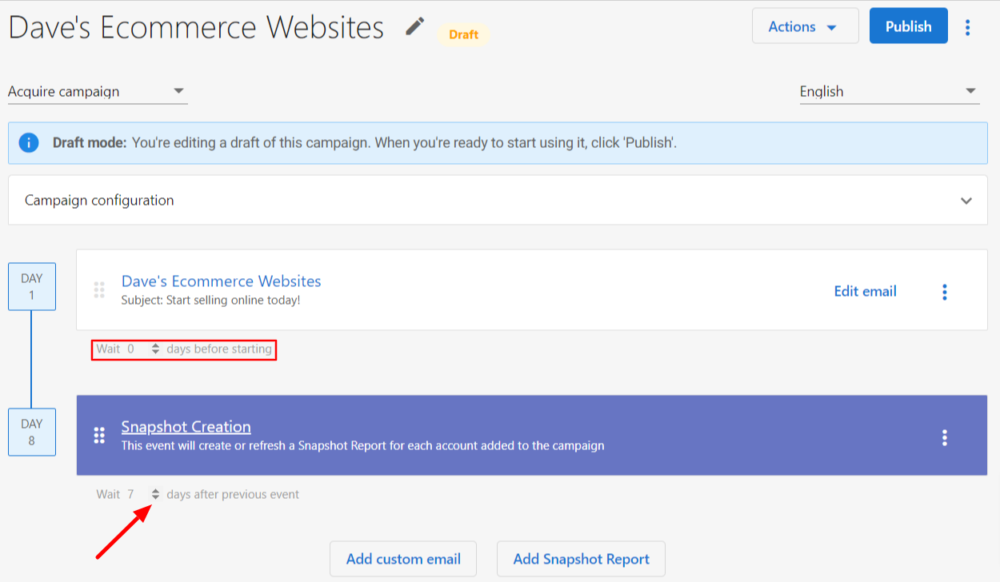

9. Configure your campaign to bring in the right number of leads on the right days. [Learn more](/marketing/campaigns/configure-email-campaigns)

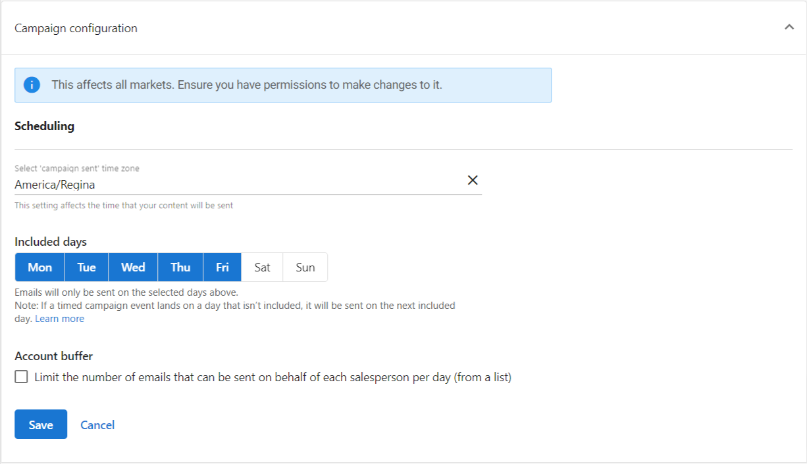

10. Before publishing your campaign, preview and test your emails.
11. Click the  icon and select Preview > Send test email.

### **Preview and test your campaigns**

Email clients—such as Gmail, Apple Mail, and Outlook—display emails differently. As such, we recommend that you preview and test your emails by sending them to your own email address or, better yet, a third-party testing tool. You need to make sure everything looks great and all your links are working.

**Note:** *In order for a Test Campaign to be sent successfully there needs to be an account linked to the User receiving the email.*

To test your emails from the campaign page:

1. Click **Preview** under the first email. 

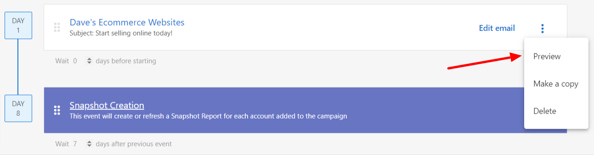

2. Click **Send Yourself a Test Email**. 

3. Enter the test email address, then click **Send Test**.
4. Scroll Next to the following emails, if applicable. Click **Send Test** for each email. 

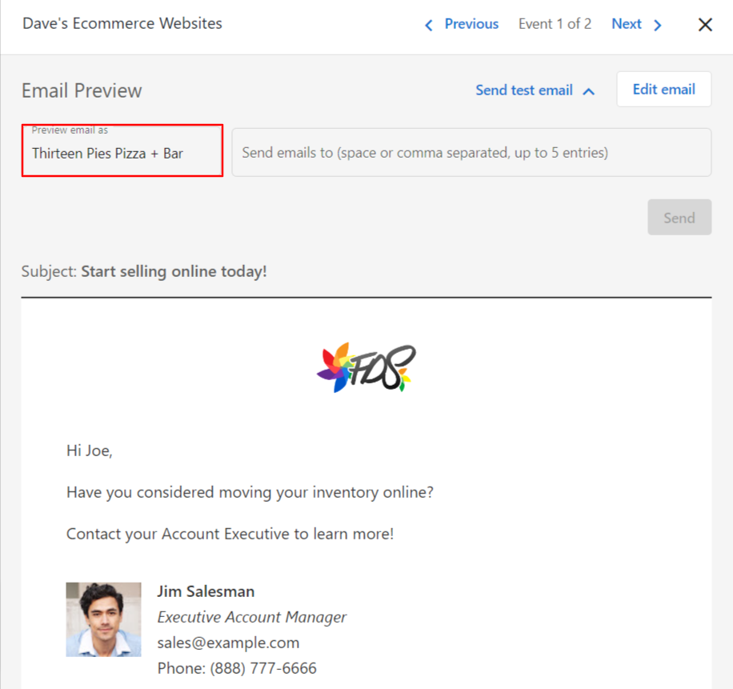

:::note
Don't like how your campaign looks?
You can edit your campaign before launching it. [Learn more](/marketing/campaigns/edit-email-campaigns)
:::

### **Publish your campaigns**

To publish the campaign from the campaign page:

* Click **Publish**.

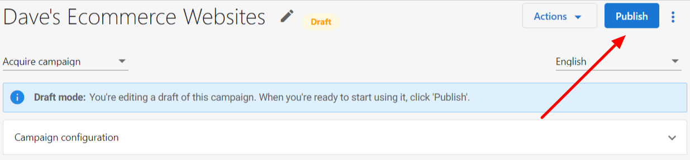