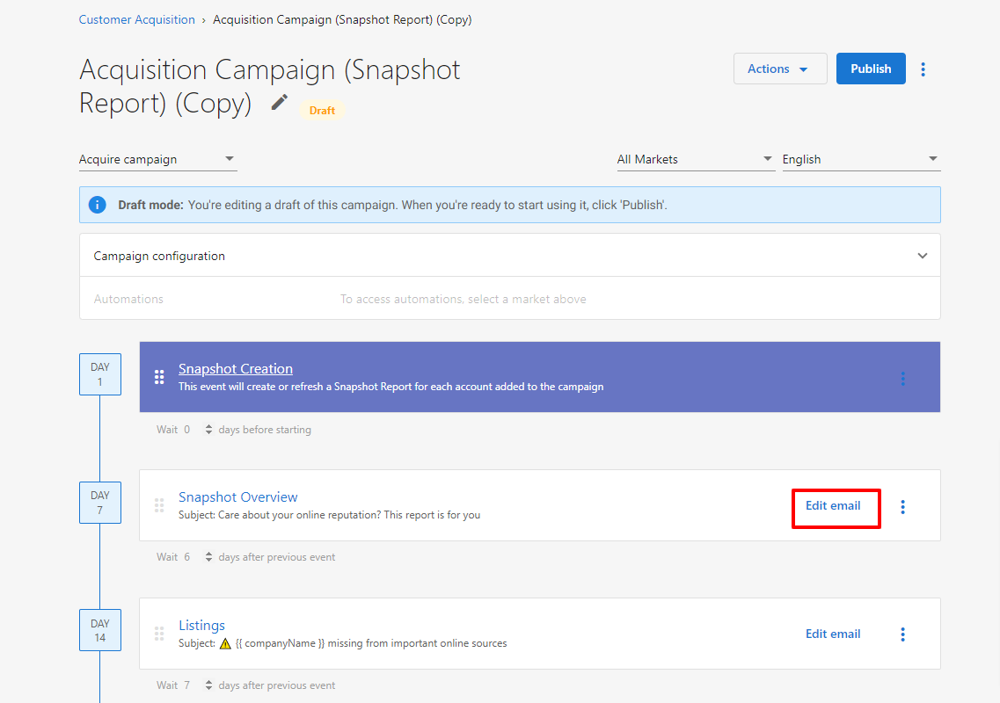
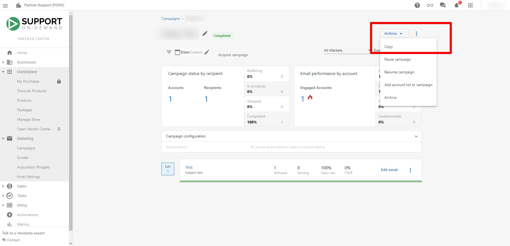
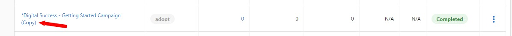
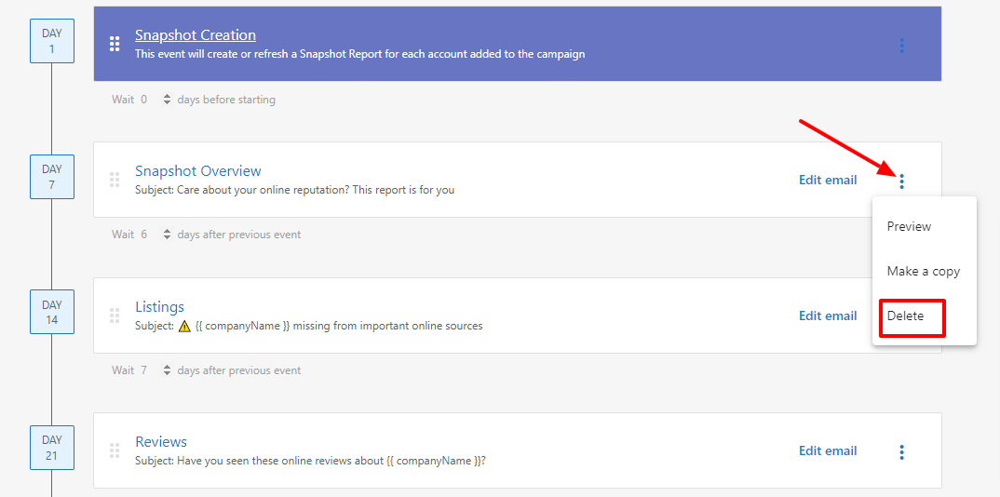

## Edit email campaigns

To edit a specific campaign, go to `Partner Center` → `Marketing` → `Campaigns` and select a campaign. From the campaign details page, you can edit the following:

### Edit email content

:::note
Editing the email content for an **active** campaign will alter the email for all the accounts on the campaign. Doing so will also reset the email's statistics.
:::

To edit the content of an email within a campaign:

1. Click `Edit` on any email.
2. Edit the content, then click `Save`.

### Edit campaign structure

:::note
You cannot change the structure of the email campaign (as in, the order the emails are sent out) for a published campaign. To edit this campaign email order, make a copy of the campaign by clicking `Actions` → `Copy`.
:::

:::note
This will create a copy of the campaign in your Campaigns table with `(Copy)` in the title. 
:::

### Add email

To add an email to a campaign:

1. Click on the campaign in `Draft` mode.
2. Select `Create new email`.

### Remove email

To remove an email from a campaign in `Draft` mode:

1. Click **⋮** next to the Edit email option.
2. Click `Delete` to confirm the action.

### Reorder email events

To reorder emails within a campaign: 

- Click on the boxes on the left-hand side of the event row and then drag the event up or down to where you want it placed.

### Change order of events after publishing

Once a campaign is published, you cannot directly change the order of events. However, you can:

1. Create a copy of the campaign by clicking `Actions` → `Copy`
2. Edit the event order in the copied campaign
3. Archive the original campaign and publish the new version with the correct order

This ensures your campaign structure remains consistent while allowing you to make necessary adjustments.