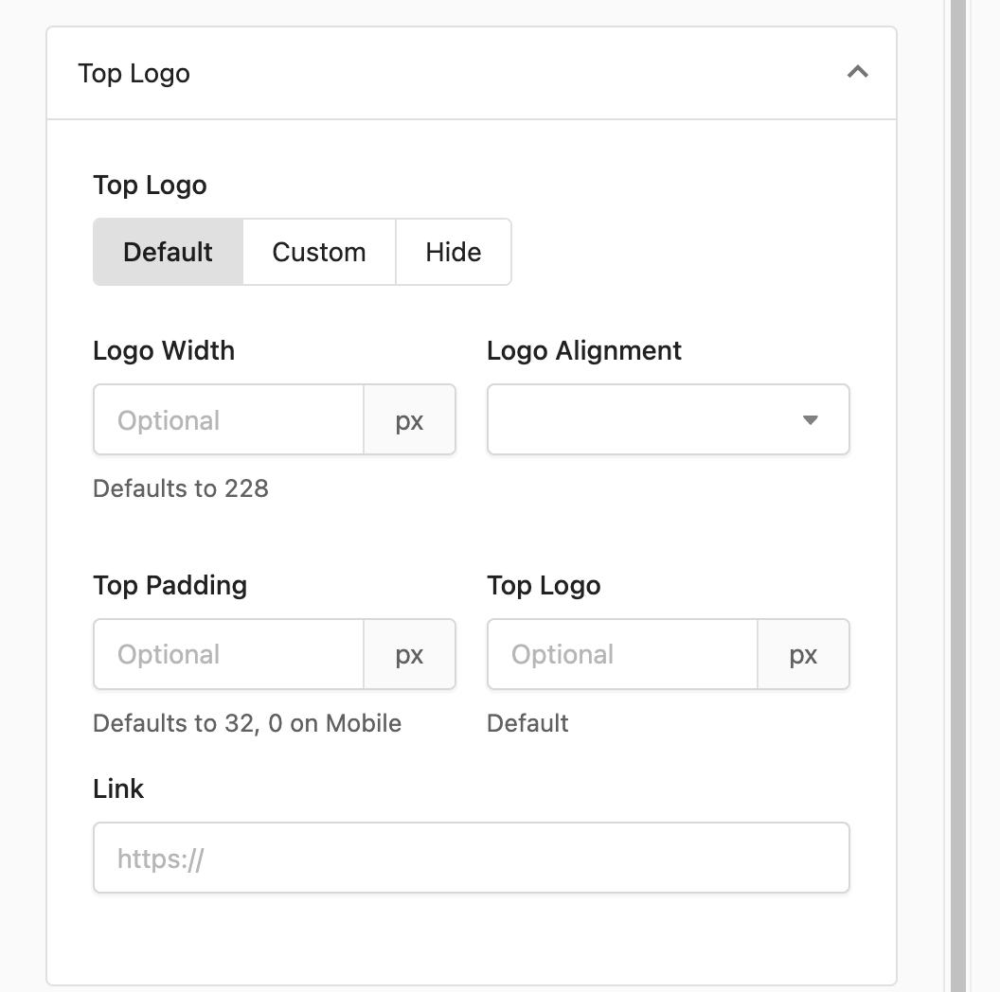
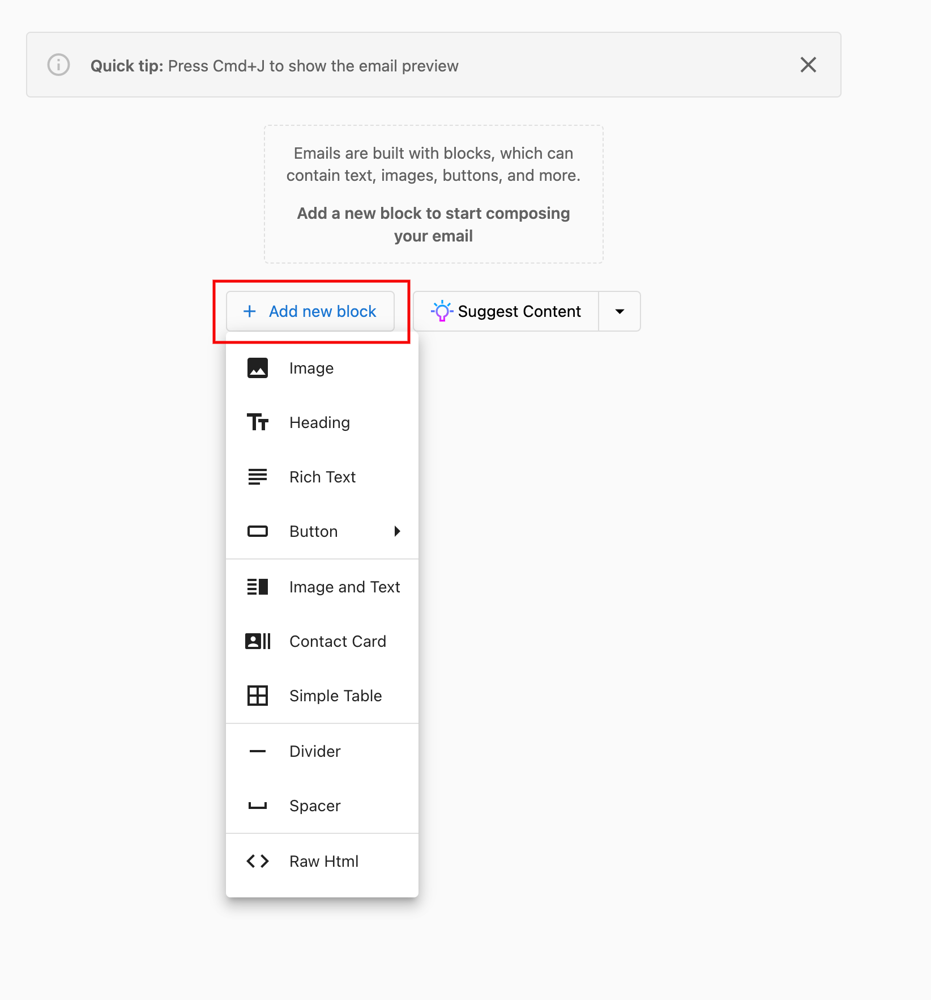
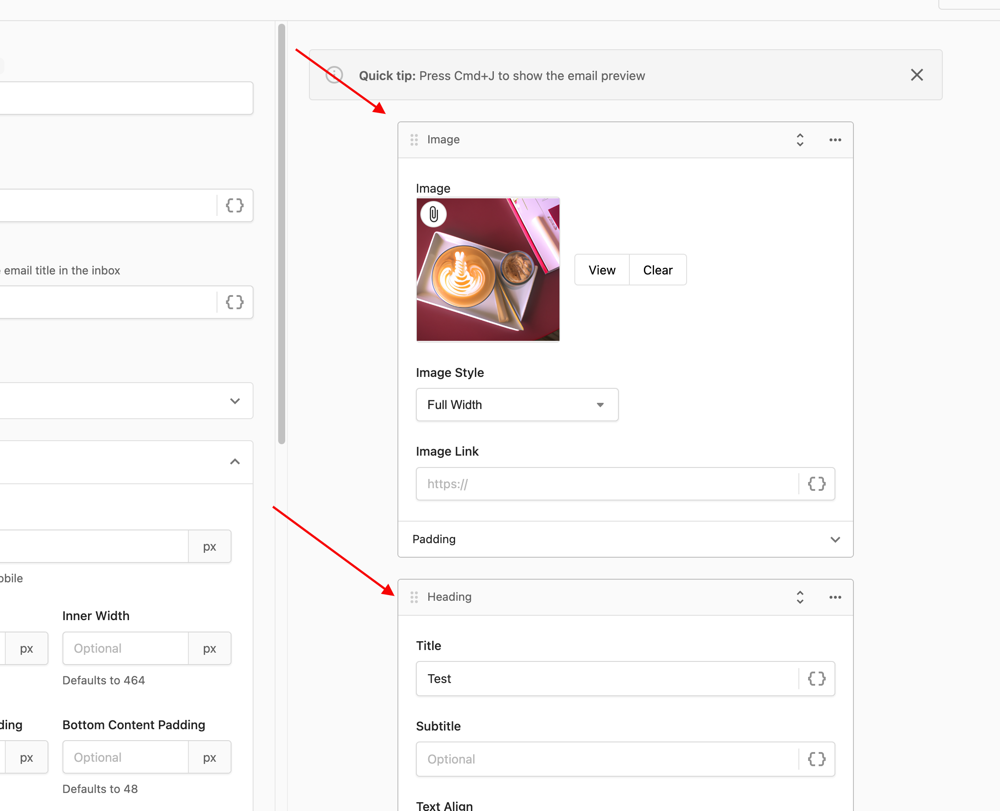
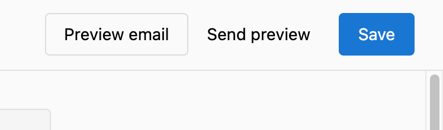
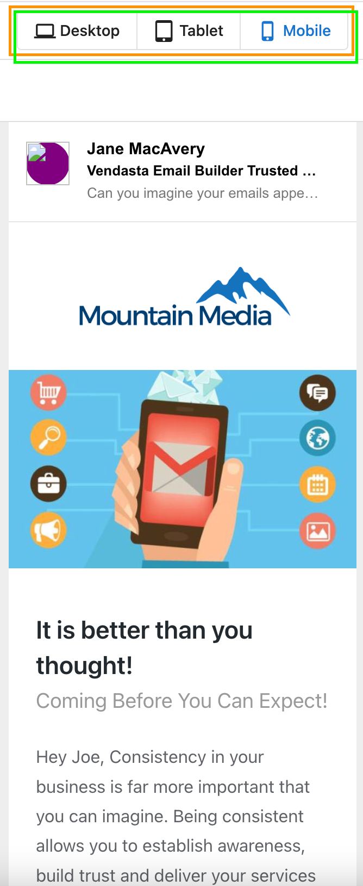

# Email Builder - Overview

Email Builder allows you to design engaging emails that look great on any device. The Email Builder inside the **Partner Center** gives you the ease and speed to build eye-catching personalized and customized emails on the go that will drive user engagement.

The world-class sales intelligence Vendasta offers with tools like the Snapshot Report are perfect for utilizing in email campaigns, but it's hard to know how these emails will be seen when upwards of [80% of emails are opened on a mobile device.](https://www.litmus.com/blog/email-client-market-share-infographic/)

With the email builder you can quickly create an effective email campaign utilizing all the data points available in Vendasta while optimizing it for a variety of devices with instant visual feedback.

## Why is Email Builder important?

The world-class sales intelligence Vendasta offers with tools like the Snapshot Report are perfect for utilizing in email campaigns, but it's hard to know how these emails will be seen when upwards of [80% of emails are opened on a mobile device.](https://www.litmus.com/blog/email-client-market-share-infographic/)

With the email builder you can quickly create an effective email campaign utilizing all the data points available in Vendasta while optimizing it for a variety of devices with instant visual feedback.

## How does it work?

### Accessing the email builder

When creating an email campaign, click "Create new email" to be taken into the email builder.

### Customize Logo

Use this feature to hide or customize the logo for each email you design in the campaign. The logo can be hidden or changed for each different email inside the drip campaigns. This will allow for more personalized content to go out.

The logo customization block will also allow adding any URLs to which the users can be directed upon clicking on the logo.

### Using content blocks

All email content is placed in content "blocks." Email Builder gives you multiple blocks that you can just click and add. The blocks determine what kind of content can be entered as well as the styling and editing options that are available to you. Click "+Add new block" to start building your email.

After creating a content block, the blocks can be dragged and dropped to re-order the content.

Click "Preview" in the top right-hand corner to check out your email!

### Render Email In Different Devices

Not only can you see the changes and every cool thing that you add to personalize your email in real-time, but you can now see in real-time how your email will appear on different devices with the click of a button.

## Many Other Exciting Features!

- **Rendering Images or texts side by side:** Email Builder powers the capability to render the block of images and texts side by side just with a simple click and selection to build engaging email content.
- **Changing background and text color:** You get many options to change the color for the text, title, subtitle, links, footer text, content background, and page background.
- **Customizable button:** Choose the colors, link to a URL, customize button text, and put a dynamic component in a button, and all of this with a simple selection.
- **Tables**: You can also add simple tables to arrange any data in the email for making the email more intuitive.
- **Contact Card:** Personalize your email with a personal reference with a personalized image and more details and optional fields to add.

## Current Limitations of Email Builder

1. Emails built in the legacy Email Builder can not be edited in the new Email Builder and vice-versa
2. Emails that have been started in the legacy builder can not be switched in the middle to continue building in the new Email Builder and vice versa.