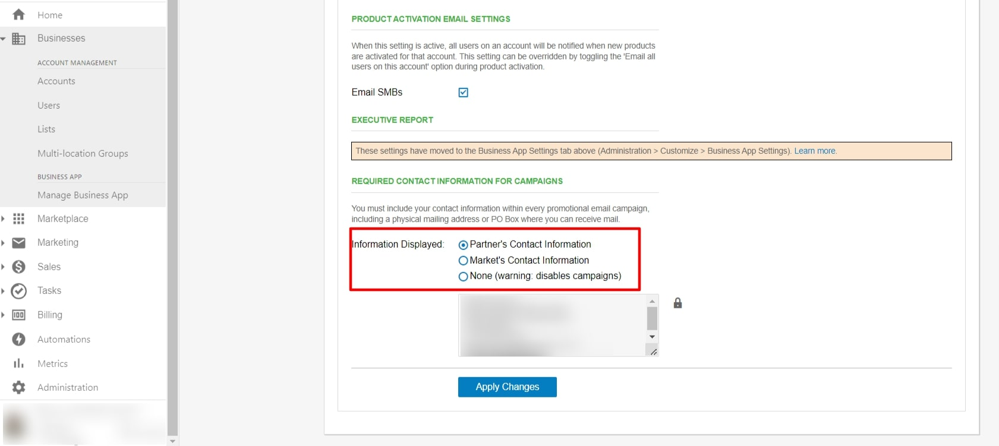

Are you getting an error "***Your company hasn't set up campaigns yet. To use them, reach out to your administrator,***" while sending an email campaign?

Here is why you are receiving that error and how to fix it:

The contact information is required in order to send a marketing campaign. The error message above therefore is because there is no contact profile selected to be used for the campaign.

The contact profile options are either the **Partner's Contact Information** or **Market's Contact Information**, if **None** is selected the campaign will be disabled and thus throw the error.

This can be changed by following these steps:

Step 1: Navigating to Administration tab > Customize > Market

Step 2: Click on the pencil (edit icon)

Step 3: Click the Email Settings

Step 4: Select either the Partner's contact information or the Market's contact information under the REQUIRED CONTACT INFORMATION FOR CAMPAIGNS

#### Video Walkthrough

<iframe 
  src="https://drive.google.com/file/d/1BQJev1pT2N5cA7-MPpIIqAEFBHJBau5G/preview" 
  width="640" 
  height="480"
  allowFullScreen
></iframe>