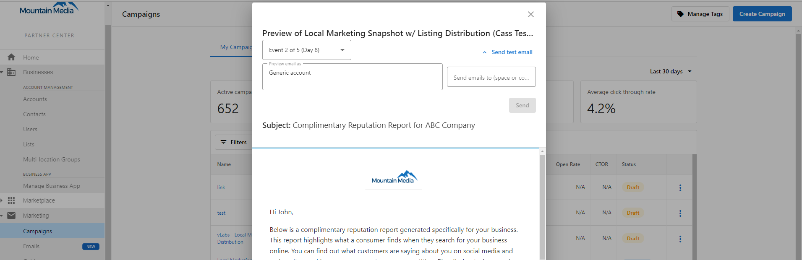
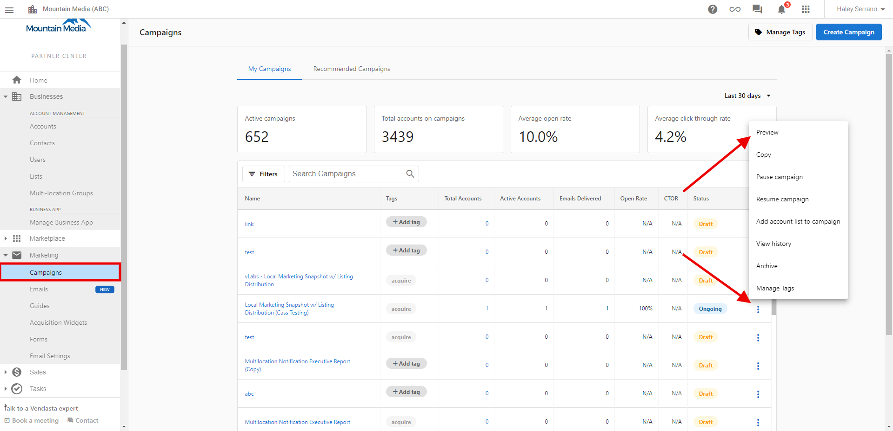
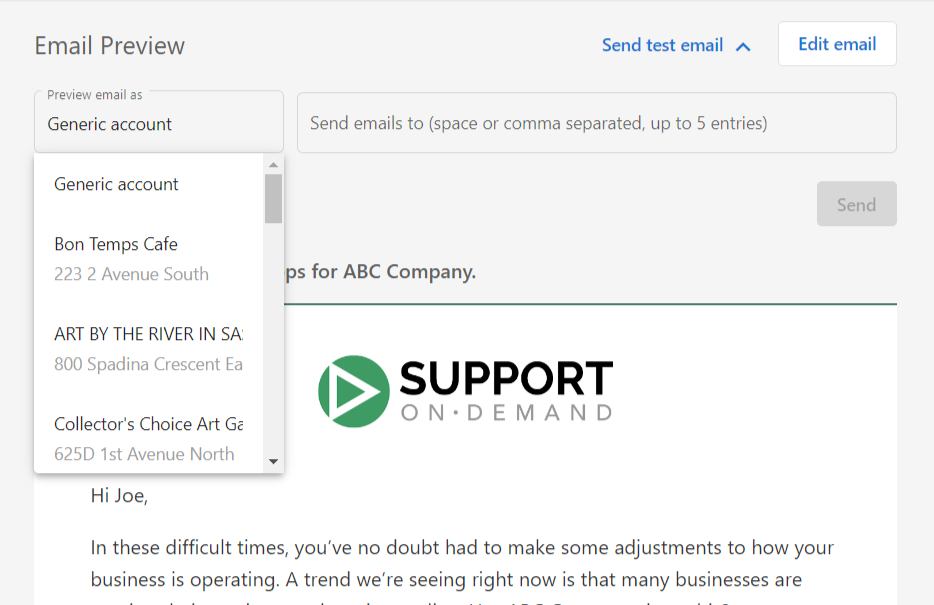

You can preview email campaigns as a specific account, so you can make sure everything looks right and works properly for your recipients. No longer will you wonder and worry whether the dynamic components or links work in your emails—with this feature, you can double-check your work, and rest assured that your recipients will see what they should.

### **How does previewing campaigns as an account work?**

From the campaign details page in **Partner Center** > **Marketing > Campaigns:**

1. Click the **3-dots** next to the email you want to preview.
2. Select **Preview.**
3. Click **Send test email**.
   

4. By default, the email will be previewed as a Generic account. To change this, click on the field and select an account that you'd like to preview the email as.
   

5. In the next field, enter emails to send the email preview. You can send a test email to yourself, or to the people you trust to review your content for you.
6. Click **Send**. 

The email addresses you entered will receive the test email, which will be customized for the account you selected.

:::note
* The preview doesn't apply to any recipient-based dynamic components, such as recipients' names, phone numbers, and email addresses. In the test email, you'll still see generic information; but don't worry, your recipients will see their real personal information in the email that's sent to them.
* This feature is not available when editing an email.
:::

  <a
    style={{
      fontSize: '16px',
      fontWeight: 'bold',
      color: '#ffffff',
      backgroundColor: '#33ace2',
      textDecoration: 'none',
      borderRadius: '5px',
      padding: '10px 30px 9px 30px',
      border: '1px solid #33ACE2',
      display: 'inline-block',
      textAlign: 'center'
    }}
    href="https://partners.vendasta.com/marketing/campaigns/acquire"
    target="_blank"
    rel="noopener"
  >
    Preview emails
  </a>

