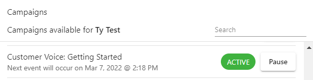
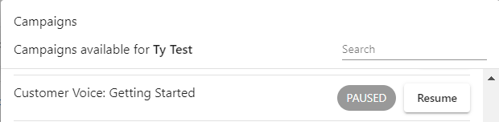

Removing a user from a campaign means stopping a user from receiving any more emails from a campaign. 

## To do so:

1. Navigate to **Partner Center** > **Accounts** > **Manage Accounts** > Select **Account**.
2. Click on the menu icon  next to **User** > **Campaigns** > Click **Pause** next to the active campaign.

- Similarly, you can also unpause a campaign for a user by clicking the 'Resume' button instead. 
  