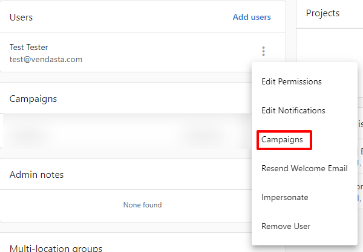
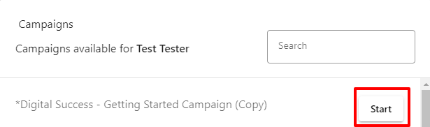

Email campaigns can be sent to contacts, companies, and lists through various methods in the Vendasta platform. The CRM-based approaches provide the most comprehensive functionality and tracking capabilities.

## Prerequisites

Before sending email campaigns, ensure you have:

- **Configured email settings** - Set up your domain authentication (SPF, DKIM, DMARC records). See [Email Settings](/marketing/email-settings) for complete setup instructions
- **Created an email template** - Design a marketing email using the [Email Builder](/marketing/campaigns/create-email-campaigns)
- **Prepared your audience** - Identify contacts, companies, or lists to receive the campaign. Learn about [CRM contact fields](/crm/contacts/crm-default-contact-fields) and [CRM company fields](/crm/companies/crm-default-company-fields) for targeting options
- **Verified mailing address** - Ensure your business mailing address is configured in Partner Center. See [Email Settings requirements](/marketing/email-settings/email-settings-requirements) for details

## Primary methods (recommended)

### 1. Send to CRM contacts

The primary and recommended way to send campaigns is through CRM contacts, which provides full field support and comprehensive tracking:

**Via Contact Selection:**
1. Go to `Partner Center` → `CRM` → `Contacts`
2. Select the contacts you want to include (Or Apply Filter and click Select All ) 
3. Click `Actions` → `Add to campaign`
4. Choose your campaign and configure sending options
5. Click **Start Campaign**

**Via CRM Contact Lists (Smart or Static):**
1. Go to `Partner Center` → `CRM` → `Lists`
2. Create or select a contact list (smart lists automatically update based on criteria)
3. Click `Three dots` → `More action` from the list menu
4. Select `Start Campaign for Contact` or `Send Email to Contact`
5. Choose your campaign and start sending

**Via Automation Steps:**
- Use `Start Campaign for Contact` automation step
- Use `Send Email to Contact` automation step
- Trigger campaigns based on contact actions, form submissions, or data changes

### 2. Send to CRM companies

Send campaigns to entire companies through the CRM system. When you target a company, the campaign automatically sends emails to all associated contacts at that company (up to 50 contacts per company) while using company-level data for personalization.

**How Company Campaigns Work:**
- Target the company as an entity
- Emails are automatically delivered to associated contacts at that company (up to 50 contacts per company)
- All emails use the company's data for dynamic content and personalization
- Perfect for account-based marketing and business-level messaging

**Via CRM Company Lists:**
1. Go to `Partner Center` → `CRM` → `Lists`
2. Create or select a company list
3. Click `Three dots` → `More action` from the list menu
4. Select `Start Campaign for Company` or `Send Email to Company`
5. Choose your campaign targeting companies

**Via Automation Steps:**
- Use `Start Campaign for Company` automation step
- Use `Send Email to Company` automation step
- Use `Get Associated Company` step if using an account trigger
- Target based on company characteristics, product usage, or business data

### 3. Send through CRM automation (advanced)

Set up sophisticated automated campaigns with business logic:

1. Go to `Partner Center` → `Automations`
2. Create automation workflows with triggers like:
   - Form submissions
   - Contact engagement patterns
   - Opportunity stage changes
   - Product activation events

**Automation Email Steps:**
- **Start Campaign for Contact** – Launches a campaign targeting an individual contact
- **Start Campaign for Company** – Initiates a campaign for the entire company  
- **Send Email to Contact/Company** – Sends a direct email to the selected contact or company
- **Campaign Step** - Use existing campaigns as building blocks within automation workflows

## Benefits of CRM-based sending

- **Complete Field Access** - Use all [CRM contact fields](/crm/contacts/crm-default-contact-fields) and [CRM company fields](/crm/companies/crm-default-company-fields) in dynamic content
- **Primary Company Data** - Company fields automatically use the contact's primary company information  
- **CRM Integration** - All email activity is captured in CRM for segmentation and future automation
- **Smart Segmentation** - Create dynamic lists that automatically update based on criteria
- **Advanced Automation** - Trigger campaigns based on complex business rules and contact behavior

## Choosing between contact vs company targeting

### Send to CRM contacts when:
- **Individual Focus**: Personalizing content for specific roles, interests, or individual behavior
- **Role-Based Messaging**: Sending different content to different job functions (owner vs staff)
- **Personal Relationships**: Building individual relationships and personal touchpoints
- **Engagement-Based**: Targeting based on individual login, usage, or interaction history
- **Permission-Based**: Sending only to contacts who have specifically opted in

### Send to CRM companies when:
- **Account-Based Marketing**: Targeting entire business accounts as strategic units
- **Business Decisions**: Promoting products/services that require business-level decision making  
- **Company Performance**: Using business metrics, rankings, or performance data for messaging
- **Complete Coverage**: Ensuring all decision-makers and influencers receive the same message
- **Revenue Opportunities**: Targeting based on business size, growth potential, or product gaps
- **Industry Campaigns**: Sending industry-specific content relevant to the entire business

### Company data available for personalization

All [CRM company fields](/crm/companies/crm-default-company-fields) are available for dynamic content including:
- **Company Information**: Company name, website, address details, phone number, number of employees
- **Engagement Data**: Last activity date, last campaign email interactions, lifecycle stage
- **Social Media**: LinkedIn URL, Facebook URL, X URL, Instagram URL  
- **Tracking Data**: UTM parameters, Google Place ID, Google review score
- **Custom Organization**: Tags (up to 25 tags, 50 characters each), custom categories
- **System Information**: Creation date, timezone, record source details
- **Snapshot Report details**: Enrichment from the Snapshot Report, the section's grades and the details
- **Product details**: The active products on a company

## Alternative methods

### Account/user-based sending

For specific use cases, you can also send campaigns through account management:

**Send to Account Lists:**
1. Go to `Partner Center` → `Marketing` → `Campaigns`
2. Find your campaign and click the **3-dot menu**
3. Select **Add account list to campaign**
4. Configure sending options

**Send to Individual Accounts:**
1. Go to `Partner Center` → `Accounts` → [`Manage Accounts`](https://partners.vendasta.com/manage-accounts)
2. Find the company account, then click on the account name
3. On the account details page, scroll down to the `Users` section. Click the `menu` icon  beside the User
4. Select `Campaigns` from the menu  

5. Find the campaign and click `Start` next to the campaign name  

## Smart automation examples

### Product upselling campaigns
Filter companies with no active product (such as Conversation AI) and automatically send upselling campaigns highlighting the benefits and ROI potential for their business size and industry.

### Performance-based campaigns
Use snapshot report data to identify companies with low listing scores or poor online visibility, then automatically send improvement campaigns with actionable recommendations.

### Engagement recovery campaigns
Target contacts who haven't engaged recently, sending re-engagement campaigns with personalized incentives.

## Campaign configuration options

### Scheduling options
When sending campaigns, you can:
- **Send immediately** - Campaign starts right away
- **Schedule for later** - Set a specific date and time

### Sender configuration
Configure who the campaign is sent from:
1. **Default sender** - Uses your configured email settings
2. **Salesperson assignment** - When a salesperson is assigned to an account, their information will be used as the sender, overriding your partner-level sender settings
3. **Custom sender** - Override with specific sender details for the campaign

**How salesperson sender override works:**

When an account has an assigned salesperson, campaign emails go out from the salesperson's email address and name, not your partner-level "from" address. This is by design so replies go directly to the salesperson managing the relationship.

If the salesperson's email is on an unverified or unauthenticated domain, the platform automatically sends the email from your verified domain while preserving the salesperson's name as the display name (e.g., `Jane Smith via yourdomain.com`). This may appear in Gmail as "via yourdomain.com" in the sender line.

**To send campaigns from your partner-level sender instead:** Remove the salesperson assignment from the account before starting the campaign.

**Reply-to addresses:**

The **Reply Address** field in **Marketing** → **Email Settings** → **Sender and Reply Settings** applies to system emails only (such as Daily Digest notifications), not to campaign emails. Campaign replies go to the sender address (salesperson or partner-level sender, as described above).

### Email deliverability settings
Ensure successful delivery by:
- **Verifying domain authentication** - Check SPF, DKIM, and DMARC records are properly configured. See [Email Authentication](/marketing/email-settings/email-authentication) and [Update Email Settings](/marketing/email-settings/update-email-settings) for setup instructions
- **Include correct physical address** - CAN-SPAM law requires a valid physical postal address in all commercial emails. Configure your business address in [Email Settings Requirements](/marketing/email-settings/email-settings-requirements)
- **Testing campaigns** - Always send test emails before launching to full audience. Learn about [Email Deliverability best practices](/marketing/email-settings/email-deliverability) which includes troubleshooting common delivery errors

## Monitor campaign performance

After sending campaigns:
- Track open rates and click-through rates in campaign analytics
- Monitor bounce rates and unsubscribes
- Review delivery status for each recipient
- Use performance data to optimize future campaigns

For detailed guidance on analyzing your campaign results, see [Track Email Campaign Performance](./track-email-campaign-performance.mdx) for comprehensive metrics and optimization strategies.

:::tip Recommendation
Use CRM-based methods whenever possible for better data integration, tracking capabilities, and automation potential. The CRM approach provides more granular control and comprehensive contact management.
:::

## Frequently asked questions

Can I customize which users on an account receive an email campaign?

No, this is not possible when using account-based sending methods. If an account is added to a campaign, all users on the account will be added to the campaign. 

**Alternative approaches for targeted sending:**
- **Use CRM Contacts**: Send campaigns directly to specific contacts through the CRM system for precise targeting
- **Use Contact Lists**: Create targeted lists of specific contacts and send campaigns to those lists
- **Individual Campaign Sending**: Send campaigns to individual users through `Partner Center` → `Accounts` → `Manage Accounts` → `User menu` → `Campaigns`

The CRM-based contact targeting methods provide much more flexibility and control over exactly who receives your campaigns.

When I send a campaign to a CRM company, who receives the emails?

When you send a campaign to a CRM company, the system automatically sends emails to **up to 50 associated contacts** at that company. You cannot customize which specific contacts at the company receive the campaign.

**How company-level targeting works:**
- **Target Selection**: You select companies from your CRM
- **Automatic Distribution**: System identifies associated contacts at each selected company
- **Contact Limit**: Maximum of 50 contacts per company will receive the campaign
- **Email Delivery**: Campaign emails are sent to eligible contacts at each target company
- **Dynamic Content**: All emails use the company's data fields for personalization

**Important limitation**: If a company has more than 50 contacts, only up to 50 will receive the campaign emails. The system will select which contacts receive the emails.

**For selective contact targeting:**
- **Use CRM Contact Lists**: Create lists with specific contacts from the companies you want to target
- **Individual Contact Selection**: Select specific contacts directly from the CRM contacts table
- **Smart Lists**: Set up criteria to automatically include/exclude contacts based on their properties

This company-level approach is ideal for account-based marketing where you want to ensure all decision-makers and stakeholders receive consistent messaging.

:::tip Pro Tip
All email activity from CRM-based campaigns is automatically tracked in the contact and company records, enabling sophisticated follow-up automation and lead scoring based on engagement patterns.
:::