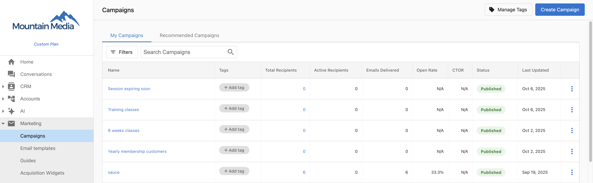
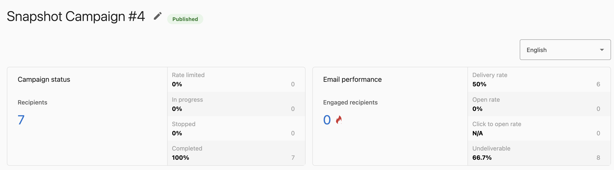
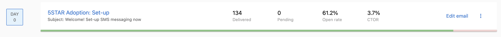

# Track Email Campaign Performance

## Overview

Once you start an email marketing campaign, Vendasta tracks how recipients engage with the campaign to help you make insightful decisions. The platform provides campaign statistics that give you visibility into your email performance across multiple levels:

- **Campaign-level metrics**: View overall performance across all emails in your campaign, including total recipients, active recipients, emails delivered, open rates, and click-to-open rates (CTOR)
- **Step-level metrics**: Monitor individual email performance within multi-step campaigns, tracking delivery status, engagement rates, and recipient progression
- **Detailed analytics**: Access granular data including link activity, delivery status, bounce rates, and unsubscribe metrics

These insights help you optimize future campaigns and understand what resonates with your audience.

### Understanding metric accuracy

All activity is always attributed to the original recipient, even though external processes and systems can sometimes initiate the activity. There are no clear indicators to differentiate if these activities are initiated by a human or an automated program, resulting in some Open Rates or Click-Through Rates (CTRs) being falsely registered on behalf of the recipient. Here are some common reasons why that may happen:

- **Third-party unsubscribe links**: Our email campaigns contain an unsubscribe link. When this link is clicked, it only registers as an "unsubscribe" and not as a click. However, many email clients nowadays have the option to ask the recipient to unsubscribe from suspected spam/newsletter emails. If the recipient unsubscribes using these third-party links, it registers with a click.
- **Recipient email client settings**: An email's open rate is recorded with a single tracking pixel embedded into the email. Usually, this tracking pixel is associated with an image. A recipient's email client may block loading images to protect the recipient from spammers. If the email client blocks loading images, the open rate is not tracked.
- **Spam and virus scanners**: Some internet service providers (ISP) click on links within an email to check for security risks. When this happens, the clicks are recorded on behalf of the recipient.

Unfortunately, these external initiations are out of our control. To maintain accurate email metrics, we recommend identifying domains that skew campaign metrics and segmenting those domains from your analysis.

## Campaign statistics
- Aggregated by campaign
    - [Campaigns page](#campaigns-page)
    - [Campaign Details page](#campaign-details-page)
- Aggregated by campaign step
    - [Campaign step overview](#campaign-step-overview)
    - [Campaign step bar](#campaign-step-bar)
    - [Email performance overview](#email-performance-overview)

### Campaigns page

- **Total Recipients** - how many recipients were added to the campaign.
- **Active Recipients** - how many recipients clicked on an email in a campaign.
- **Emails Delivered** - how many emails in a campaign were delivered. 
- **Open Rate** - describes what percentage of your emails have been opened by your recipients. This is calculated by dividing the number of opened emails with the number of delivered emails.
- **CTOR** - stands for Click-to-open rate, and describes what percentage of your opened emails have had links on their content body clicked. This is calculated by dividing the number of clicks captured with the number of emails opened.

### Campaign Details page

#### Campaign status
- **Recipients** - how many recipients were added to the campaign. This statistic matches the Total Recipients statistic in the Campaigns page.
- **Rate limited** - how many campaigns are currently unable to progress because of a rate limit in place. See [Rate limit](/marketing/campaigns/configure-campaigns#rate-limit) for details. 
- **In progress** - how many campaigns are still in the process of sending emails.
- **Stopped** - how many campaigns have been manually paused. This includes campaigns whose recipient has unsubscribed from. 
- **Completed** - how many campaigns whose emails have all been delivered. **Note:** this does not mean that the recipient has received the email; only that SendGrid has successfully sent the email to the recipient's email server. It will be up to the recipient's email server to determine if the email can be sent to the recipient's inbox.

#### Email performance
- **Engaged recipients** - how many recipients have clicked on at least one email in their campaign. 
- **Delivery rate** - describes what percentage of emails were successfully delivered. This statistic is calculated by dividing how many emails were successfully delivered with how many emails were processed. Processed events mean that SendGrid has successfully received the email Vendasta sent, but have yet to send to the recipient's email server.
- **Open rate** - describes what percentage of all emails have been opened. This statistic is calculated by dividing how many emails were successfully delivered with how many emails were delivered. This statistic matches Open rate in the Campaigns page.
- **Click to open rate** - describes what percentage of your emails opened have had links on their content body clicked. This is calculated by dividing how many click events have links captured with the number of opened emails. This statistic matches CTOR in the Campaigns page.
- **Undeliverable** - how many emails were unable to be delivered. This statistic is calculated by dividing how many emails were bounced and dropped with how many emails were processed.

### Campaign step overview

- **Delivered** - how many emails in that step were successfully delivered to the recipient's email server.
- **Pending** - how many recipients haven't yet received an email for that step.
- **Open rate** - how many emails were opened, divided by how many emails were delivered.
- **CTOR** - stands for Click-to-open rate, and describes the percentage of emails whose links were clicked on the content body, divided by how many emails were opened.

### Campaign step bar
You can find these stats by hovering over the bar below each of the campaign step overview panels.

- **Delivered** - how many emails in that step were successfully delivered to the recipient's email server.
- **Pending** - how many recipients haven't received an email for that step.
- **Bounced** - how many emails were rejected from the recipient's email server.
- **Unsubscribed** - how many recipients clicked on the 'Opt Out of All Emails' link.
- **Spam** - how many emails were marked as spam by the recipient.
- **Dropped** - how many emails were rejected by SendGrid.
- **Stopped** - how many campaigns have been manually paused. This includes campaigns whose recipient has unsubscribed from. 

### Email performance overview
You can find these cards by clicking on the three dots on any of the step panels. These stats are also grouped by step.

- **Opened** - the percentage of how many emails were opened, divided by how many emails were delivered. This matches Open rate in the Campaign step overview.
- **CTOR** - stands for Click-to-open rate, and describes the percentage of emails whose links were clicked on the content body, divided by how many emails were opened. This matches the CTOR stat in the campaign step overview.
- **Opens** - how many emails were opened.
- **Clicks** - how many emails whose links were clicked on the content body.

#### Link Activity
This section gives insights as to what links have been clicked, as well as how many times and by which recipients. 

- **Total Clicks** - how many times a link has been clicked in total. This counts multiple clicks from the same email.
- **Unique Clicks** - how many recipients have clicked on the link. This filters out multiple clicks from the same email.

#### Delivery Status
- **Delivered** - how many emails in that step were successfully delivered to the recipient's email server. This matches the Delivered step in the Campaign step overview.
- **Pending** - how many recipients haven't received the email for that step. This matches the Pending step in the Campaign step overview.
- **Bounced** - how many emails were rejected from the recipient's email server.
- **Spam** - how many emails were marked as spam by the recipient.
- **Unsubscribed** - how many recipients clicked on the 'Opt Out of All Emails' link.
- **Dropped** - how many emails were rejected by SendGrid. This could be for a variety of reasons; for a more detailed overview, see SendGrid's documentation.

## Export Campaign Activity

After starting an email campaign, you can export a list of users who interacted with the campaign. Then, you can use that exported data to create a new user list and retarget those users with another campaign.

To export campaign activity:

1. Go to **Marketing > Campaigns**.
2. Go to the **Campaign Activity** page.
3. At the end of a row in the campaigns table, click the three dots next to the Campaign, then click **View History**.

## Why is this important?

The Email Builder streamlines the process of creating emails, offering an easy-to-use drag-and-drop functionality. This empowers you to save time and craft effective emails that engage prospects and drive conversions.
