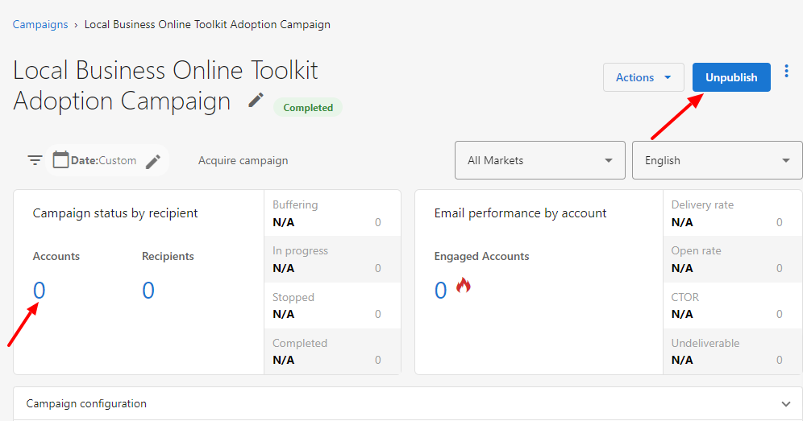
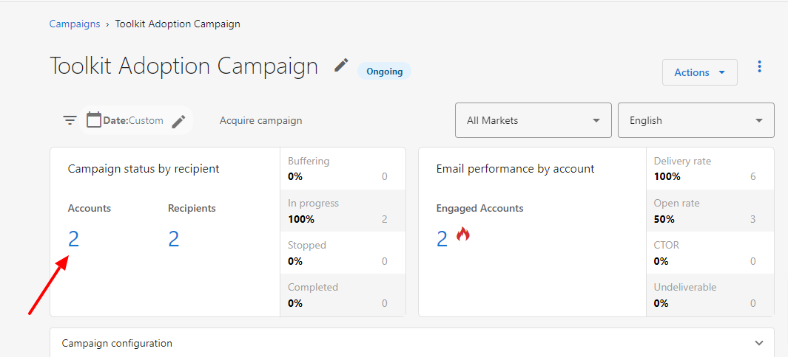
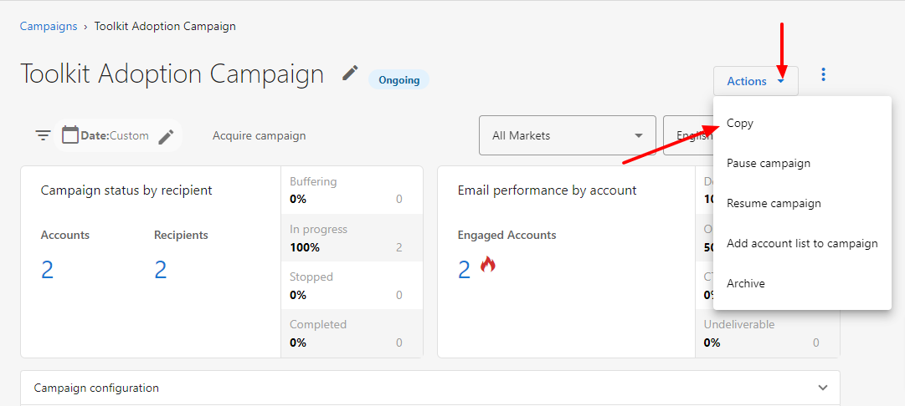

# How do I unpublish an email campaign?

If a published email campaign has not had any accounts added to it yet, it can be unpublished by clicking the blue "Unpublish" button in the top right.

**Please note:** Once an email campaign has an account added to it, it cannot be unpublished.

Instead, you can pause the email campaign, and then **Copy** it to make the necessary changes.

