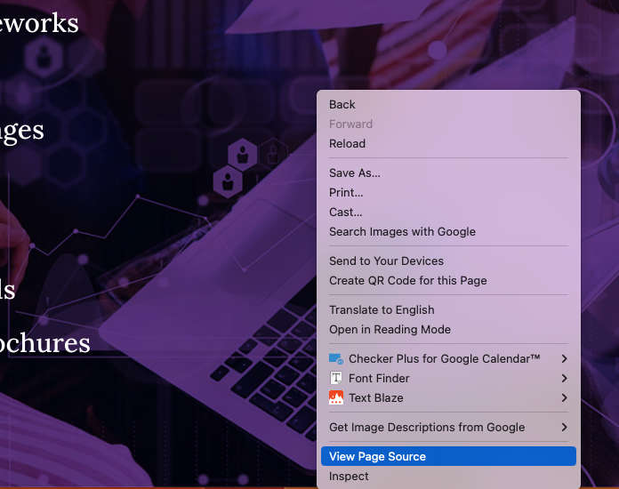
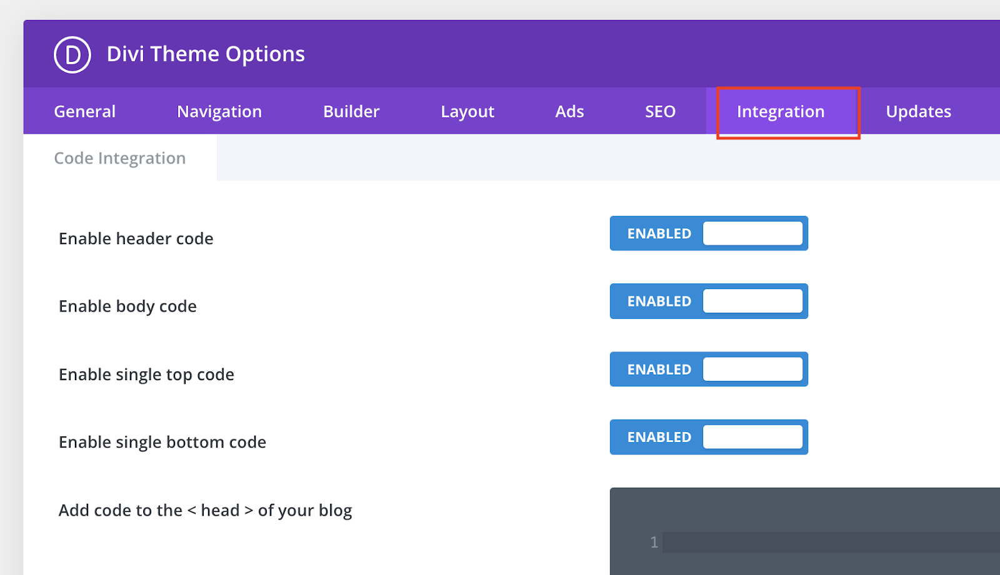
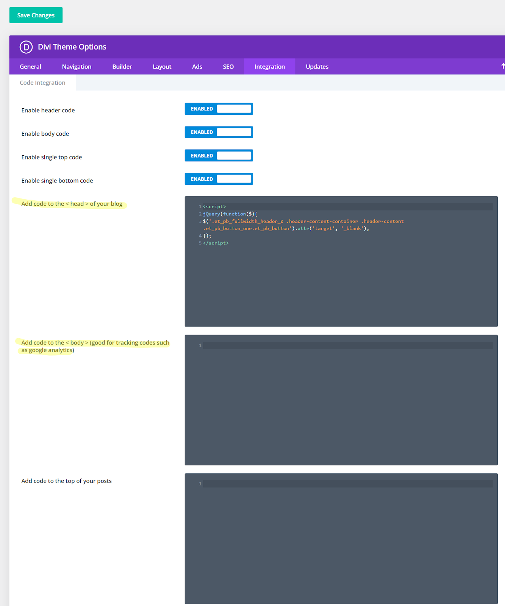
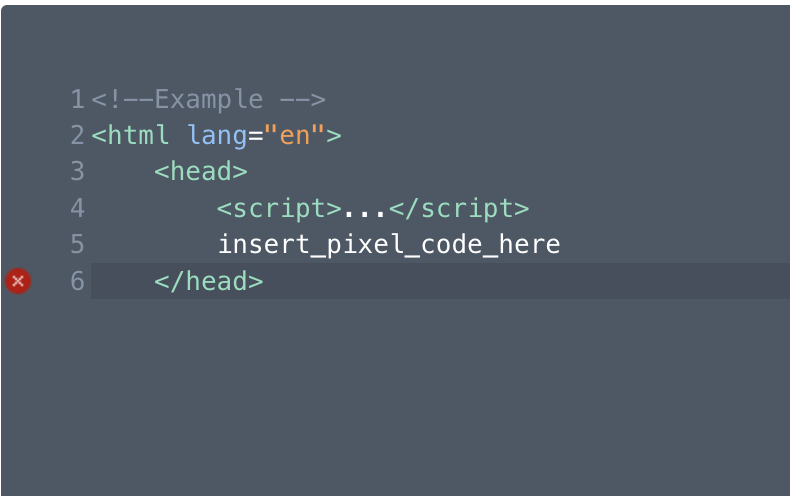
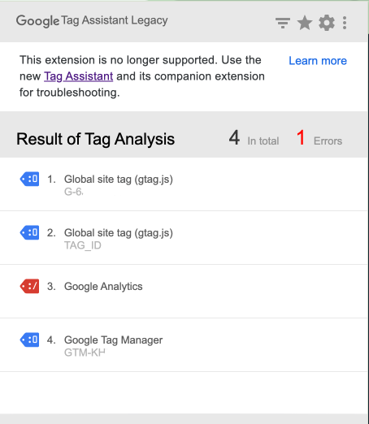
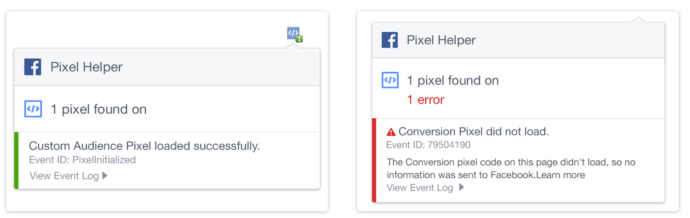

This article will guide you through the essentials of Google Tag Manager (GTM) tags and Facebook Meta Pixels. Understanding and implementing these tools is crucial for tracking and optimizing your digital marketing campaigns, ensuring you get the most out of your advertising efforts.

**Table of Contents:**

*   [**What is a GTM?**](https://marketing-services.zendesk.com/hc/en-us/articles/25119048322327-GTM-Tags-Facebook-Meta-Pixels-Placement-Tutorial#h_01J3GT06PW0BKBTX4NPD6MSBSF)
    *   How GTM Works
    *   Why You Need GTM on Your Website
*   [**What is a Facebook Meta Pixel?**](https://marketing-services.zendesk.com/hc/en-us/articles/25119048322327-GTM-Tags-Facebook-Meta-Pixels-Placement-Tutorial#h_01J3GT4FS5A5W8FGF4GABK5T16)
    *   How Facebook Meta Pixel Works
    *   Why You Need Facebook Meta Pixel on Your Website
*   [**Obtaining the GTM Code or Facebook Meta Pixel Code**](https://marketing-services.zendesk.com/hc/en-us/articles/25119048322327-GTM-Tags-Facebook-Meta-Pixels-Placement-Tutorial#h_01J3GT8RSKPM8RGW052T9NPHPA)
    *   Finding the GTM Code
    *   Finding the Facebook Meta Pixel Code
*   [**Checking Your Website for Existing Code**](https://marketing-services.zendesk.com/hc/en-us/articles/25119048322327-GTM-Tags-Facebook-Meta-Pixels-Placement-Tutorial#h_01J3JXN33DHYS2NVW5W4TAHWMQ)
*   [**Adding a GTM or Facebook Meta Pixel to Your Website**](https://marketing-services.zendesk.com/hc/en-us/articles/25119048322327-GTM-Tags-Facebook-Meta-Pixels-Placement-Tutorial#h_01J3JXPARXE3H152M7GAE5S85X)
    *   Access the Backend of the Website
    *   Adding the GTM Code to the Website
    *   Adding the Facebook Meta Pixel Code to the Website
*   [**Verifying Correct Installation & Functionality of GTM or Facebook Meta Pixel on Website**](https://marketing-services.zendesk.com/hc/en-us/articles/25119048322327-GTM-Tags-Facebook-Meta-Pixels-Placement-Tutorial#h_01J3JXSZNDG20NKFKY9G1XSQ2Z)
    *   Verify Your GTM Installation
    *   Verify Your Facebook Meta Pixel Installation

## What is a GTM?

**Google Tag Manager (GTM)** is a free tool provided by Google that allows you to manage and deploy marketing tags (snippets of code or tracking pixels) on your website without having to modify the code directly. Tags are tiny bits of website code that can measure traffic and visitor behaviour, understand the impact of online advertising and social channels, use remarketing and audience targeting, and test and improve your site.

**How GTM Works**  
GTM uses a container tag to contain all the other tags for your site, like Google Analytics, Google Ads, or third-party tags. When a user visits your website, the container tag is triggered and fires all the tags contained within it based on specific rules you set up. This allows for greater control and flexibility in managing your tags without needing to involve a developer for each update.

**Why You Need GTM on Your Website**

1.  **Ease of Use:** Marketers can easily add and update website tags without needing technical knowledge or a developer's help.
2.  **Speed:** Updates and changes to tags can be done quickly and efficiently.
3.  **Flexibility:** Allows you to deploy a wide variety of tags from different vendors.
4.  **Debugging and Preview Mode:** You can test and debug your tags before deploying them live, reducing errors and ensuring correct data collection.
5.  **Centralized Management:** All tags are managed from one platform, simplifying the process and improving organization.

GTM is crucial for running effective digital ad campaigns. It ensures accurate data collection and enables better performance tracking, optimization, and reporting.

## What is a Facebook Meta Pixel?

A **Facebook Meta Pixel** is a snippet of JavaScript code that you place on your website. It allows you to track visitor activity on your site, gather insights about your audience, and measure the effectiveness of your Facebook advertising campaigns.

**How Facebook Meta Pixel Works**  
When someone visits your website and takes an action (like completing a purchase), the Facebook Pixel is triggered and reports this action. This allows you to track visitors as they interact with your website, ensuring your ads are shown to the right people and measuring the outcomes of your ads.

**Why You Need Facebook Meta Pixel on Your Website**

1.  **Audience Insights:** Helps you understand your audience better by tracking their interactions on your website.
    
2.  **Ad Targeting:** Allows you to create custom audiences based on specific actions people take on your site, leading to more targeted and effective ads.
    
3.  **Conversion Tracking:** Measures the effectiveness of your Facebook ads by tracking actions taken by users on your website.
    
4.  **Optimization:** Enables Facebook’s algorithms to optimize ad delivery to people who are more likely to take the desired action, improving ROI.
    
5.  **Retargeting:** Allows you to retarget users who have visited your site but did not complete desired actions, increasing the chances of conversion.
    

Implementing the Facebook Meta Pixel is essential for running successful Facebook ad campaigns. It provides valuable data for optimizing ads and understanding user behaviour on your website.

## Obtaining the GTM Code or Facebook Meta Pixel Code:

To add a GTM or Facebook Meta Pixel to your website, you will need to add the code for the GTM container or the pixel to the website.

**Finding the GTM Code:**

1.  Open the [Google Tag Manager website](https://tagmanager.google.com/) and sign in with the Google account you’ve used to create the tags and containers.
2.  Once your container is created, Google Tag Manager will provide you with the GTM code snippets. There will be two pieces of code: one to be placed in the `<head>` section and one in the `<body>` section of your website's HTML.
    1.  The GTM itself is quite short (ex: GTM-ABCDEFG), but the entire code will be several lines of text.

**Finding the Facebook Meta Pixel Code:**

1.  Log into your Facebook account and go to [Facebook Ads Manager](https://www.facebook.com/adsmanager).
    
2.  Click on the menu icon (a grid of nine small squares) in the top left corner to open the Business Tools menu. Select **Events Manager**.
    
3.  In the Events Manager, you’ll see a list of data sources. Look for the section labelled “Pixels.”
    
4.  Find and click on the name of your pixel. If you have multiple pixels, select the one you want to work with.
    
5.  Once you click on your pixel, you’ll be taken to the pixel details page.
    
6.  Click on the **Set Up** button in the top right corner.
    
    1.  Choose “Install Pixel” and then “Manually add pixel code to website” to access the pixel code.
        

## Checking Your Website for Existing Code:

In case the code has been already placed on the site, it’s a good idea to check for it first.

1.  Open the homepage (or any page) of your website on a desktop computer.
2.  Right-click on the page and click “Inspect” from the drop-down menu.  
    
3.  After you’re redirected to the additional tab, click CTRL + F (Windows) or Command + F (Mac) and paste your code into the search bar.  
    
    1.  Review the results to see if any match your GTM or Facebook Meta Pixel.
4.  If the code is not on the website, proceed with the below steps to add it.

## Adding a GTM or Facebook Meta Pixel to Your Website:

**Access the Backend of the Website:**

1.  Go to the backend of your website and navigate to the HTML sections. (The steps will be different depending on your website platform and builder.)
    
    _Below are the steps for a WordPress website built with Divi:_
    
2.  Within the WordPress dashboard, click on “Divi” from the navigation bar on the left.  
    
3.  From the Divi Theme Options page, click on the **Integration** tab.  
    
4.  Look for two boxes in which code can be added—one for the `<head>` and one for the `<body>`.  
    

**Adding the GTM Code to the Website:**

1.  From Google Tag Manager, copy the GTM code snippets and paste them into your website’s HTML where instructed.
    1.  Paste the code for the `<head>` in the relevant section and the code for the `<body>` into the relevant section.
        1.  The `<head>` snippet should be placed as high in the `<head>` section as possible, and the `<body>` snippet immediately after the opening `<body>` tag.
            
            This approach ensures that your tags in the GTM will fire ASAP, whereas placing the code lower in the HTML script will cause them to fire later and could result in missing some of your data.
            
2.  Click the green **Save Changes** button at the bottom of the page.

**Adding the Facebook Meta Pixel Code to the Site:**

1.  Copy the entire pixel code provided by Facebook.
2.  Paste the pixel code into your website’s HTML within the header (ie. the `<head>`) section.
    1.  (You will need to access the backend of your website to do this.)
3.  Paste the entire pixel code just before the closing `</head>` tag.  
    
4.  Click the green **Save Changes** button at the bottom of the page.

Now that the GTM code and/or the Facebook Meta Pixel codes have been added to the site, you should verify the installation and that they’re functioning correctly.

## Verifying Correct Installation & Functionality of GTM or Facebook Meta Pixel on Website:

**Verify Your GTM Installation:**

To verify that you’ve installed the GTM and that it’s functioning correctly, you can use a browser extension tool, like Google’s [Tag Assistant Legacy](https://chromewebstore.google.com/detail/deprecated-tag-assistant/kejbdjndbnbjgmefkgdddjlbokphdefk) from the Chrome Web Store.  
_Note: This extension is deprecated however, we find it is more straightforward to use than Google’s [Tag Assistant Companion](https://chromewebstore.google.com/detail/tag-assistant-companion/jmekfmbnaedfebfnmakmokmlfpblbfdm) extension. With this extension no longer being maintained, keep in mind that the information may be inaccurate._

1.  Install and enable the Tag Assistant Legacy browser extension from the Chrome Web Store.
2.  Visit your website homepage on the front end. Click on the Tag Legacy browser extension. In the pop-up window, click the blue **Enable** button.
    
    1.  Refresh/reload your website homepage within the same tab.
        
3.  Google Tag Assistant Legacy will show you which Google tags are added and if they are functioning properly. It may take a few moments for the full list to reflect.  
    
    1.  If there are any errors, you can click on them to view more details.

**Verify Your Pixel Installation:**

You can use a browser extension tool, like [Meta Pixel Helper](https://chromewebstore.google.com/detail/meta-pixel-helper/fdgfkebogiimcoedlicjlajpkdmockpc) from the Chrome Web Store, to verify that you've installed the pixel and that it's functioning correctly.

1.  Install and enable the Meta Pixel Helper browser extension from the Chrome Web Store.
2.  Visit the front end of your website and the page where you installed the pixel. The Pixel Helper will indicate if the pixel is correctly installed and firing.  
    1.  If it’s not, you will see an error message.  
        

By following these steps, you can successfully add the Google Tag Manager (GTM) and/or Facebook Meta Pixel to your website. This will allow you to track user interactions, optimize your ad campaigns, and create targeted audiences.
