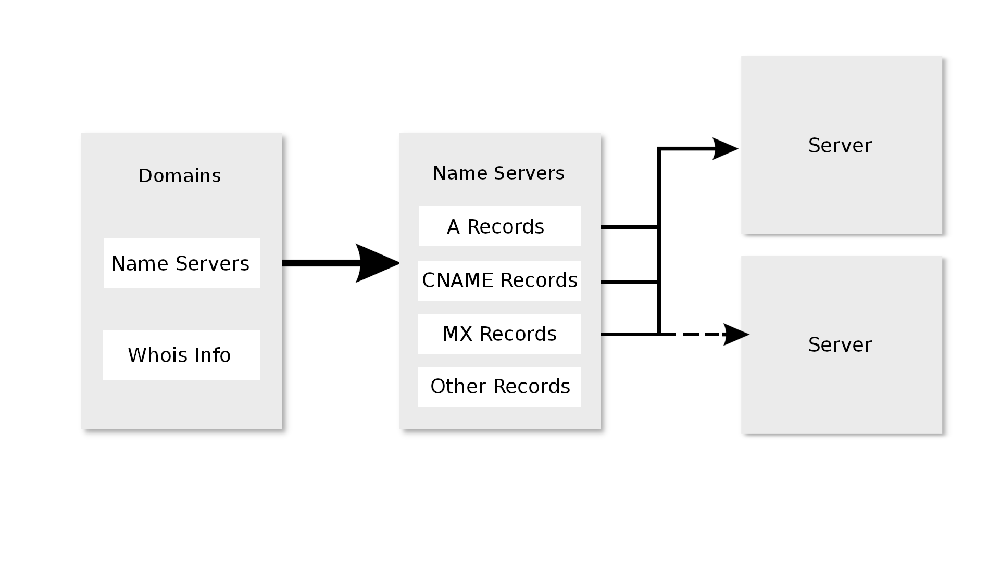
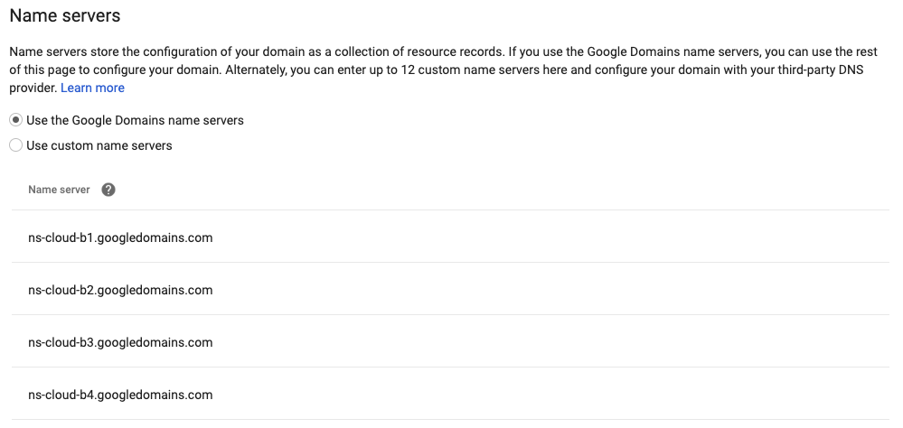
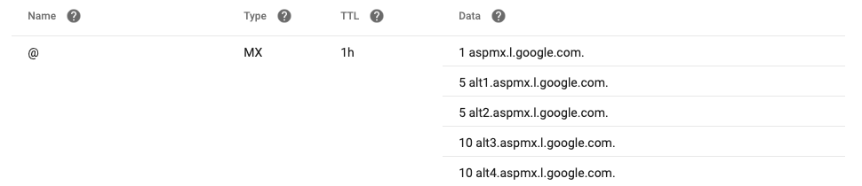

If you're a partner using or reselling marketing email products like Constant Contact, you'll need to set up your DNS records to ensure the email campaigns sent on behalf of your customer's domain work properly. This guide will walk you through the process of setting up the necessary DNS records.

## Domain connection

When using marketing email services, you need to verify domain ownership and ensure proper email delivery through DNS settings. The required DNS settings depend on the hosting provider:

## DNS hosting options

You have several options for where your DNS is hosted:

### 1. WordPress Hosting (Pro or Premium)

Custom domains are available on WordPress Hosting Pro and Premium plans. WordPress Hosting Standard does not support custom domains, so this option doesn't apply to Standard accounts.

#### Name servers

If your domain is using WordPress Hosting name servers, you'll have these settings:

#### DNS records

You can add the required DNS records in the WordPress Hosting interface:

### 2. Google Workspace

If your domain uses Google Workspace, you'll need to add the MX records in your DNS settings:

### 3. Other DNS providers

If you're using a different DNS provider, you'll need to add the required records in their interface.

## Required DNS records

### Verification record

You need to add a verification record to prove domain ownership to the email marketing service:

### Campaign settings

After domain verification, you'll need to set up your campaign settings. Navigate to the `Campaign Settings` tab and follow these steps:

1. Visit the `Campaign Settings` tab
2. Select the domain used for sending emails
3. Choose the verified domain
4. Configure any additional options as needed

### SPF record

The SPF (Sender Policy Framework) record helps prevent email spoofing by specifying which mail servers are authorized to send emails on behalf of your domain.

1. Add an SPF record to your domain's DNS settings
2. Follow the format provided by your email marketing service
3. This helps improve email deliverability and prevents emails from being marked as spam

## Troubleshooting

If you encounter issues with your email marketing setup:

- Verify all DNS records are correctly entered
- Check for typos or formatting errors
- Allow sufficient time for DNS propagation (can take up to 24-48 hours)
- Confirm you have the necessary permissions to modify DNS settings
- Contact your DNS provider or email marketing service for additional assistance

## Additional resources

- For help with specific DNS providers, consult their documentation
- Check with your email marketing service for up-to-date DNS requirements
- Consider setting up DKIM and DMARC for additional email security