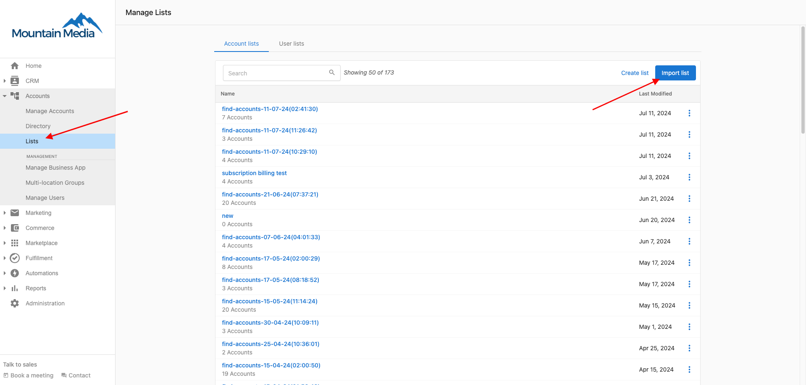
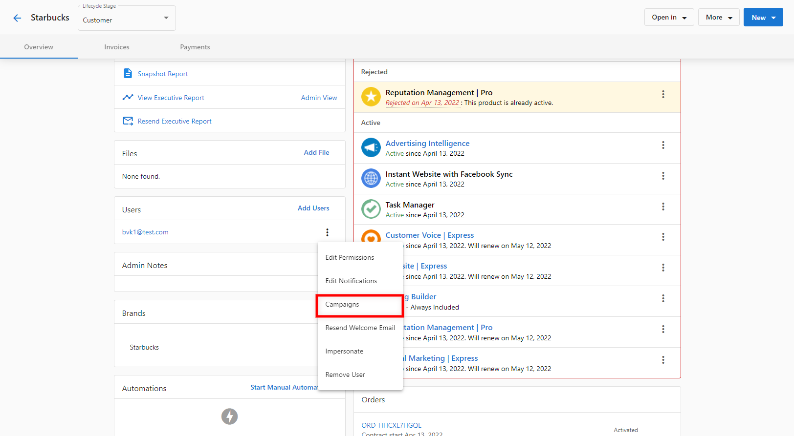

No - If an account is added to a campaign, every user on the account will be added to the campaign. If you want only specific users to get campaigns, you can either create a user list and add that to a campaign, or launch the campaign individually for each user through Partner Center.

## Add a user list to an email campaign

Under **Accounts > Lists**, you can import a list of users through a CSV file and then add that user list to a campaign:

Please note that this option is for users that do not already exist on the platform. Importing a list of users will create new users on the platform.

## Start a campaign for an individual user

On an account, scroll down to where the users are listed and click the three dots next to the user you would like to add. Select "Campaigns":

Then you can select the campaign you would like to launch for the individual user.