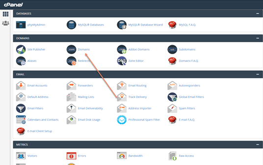
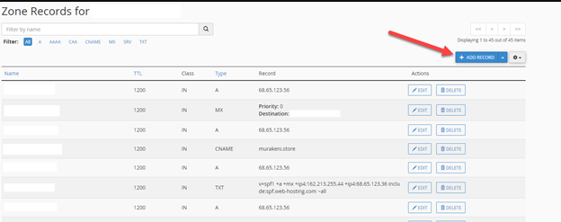

This guide will walk you through the process of adding SPF, DKIM, and DMARC records to your domain using cPanel with Namecheap as your domain host.

## Before you begin

To follow this guide, you will need:
- A domain purchased through Namecheap
- Access to your cPanel account
- The SPF, DKIM, and DMARC record values provided by your email service provider

## Adding DNS records in cPanel

### Step 1: Log into your Namecheap account

Start by logging into your Namecheap account at [namecheap.com](https://www.namecheap.com).

### Step 2: Access cPanel

1. Navigate to `Domain List` in your dashboard
2. Find the domain you want to modify and click `Manage`
3. Select the `Advanced DNS` tab

### Step 3: Add SPF record

The SPF (Sender Policy Framework) record helps prevent email spoofing by specifying which mail servers are authorized to send email from your domain.

1. In the `Host Records` section, click `Add New Record`
2. Select `TXT Record` from the dropdown menu
3. For the `Host` field, enter @ (representing your root domain)
4. For the `Value` field, enter your SPF record (typically looks like `v=spf1 include:_spf.mailgun.org ~all`)
5. Set TTL (Time to Live) to `Automatic`
6. Click `Save Changes`

### Step 4: Add both DKIM records

DKIM (DomainKeys Identified Mail) adds a digital signature to your emails to verify they haven't been tampered with.

The platform generates **two** DKIM records, both CNAME records. Both are required. Repeat these steps for each one:

1. Click `Add New Record`
2. Select `CNAME Record` from the dropdown menu
3. For the `Host` field, enter the host shown for that DKIM record in `Partner Center` → `Marketing` → `Email settings`
4. For the `Value` field, enter the matching value shown alongside it
5. Set TTL to `Automatic`
6. Click `Save Changes`

### Step 5: Add DMARC record

DMARC (Domain-based Message Authentication, Reporting & Conformance) tells receiving servers what to do with emails that fail SPF or DKIM verification.

1. Click `Add New Record`
2. Select `TXT Record` from the dropdown menu
3. For the `Host` field, enter `_dmarc`
4. For the `Value` field, enter your DMARC policy (e.g., `v=DMARC1; p=none; rua=mailto:dmarc@yourdomain.com`)
5. Set TTL to `Automatic`
6. Click `Save Changes`

### Step 6: Verify your records

After adding all your records, your DNS management page should show all four records: one SPF (TXT), two DKIM (CNAME), and one DMARC (TXT). Missing either DKIM CNAME will stop the domain from authenticating.

## Troubleshooting

If you encounter issues with your email authentication after setting up these records:

1. Check that the records have propagated (can take up to 48 hours)
2. Verify there are no typos in your record values
3. Use an online SPF/DKIM validator tool to check your configuration
4. Contact your email service provider for assistance

## Additional tips

- Start with a cautious DMARC policy (`p=none`) to monitor without affecting email delivery
- Regularly check your DMARC reports to ensure everything is working correctly
- Consider increasing your DMARC policy strictness (`p=quarantine` or `p=reject`) after confirming proper setup

## Next steps

After successfully setting up your SPF, DKIM, and DMARC records, you should:

1. Test your email delivery to ensure everything is working correctly
2. Set up a system to receive and analyze your DMARC reports
3. Gradually increase your DMARC policy strictness as you gain confidence in your setup

By properly configuring these authentication records, you'll improve your email deliverability and protect your domain from being used for email spoofing.