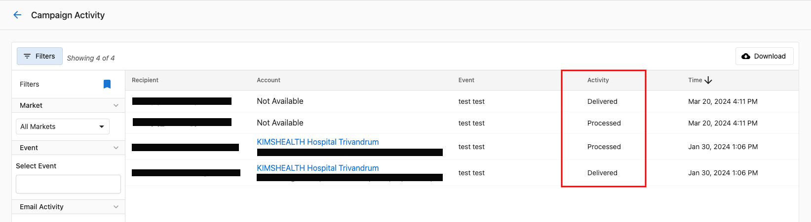
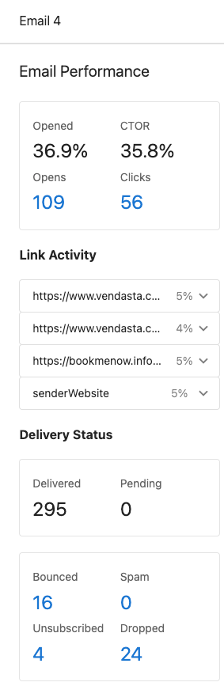
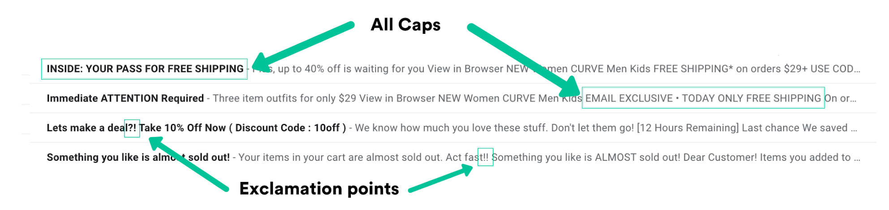
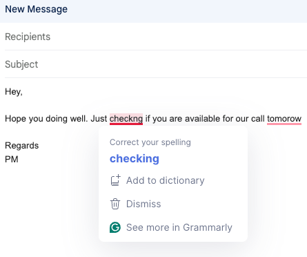
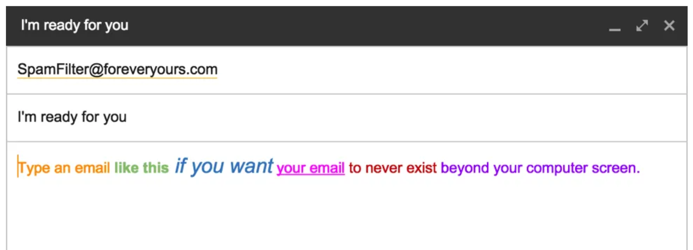
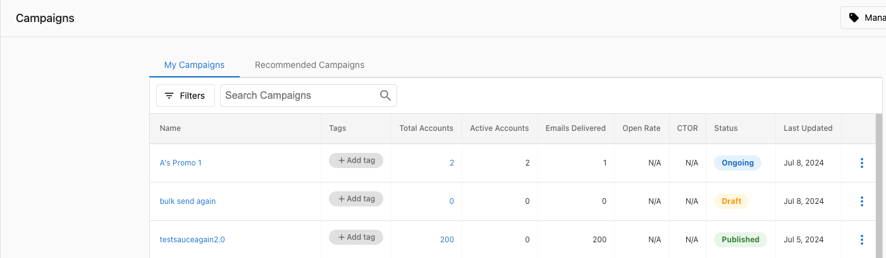
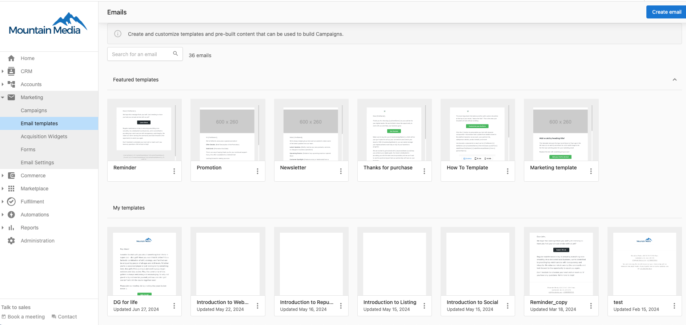

# Email Deliverability

Sending emails is a crucial part of digital marketing. However, ensuring that your email campaigns actually reach your recipients' inboxes is a complex challenge. This article covers best practices and tips to improve your email deliverability when using Campaigns.

## What is Email Deliverability?

Email deliverability refers to the ability to successfully deliver emails to recipients' inboxes. It is affected by numerous factors including sender reputation, email content, technical setup, and recipient engagement.

## How to Check Email Campaign Performance

The Campaign Activity Dashboard provides insights into your email campaign performance:

Key metrics include:

- **Delivered**: The number of emails successfully delivered to recipients' inboxes.
- **Opens**: How many recipients opened your email.
- **Clicks**: The number of clicks on links within your email.
- **Bounces**: Emails that couldn't be delivered (broken into hard and soft bounces).

## Understanding Recipients' Engagement

The Recipient Engagement section shows how your audience interacted with your campaign:

This data helps you understand which recipients are most engaged with your content.

## Best Practices for Improving Email Deliverability

### 1. Avoid Spam Triggers in Your Content

Certain elements in your emails can trigger spam filters:

**Avoid**:
- USING ALL CAPS
- Excessive exclamation points!!!
- Spam trigger words ("free", "guarantee", "no obligation")
- Too many images with minimal text
- Misleading subject lines

### 2. Check Your Grammar and Spelling

Poor grammar and spelling mistakes can trigger spam filters and reduce your credibility.

Use tools like Grammarly to proofread your content before sending.

### 3. Be Careful with Formatting and Colors

Heavily formatted emails with multiple colors can appear unprofessional and trigger spam filters.

**Best practices**:
- Use a clean, professional design
- Limit your color palette
- Ensure sufficient contrast between text and background
- Use web-safe fonts

### 4. Personalize Your Emails

Personalized emails perform better and are less likely to be flagged as spam.

#### In Campaigns:

#### In Templates:

Use merge tags to personalize:
- Subject lines
- Greeting lines
- Content based on recipient data

### 5. Maintain a Healthy Email List

- Regularly clean your email list
- Remove hard bounces and unengaged subscribers
- Use double opt-in when possible
- Never buy email lists

### 6. Follow a Consistent Sending Schedule

- Send emails on a predictable schedule
- Avoid sudden increases in volume
- Gradually increase sending volume over time

### 7. Test Before Sending

- Send test emails to yourself and colleagues
- Check how emails appear on different devices and email clients
- Use email testing tools to check for spam triggers

## Technical Considerations

### Authentication Setup

Proper email authentication is already configured when using Campaigns. This includes:

- **SPF (Sender Policy Framework)**: Verifies that the sending server is authorized to send emails on behalf of your domain.
- **DKIM (DomainKeys Identified Mail)**: Adds a digital signature to verify that emails haven't been tampered with.
- **DMARC (Domain-based Message Authentication, Reporting & Conformance)**: Tells receiving servers what to do with emails that fail authentication checks.

## Need More Help?

If you're experiencing deliverability issues or have questions about how to optimize your email campaigns, please contact support.