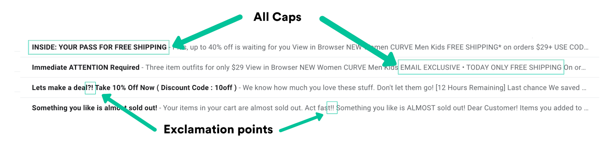
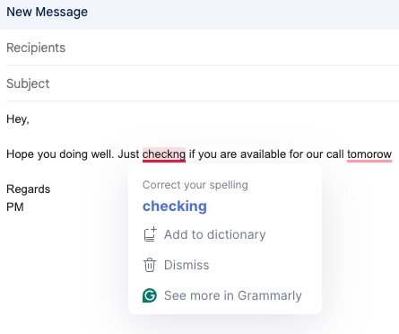
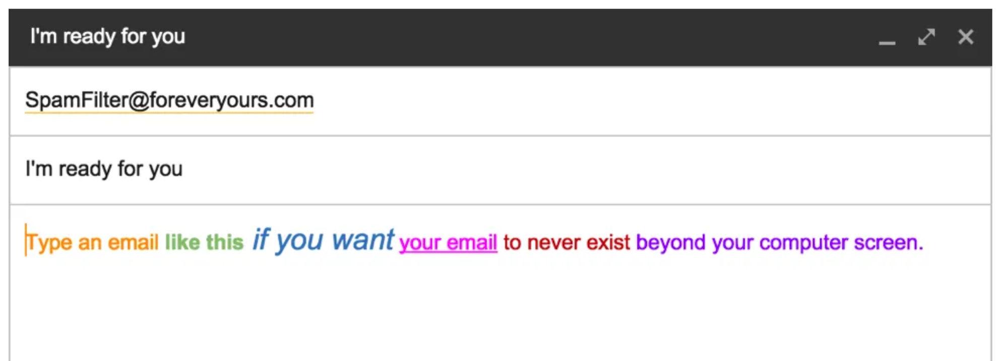
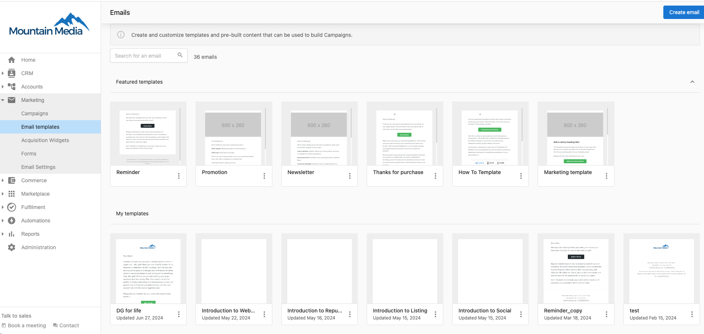

Sending emails is a crucial part of digital marketing. However, ensuring that your email campaigns actually reach your recipients' inboxes is a complex challenge. This article covers best practices and tips to improve your email deliverability when using Campaigns.

## What is email deliverability?

Email deliverability refers to the ability to successfully deliver emails to recipients' inboxes. It is affected by numerous factors including sender reputation, email content, technical setup, and recipient engagement.

## How Vendasta helps improve your email deliverability

Spam laws and regulations are becoming more complex, and precautions are needed to prevent emails from being flagged as spam. To help deliver your emails successfully, Vendasta makes automatic adjustments to optimize your email delivery.

### Automatic domain management

We start with the email you used to sign up for Vendasta, but we update the address domain portion to a verified domain. For example, if you sign up with john@gmail.com, we'll send emails from john@ at our default domain instead.

**Why do we change the domain?**

We change the domain portion of your sender email address to help send your emails properly. If the platform tried to send emails from john@gmail.com (for example), the emails wouldn't pass spam filters and wouldn't get delivered to your clients.

There are restrictions associated with sending marketing emails using free email service providers:

- **Free email addresses** (john@gmail.com) can't be verified since you don't own these domains
- **Free email services** have DMARC policies in place that can disrupt your email deliverability, even though they're intended to prevent spam

### Using your own domain

If you own a custom domain, you can update your sender address to use your domain instead of our grey-label domain. However, until you update your SPF, DKIM, and DMARC records in your Domain Name System (DNS), there's a high chance your emails will land in spam folders.

**Setting up your custom domain:**
1. Update your DNS records with proper authentication (SPF, DKIM, DMARC)
2. Go to `Partner Center` → `Marketing` → `Email Settings` → `Sender and Reply Settings`
3. Update your sender address to use your custom domain
4. Allow up to 72 hours for DNS changes to propagate

:::note
**Important:** You can only use custom email addresses. Free email addresses from gmail.com, outlook.com, yahoo.com will not save.
:::

### Reply handling

All replies are automatically forwarded to the email address you used to sign up for the platform. An email may be sent from our default domain, but when someone replies, it will be sent to john@gmail.com.

## Best practices to improve email deliverability

### 1. Avoid spam triggers in your content

Certain elements in your emails can trigger spam filters:

**Avoid**:
- USING ALL CAPS
- Excessive exclamation points!!!
- Spam trigger words ("free", "guarantee", "no obligation")
- Too many images with minimal text
- Misleading subject lines

### 2. Check your grammar and spelling

Poor grammar and spelling mistakes can trigger spam filters and reduce your credibility.

Use tools like Grammarly to proofread your content before sending.

### 3. Be careful with formatting and colors

Heavily formatted emails with multiple colors can appear unprofessional and trigger spam filters.

**Best practices**:
- Use a clean, professional design
- Limit your color palette
- Ensure sufficient contrast between text and background
- Use web-safe fonts

### 4. Personalize your emails

Personalized emails perform better and are less likely to be flagged as spam.

#### In campaigns:

#### In templates:

Use merge tags to personalize:
- Subject lines
- Greeting lines
- Content based on recipient data

### 5. Maintain a healthy email list

- Regularly clean your email list
- Remove hard bounces and unengaged subscribers
- Use double opt-in when possible
- Never buy email lists

### 6. Follow a consistent sending schedule

- Send emails on a predictable schedule
- Avoid sudden increases in volume
- Gradually increase sending volume over time

### 7. Test before sending

- Send test emails to yourself and colleagues
- Check how emails appear on different devices and email clients
- Use email testing tools to check for spam triggers

### 8. Gmail-specific considerations

Gmail applies stricter filtering than many other providers, particularly for:

- **Links that collect user information**: Gmail flags emails containing links to pages that gather user data, even if the content is legitimate. If campaigns are consistently filtered only on Gmail accounts, review your links and replace any that point to data-collection pages with safer alternatives.
- **Linked-page content**: Gmail evaluates not just the email content but also the content of linked pages. Pages with spam signals can cause the email to be filtered even if the email itself looks clean.

If Gmail-only filtering persists after reviewing links and content, register your domain on [Google Postmaster Tools](https://postmaster.google.com/) to monitor your domain reputation and authentication results with Gmail.

## Technical configuration

### Platform authentication

Vendasta automatically handles email authentication for improved deliverability. When using our grey-label domain or properly configured custom domains, this includes:

- **SPF (Sender Policy Framework)**: Verifies that the sending server is authorized to send emails on behalf of your domain
- **DKIM (DomainKeys Identified Mail)**: Adds a digital signature to verify that emails haven't been tampered with
- **DMARC (Domain-based Message Authentication, Reporting & Conformance)**: Tells receiving servers what to do with emails that fail authentication checks

### Setting up your custom domain

To authenticate your custom domain and use it for sending emails:

1. **Access your DNS provider** - Log into your domain registrar (GoDaddy, Namecheap, etc.)
2. **Configure DNS records** - Follow our domain-specific guides:
   - [Add SPF, DKIM, DMARC Records (GoDaddy)](/marketing/email-settings/email-authentication/adding-spf-dkim-dmarc-records-godaddy)
   - [Add SPF, DKIM, DMARC Records (cPanel/Namecheap)](/marketing/email-settings/email-authentication/adding-spf-dkim-dmarc-records-cpanel-namecheap)
3. **Update sender settings** - Go to `Partner Center` → `Marketing` → `Email Settings` → `Sender and Reply Settings`
4. **Verify configuration** - Allow up to 72 hours for DNS changes to propagate

:::tip Quick Access
You can directly access your email settings at [partners.vendasta.com/campaign-settings](https://partners.vendasta.com/campaign-settings)
:::

## Frequently asked questions

Do I need to register my domain on Google Postmaster Tools?

While not required, registering your domain on Google Postmaster Tools is highly recommended to improve email deliverability and monitor performance with Gmail users.

**Benefits of Google Postmaster Tools:**
- **Improved email deliverability** - Monitor how emails from your domain are being received by Gmail users
- **Identify issues** - Detect potential problems affecting your email delivery
- **Track authentication** - See SPF, DKIM, and DMARC authentication results
- **Monitor reputation** - Keep track of your domain's reputation with Gmail

**How to register:**
1. Go to [Google Postmaster Tools](https://postmaster.google.com/)
2. Sign in with your Google account
3. Click `Add a domain` and enter your domain name
4. Verify domain ownership by creating a DNS TXT record
5. Add the provided TXT record to your DNS settings
6. Return to Google Postmaster Tools and click `Verify`

**Available insights:**
- Domain reputation and IP reputation
- Authentication success rates (SPF, DKIM, DMARC)
- Spam rate and delivery errors
- TLS encryption usage statistics

My emails are going to spam - how do I troubleshoot this?

If your domain's SPF, DMARC, and DKIM records are verified but emails still land in spam folders, you can troubleshoot by examining email headers.

**Steps to troubleshoot:**

1. **Get Email Headers** - Ask the recipient to provide the email headers from the spam email
2. **Extract Headers** - Email headers contain detailed delivery information including authentication results
3. **Analyze Results** - Headers show why emails may have been flagged as spam

**How to get email headers:**
- **Gmail**: Open the email → Click the three dots icon → `Show original`
- **Outlook**: Right-click the email → `View source`
- **Apple Mail**: `View` → `Message` → `Raw Source`

**Helpful resources:**
- [MX Toolbox Email Headers Guide](https://mxtoolbox.com/public/content/emailheaders/)

**Note:** Save the email headers in a text file and share them with the Vendasta support team for detailed analysis.

**Common causes of spam delivery:**
- Content triggers (spam words, excessive caps, misleading subject lines)
- Poor sender reputation
- Authentication failures
- High bounce or complaint rates
- Poor list hygiene

What do common email deliverability error codes mean?

If you encounter email delivery errors, here are the most common issues and their meanings:

**Blacklist-Related Rejections:**

If your message is rejected with any of these reasons, it means your IP or domain has been flagged:

| Rejection Reason | Meaning |
|---|---|
| Listed on spamrl.com as a source of spam | Multiple verified spam emails originating from your IP(s) |
| Listed on spamrl.com as a source of viruses | Multiple automatically classified virus emails from your IP(s) |
| Listed on spamrl.com as a source of phishing | Multiple verified phishing emails OR large amounts of failing auth (SPF/DKIM/DMARC) reports |
| Listed on spamrl.com as a source of dictionary attacks | Significant traffic to non-existing mailboxes from your IP(s) |
| Domain IP listed on spamrl.com | Multiple spam/virus/phishing emails OR trusted third-party blacklisting |

**SMTP Error Codes:**

| Error Code | Error Message | Meaning |
|:---:|---|---|
| **550 5.1.1** | User unknown | Recipient email address doesn't exist or is invalid |
| **550 5.4.1** | Recipient address rejected | Receiving server rejected email due to policy restrictions |
| **554 5.7.1** | Message rejected due to content | Email content triggered spam filters or violates content policies |
| **421 4.7.0** | IP address temporarily deferred | IP address temporarily blocked, usually due to rate limiting |
| **550 5.7.1** | Authentication failed | SPF, DKIM, or DMARC authentication failed for your domain |
| **552 5.2.2** | Mailbox full | Recipient's mailbox is full and cannot accept new messages |
| **550 5.1.8** | Domain of sender address does not exist | Sending domain cannot be found or lacks proper DNS records |
| **451 4.3.0** | Temporary server error | Temporary issue with the receiving mail server |
| **550 5.7.606** | Access denied, banned sending IP | IP address permanently banned by the receiving server |
| **550 5.7.1** | Relaying denied | Mail server doesn't allow relaying from your IP address |

**What should I do if I encounter these errors?**

1. **Check external blacklists** - Use [MX Toolbox](http://mxtoolbox.com/blacklists.aspx) to check for blacklist listings and request delisting
2. **Request delisting** - If listed on spamrl.com, request delisting [here](https://spamrl.com/delist/)
3. **Review content** - Ensure your email content doesn't trigger spam filters
4. **Verify authentication** - Check that your SPF, DKIM, and DMARC records are properly configured
5. **Monitor sending practices** - Review your sending volume, frequency, and list hygiene

Links in my emails are being blocked or rewritten by Microsoft Defender Safe Links. How do I fix this?

Microsoft Defender Safe Links is a security feature in Microsoft 365 that rewrites URLs in incoming emails and scans them before allowing them to open. This can cause campaign links, including links sent through `sendgrid.net`, to be blocked or display an error page.

There are two resolution paths depending on whether the affected user is on a personal Outlook.com account or a managed Microsoft 365 organization.

**For organizations with Microsoft Defender Premium (IT admin required):**

1. Sign in to the [Microsoft 365 Defender portal](https://security.microsoft.com)
2. Go to `Email and collaboration` → `Policies and rules` → `Threat policies` → `Safe Links`
3. Edit the applicable Safe Links policy
4. Under `Do not rewrite the following URLs`, add:
   - `*.sendgrid.net/*`
   - `*.<your-partner-domain>.com/*`
   - `*.<your-business-app-url>.com/*`
5. Save the policy

Use wildcard syntax as shown. Changes take effect for new emails after the policy is saved.

**For individual users on Outlook.com:**

1. Sign in to [Outlook.com](https://outlook.com)
2. Go to `Settings` → `Mail` → `Junk email`
3. Under `Safe Links`, disable the link-rewriting option

Note that this only applies to future messages. Previously received emails with rewritten links are not affected.

If the issue persists after updating the policy, confirm the correct Safe Links policy was edited and that the wildcard syntax matches your domains exactly.

How do I help a recipient whitelist my sender address so emails don't go to spam?

Ask recipients to add your sender address to their safe senders list using the steps for their email client.

**Outlook 365:**
1. Go to `Settings` → `View all Outlook settings` → `Mail` → `Junk email`
2. Under `Safe senders and domains`, click `Add`
3. Enter your sender email address or domain and save

**Gmail:**
1. Open a previous email from your sender address
2. Click the three dots in the top right of the email
3. Select `Filter messages like these`
4. Click `Create filter`
5. Check `Never send it to Spam` and click `Create filter`

Alternatively, the recipient can drag the email from Spam to their inbox. Gmail treats this as a "Not spam" signal and learns from it over time.

Calendar invitation emails are going to spam in Gmail. How do I fix this?

Gmail sometimes routes calendar invitation emails to spam, even when the sender is trusted. This is a Gmail-side behavior related to how it handles calendar events from unknown senders.

Ask the recipient to:

1. Find the calendar invitation email in their **Spam** folder
2. Open the email and click `Add to Calendar`
3. Click `Report as Not Spam` (or drag the email to the inbox)

Once the recipient marks the email as Not Spam, future calendar invitations from the same sender are more likely to land in the inbox.

## Need more help?

If you're experiencing deliverability issues or have questions about how to optimize your email campaigns, please contact support.