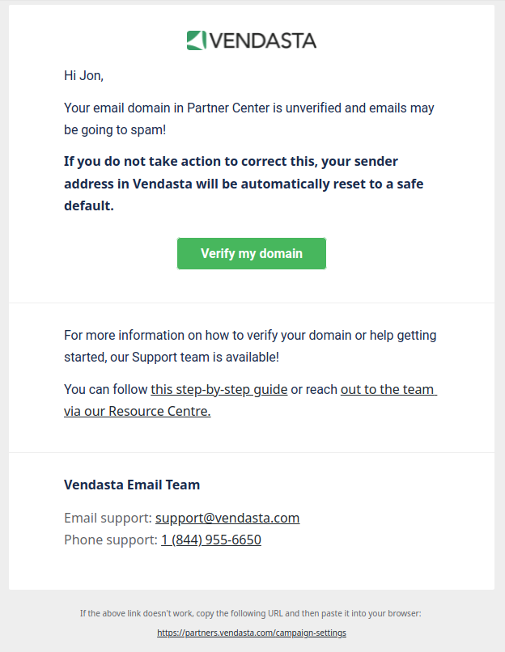

# Email Domain Settings: Notifications and Auto-Rollback

To help make sure that emails sent through the Vendasta platform are reaching inboxes and not going to the spam folder, we will be:

1. Automatically notify Partner Center admins **every 2 weeks** when your [Email Settings](https://support.vendasta.com/hc/en-us/articles/4406951758871) are using an unverified domain 
2. Automatically roll back your Email Settings **after 8 weeks** to send emails from our grey-label domain. This will include notification as well.

Vendasta will be notifying you via an in-platform notification as well as sending an email to Partner Center admins.

