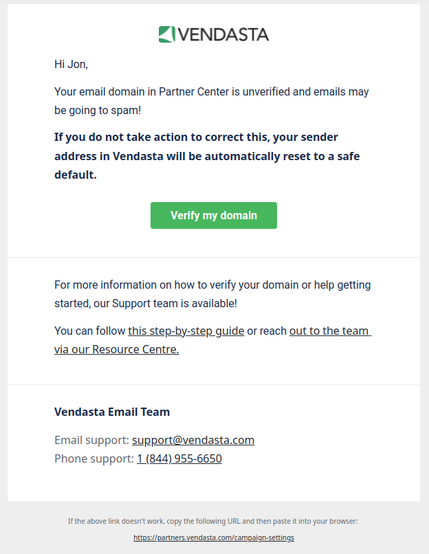

# Email Domain Settings: Notifications and Auto-Rollback

To help make sure that emails sent through the Vendasta platform are reaching inboxes and not going to the spam folder, we:

1. Automatically notify Partner Center admins **every 2 weeks** when your [Email Settings](./index.mdx) are using an unverified domain 
2. Automatically roll back your Email Settings **after 8 weeks** to send emails from our grey-label domain. This will include notification as well.

Vendasta notifies you via an in-platform notification as well as sending an email to Partner Center admins.

