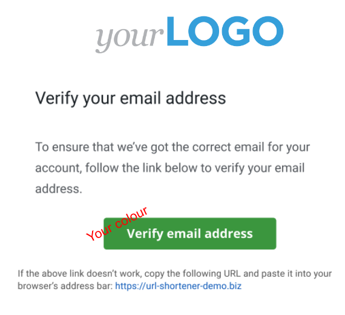
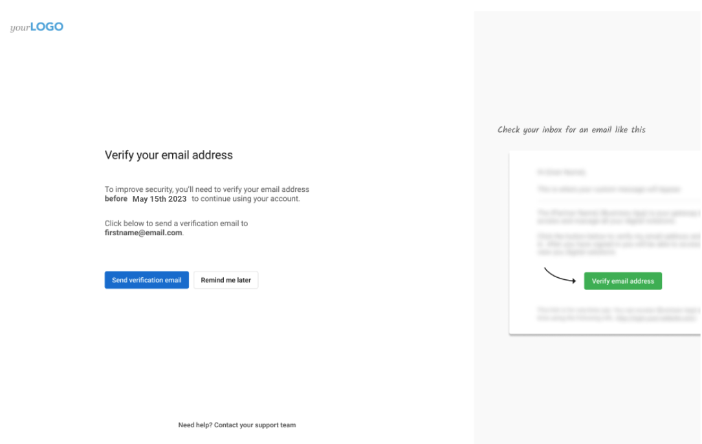
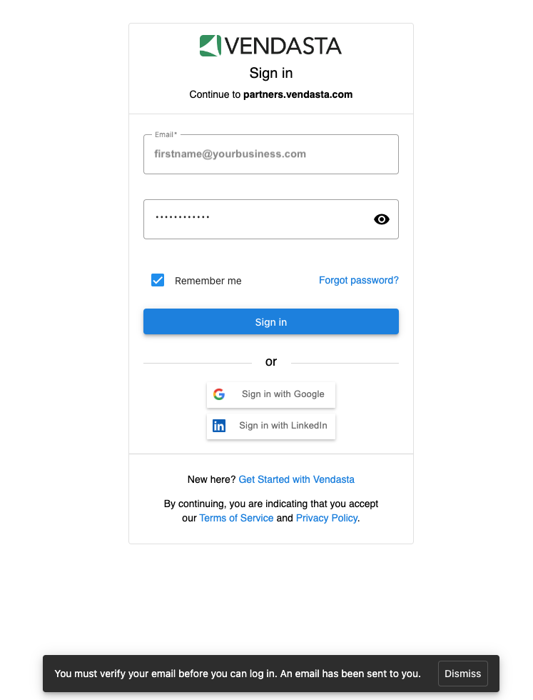
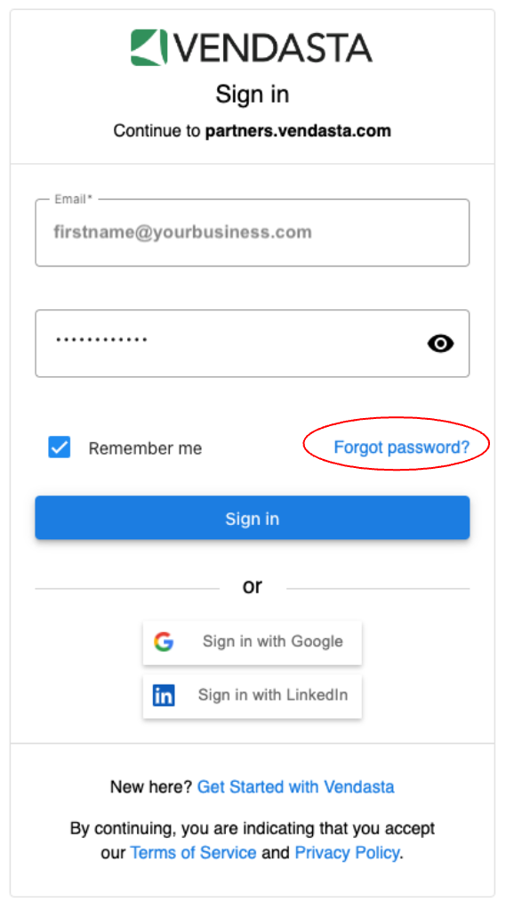

At Vendasta, are committed to securely storing all the business data of our Partners, and their clients, reducing the risk of exploitation, and improving security. Therefore, we have further enhanced the security of our platform by requiring all the users (new and existing) i.e. Partner Center users, Salespeople, Digital Agents, and Business App users to verify their email addresses. This will ensure that all users are genuine and have access to the email ID they provided. Any user added will automatically be verified when we send them a welcome email with a link to set their own password. **If you or your users do not see a page asking them to verify your/their email ID you don't need to do anything, your/their email address is verified.**

:::note
Please be assured that we have maintained all the white labels in place so Business App users will not see 'Vendasta' during the email verification process. They will be asked to verify their email address under your brand.
:::

In order to maintain white label, we won't be sending any emails to your clients regarding email verification other than a white-labelled page, which they'll see when they login to Business App if their email ID is unverified. Therefore, it is your responsibility to nudge your clients to verify their email IDs.

**There are a few ways users can verify their email IDs:**

- Changing their password will verify the email as the password reset code is sent to the owner's email
- Setting a password via the new user welcome email will verify the email as the welcome email is sent to the owner's email
- Signing in with any federated identity provider (Google, LinkedIn, Facebook, etc) will verify the email as that proves they own the email
- By sending a verification email from the page shown after logging in and clicking on the verification link sent to your email.

All existing Partners and users need to verify their email addresses by May 15th, 2023 11:59 pm UTC. If you are an existing Partner (or Partner Center user, Salesperson, Digital Agent, or Business App user) and have never verified your email ID, there are a few simple steps that can be taken to complete the process:

1. Log in to the Vendasta platform
2. You'll see a page asking you to verify your email address.

3. Click the "Send verification email" button and you'll receive an email with a verification link
4. Click on that link, complete the verification process, and continue using the platform
5. Congratulations! Your email ID is now verified 

In case, you did not receive the verification email, please verify you have the correct/active email ID on file. If not, please update your email ID, and you'll receive a verification email.

If you do not have access to the email ID you use to log in anymore, please contact Support and get your email ID updated.

Once you have completed these steps there's nothing else required. We thank you for your continuous support!

**If you are locked out of the platform,** please try any of the following:

- check your inbox for the verification email and click the link enclosed
- reset your password using the forgot password option available on the sign-in page

- contact your admin to reset your password

Once you click on the verification link or reset your password, you will be able to log in as usual and your email ID will be verified. More on regaining access to the Vendasta platform or Business App can be found [here](/marketing/marketing-email-settings/regaining-access-to-the-vendasta-platform-or-business-app).

**Note:** Your admin or the Vendasta Support team cannot set a password for you - however, they can send an email to reset your password.

**If you have an SSO integration with Vendasta here is some additional information:**

- Your Business App users who log in to your platform using their email ID and password, and SSO into the Vendasta platform do not see anything and do not need to complete the email verification process. They are considered verified.
- Your team members i.e. Partner Center users, Salespeople, and Digital Agents who log in to the Vendasta platform using their email ID and password, if unverified and see the prompt to verify, need to complete the verification process.