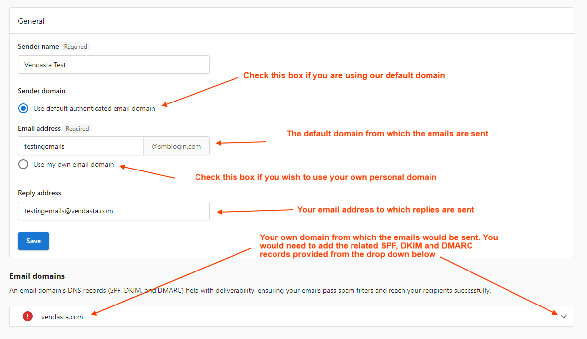
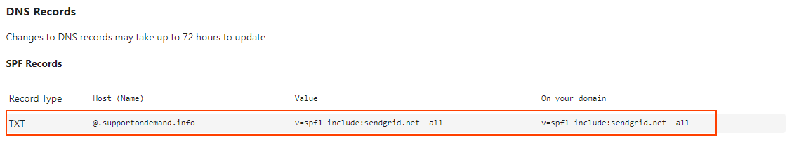
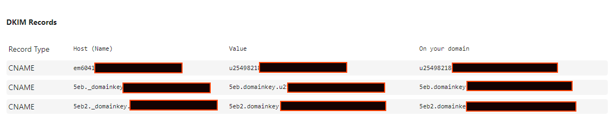
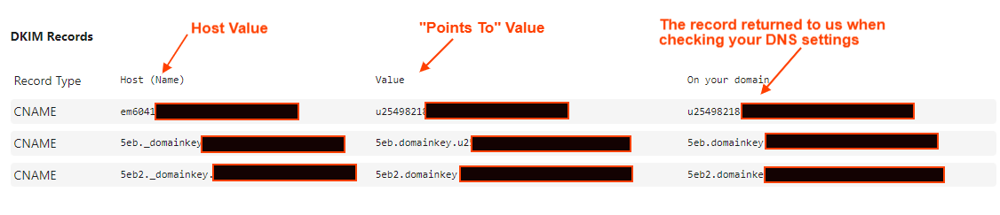
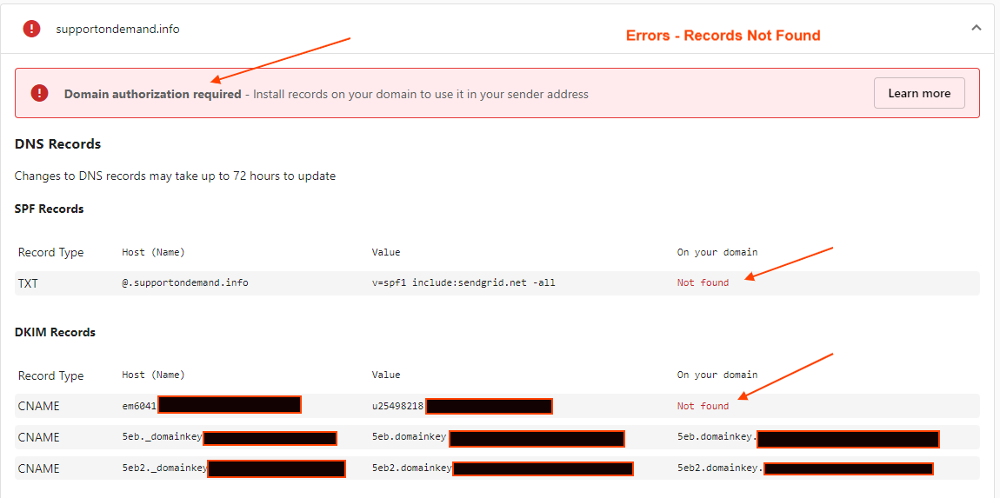
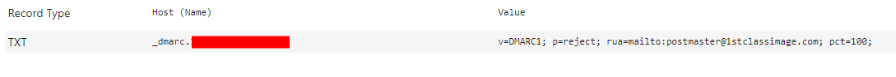

This is a guide to help set up SPF/DKIM/DMARC records for anyone that has GoDaddy as their domain provider. These steps can vary based on the domain provider, so if you are using a provider other than GoDaddy, you can usually find articles on adding CNAME or TXT records in their support center or FAQs. Having DMARC set up for sender domain is an upcoming standard for Gmail and other email service providers. Having this set up properly will help **increase email deliverability.**

Before we begin, you will want to open up the **Email Settings** tab in Partner Center. (Partner Center > Marketing > Email Settings). This page has all of the information and values you will need to configure your records.

On this page, you will also want to expand the section below where it says **Email Domains** to ensure that you are able to access the records which you would enter into your DNS settings. The sender email address should be associated with the domain you wish to use when sending emails and using your own domain.

You can also use our default domain if you do not have your own domain.

Below is an example for **vendasta.com**

Note: Each domain would have different values for their records, so the values in the screenshots below WILL NOT work for your domains. You will have to get your own values from Partner Center in the Email Settings tab.

**Now that this is done, we can configure the records:**

**[Video Guide](https://www.loom.com/share/33d9330b7df9450b9abdbd996486dcab)**

**SPF Validation:**

For SPF Validation, you will have to add a TXT record. This guide from GoDaddy provides the steps to add a TXT record within their system:
[https://ca.godaddy.com/help/add-a-txt-record-19232?](https://ca.godaddy.com/help/add-a-txt-record-19232?)

**Values:**
**Host:** You will want to enter **_@_** in the Host field as GoDaddy will automatically apply your domain when you enter the @ symbol

**TXT Value:** This will be the value that appears in the Partner Center. If you have an existing record, you should add the portion that is recommended to your current record. The **Value** is what the full record should look like. The screenshot below highlights these values:

**TTL:** We generally recommend a TTL of 3600 (or 1 hour)

**DKIM:**

For DKIM records, you will need to add three CNAME records to your domain. The guide on adding these through GoDaddy can be found here:
[https://ca.godaddy.com/help/add-a-cname-record-19236](https://ca.godaddy.com/help/add-a-cname-record-19236)

Each of the records will be on a separate row as shown below:

**Values:**

**Host:** This will be the portion under the **'Host (Name)'** header. 
**Note:** This will only be the first portion of the subdomain. GoDaddy will automatically add the domain itself, so you will **_only add the first portion_** until the end of 'domainkey'. In the screenshot above, the two **Host values** you would use would be the following:
seb._domainkey
seb2._domainkey

**"Points to" Value:** This will be the full value as it appears in the **Value** column.
**On Your Domain:** This shows the record returned when checking against your DNS settings. 

If the records do not match they will show a "**Not Found**" status.

**Errors - Not Found (Screenshot Below)**

**TTL:** We generally recommend a TTL of 3600 (or 1 hour)
Examples of the records would be the following:
**Host:**  5eb.domainkey
**Value:** 5eb2.domainkey.u10054833.wl084.sendgrid.net

**TTL:** 3600 (or 1 hour) 

**DMARC:**

For DMARC validation, you will once again be adding a TXT record. I have pasted the guide here for your convenience:
[https://ca.godaddy.com/help/add-a-txt-record-19232?](https://ca.godaddy.com/help/add-a-txt-record-19232?)

**Host:** This will be similar to the CNAME records for DKIM validation, where we will only be using the subdomain portion (part until the first period (.)). This will usually be "**_dmarc**".

**Value:** The value will be as it appears in this area. It will be the second value that appears and will have an icon to Copy the value next to it:

**TTL:** We recommend a TTL of 3600 (or 1 hour)