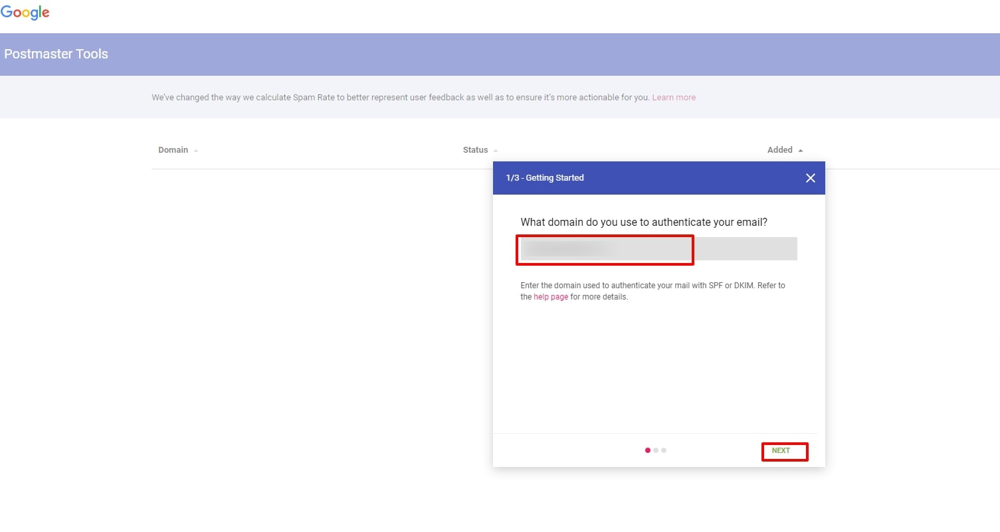
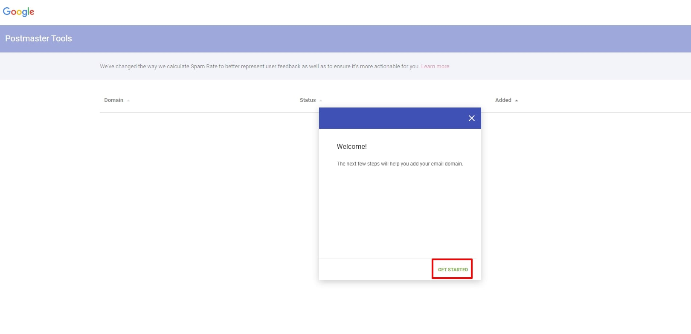
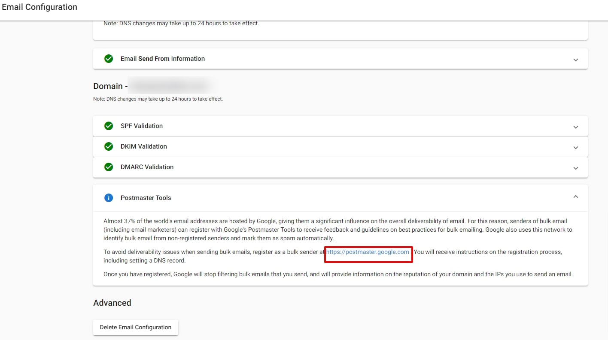
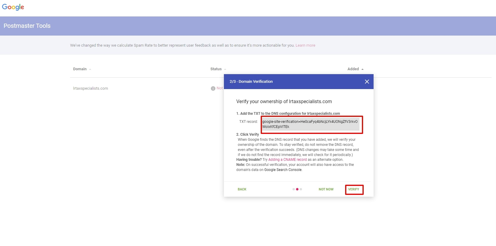
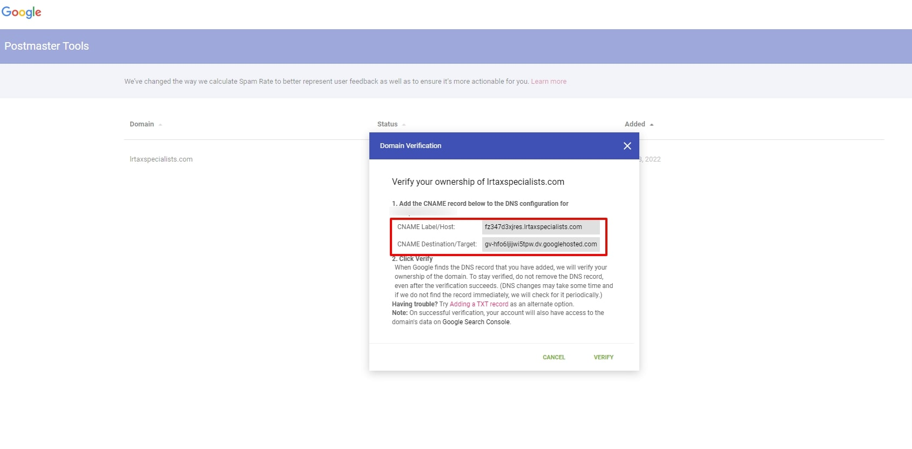

# Do I need to register my domain on the Postmaster tool?

Yes, if you are using Google as your ESP and you want to improve your email deliverability and monitor performance, you should register your domain on Google's Postmaster Tools.

## What is Google Postmaster Tools?

Google Postmaster Tools is a free service by Google that allows domain owners to monitor the delivery of their emails to Gmail users. It provides insights into email performance, including spam rate, delivery errors, and authentication results.

## Why should I register my domain?

Registering your domain on Google Postmaster Tools offers several benefits:

- **Improved email deliverability**: Monitor how emails from your domain are being received by Gmail users
- **Identify issues**: Detect potential problems affecting your email delivery
- **Track authentication**: See SPF, DKIM, and DMARC authentication results
- **Monitor reputation**: Keep track of your domain's reputation with Gmail

## How to register your domain on Google Postmaster Tools

1. Go to [Google Postmaster Tools](https://postmaster.google.com/)
2. Sign in with your Google account
3. Click on "Add a domain" button

4. Enter your domain name

5. Verify domain ownership by creating a DNS TXT record

6. Add the provided TXT record to your DNS settings

7. Return to Google Postmaster Tools and click "Verify"

8. Once verified, you can start monitoring your email statistics

## What information can I see in Google Postmaster Tools?

After registering your domain, you can access various dashboards showing:

- **Domain reputation**: How Gmail users view emails from your domain
- **IP reputation**: Reputation of IP addresses sending emails from your domain
- **Authentication**: Success rates for SPF, DKIM, and DMARC
- **Encryption**: TLS encryption usage statistics
- **Spam rate**: Percentage of emails marked as spam
- **Delivery errors**: Failed delivery attempts
